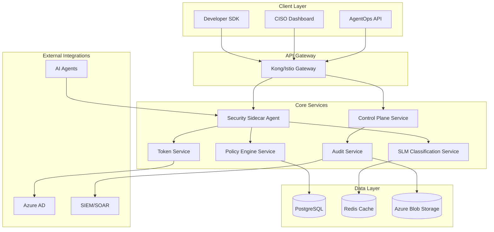

# AI Agent Security Platform - Design Document

## Overview

The AI Agent Security Platform is a production-grade security and governance solution for autonomous AI agents. Built on a microservices architecture, it provides three distinct product offerings: a Developer SDK, AgentOps Runtime Security, and CISO Governance UI.

### Design Principles

- **Security by Design**: Every component implements zero-trust principles
- **Cloud Native**: Kubernetes-first with multi-cloud support
- **Developer First**: Seamless integration with existing workflows
- **Compliance Ready**: Built-in support for major regulatory frameworks
- **Performance Focused**: Sub-second response times with horizontal scaling
- **12-Factor Compliant**: Follows all twelve-factor app methodology principles
- **User-Centered Design**: Apply design thinking principles throughout development
- **Progressive Disclosure**: Make complex security concepts accessible to non-experts
- **Contextual Guidance**: Provide help exactly when and where users need it

### 12-Factor App Compliance

1. **Codebase**: Single codebase per service, tracked in Git, deployed across environments
2. **Dependencies**: All dependencies explicitly declared in package.json/requirements.txt/go.mod
3. **Config**: Configuration stored in environment variables, never in code
4. **Backing Services**: Database, cache, message queues treated as attached resources via URLs
5. **Build/Release/Run**: Strict separation with immutable releases and unique version tags
6. **Processes**: Services are stateless; session state stored in Redis/database
7. **Port Binding**: Each service exports HTTP via port binding (no web server dependencies)
8. **Concurrency**: Horizontal scaling via process replication in Kubernetes pods
9. **Disposability**: Fast startup/shutdown with graceful termination handling
10. **Dev/Prod Parity**: Identical environments using containers and infrastructure-as-code
11. **Logs**: Treat logs as event streams, output to stdout, aggregated by log management
12. **Admin Processes**: One-off admin tasks run as separate containers in same environment

## Architecture

### High-Level Architecture



### Service Architecture

The platform follows a microservices architecture with clear service boundaries and 12-factor app compliance:

#### Core Services

1. **Security Sidecar Agent (SSA)**
   - Primary entry point for all agent requests
   - Orchestrates security workflow
   - Implements Agent Action Firewall (AAF)
   - **12-Factor**: Stateless, config via env vars, logs to stdout

2. **SLM Classification Service**
   - Runs small language models for intent analysis
   - Provides risk scoring and recommendations
   - Caches frequent classifications in Redis
   - **12-Factor**: Horizontally scalable, backing services via URLs

3. **Policy Engine Service**
   - Evaluates deterministic security policies
   - Supports Rego/Cedar policy languages
   - Manages policy versioning and rollback
   - **12-Factor**: Immutable deployments, config externalized

4. **Control Plane Service**
   - Manages service attestation and health
   - Distributes signed policy bundles
   - Implements kill switches and emergency controls
   - **12-Factor**: Admin processes as separate containers

5. **Audit Service**
   - Records all security decisions and actions
   - Implements PQC-sealed tamper-evident logs
   - Exports to SIEM/SOAR systems
   - **12-Factor**: Logs as event streams, disposable processes

6. **Token Service**
   - Issues OAuth 2.0 tokens with RAR/Resource Indicators
   - Implements token introspection (RFC 7662)
   - Manages JIT scope provisioning
   - **12-Factor**: Port binding, dev/prod parity

## Components and Interfaces

### Security Sidecar Agent (SSA)

**Purpose**: Primary security enforcement point that mediates all agent tool/API calls.

**Key Interfaces**:
```typescript
interface AgentRequest {
  agentId: string;
  toolName: string;
  parameters: Record<string, any>;
  context: RequestContext;
}

interface SecurityDecision {
  action: 'allow' | 'deny' | 'transform';
  reason: string;
  transformedRequest?: AgentRequest;
  requiredScopes: string[];
  auditMetadata: AuditMetadata;
}
```

**Responsibilities**:
- Request interception and validation
- SLM consultation for risk assessment
- Policy engine evaluation
- Token acquisition and validation
- Audit trail generation

### SLM Classification Service

**Purpose**: Provides AI-powered intent classification and risk assessment.

**Key Interfaces**:
```typescript
interface ClassificationRequest {
  intent: string;
  toolMetadata: ToolMetadata;
  userContext: UserContext;
  environmentContext: EnvironmentContext;
}

interface ClassificationResponse {
  riskLevel: 'low' | 'medium' | 'high' | 'critical';
  intentCategory: string;
  recommendedAction: 'allow' | 'deny' | 'transform' | 'escalate';
  confidence: number;
  reasoning: string;
}
```

**Implementation Details**:
- Uses Phi-3 small/mini models for fast inference
- Implements response caching for common patterns
- Supports model versioning and A/B testing
- Provides fallback to rule-based classification

### Policy Engine Service

**Purpose**: Evaluates deterministic security policies and makes final authorization decisions.

**Key Interfaces**:
```typescript
interface PolicyEvaluationRequest {
  slmRecommendation: ClassificationResponse;
  agentContext: AgentContext;
  resourceContext: ResourceContext;
  policyVersion: string;
}

interface PolicyDecision {
  allow: boolean;
  reason: string;
  requiredScopes: OAuth2Scope[];
  transformations: RequestTransformation[];
  auditRequirements: AuditRequirement[];
}
```

**Policy Language Support**:
- Open Policy Agent (Rego)
- Cedar policy language
- Custom JSON-based rules for simple cases

## Data Models

### Core Entities

#### Agent Registration
```typescript
interface Agent {
  id: string;
  name: string;
  version: string;
  owner: string;
  capabilities: string[];
  riskProfile: RiskProfile;
  attestationStatus: AttestationStatus;
  createdAt: Date;
  lastActive: Date;
}
```

#### Security Policy
```typescript
interface SecurityPolicy {
  id: string;
  name: string;
  version: string;
  language: 'rego' | 'cedar' | 'json';
  content: string;
  signature: string;
  effectiveDate: Date;
  expirationDate?: Date;
  industryPack?: string;
}
```

#### Audit Record
```typescript
interface AuditRecord {
  id: string;
  timestamp: Date;
  agentId: string;
  requestId: string;
  action: string;
  decision: SecurityDecision;
  executionResult?: ExecutionResult;
  pqcSeal: string;
  complianceFlags: string[];
}
```

### Database Schema

**PostgreSQL Tables** (Factor 4: Backing Services):
- `agents` - Agent registration and metadata
- `policies` - Security policies and versions
- `audit_records` - Security decisions and actions
- `tokens` - OAuth token metadata and status
- `compliance_mappings` - Framework-specific requirements

**Redis Cache** (Factor 4: Backing Services):
- SLM classification results (TTL: 1 hour)
- Policy evaluation cache (TTL: 30 minutes)
- Token introspection cache (TTL: 5 minutes)

**Environment Parity** (Factor 10: Dev/Prod Parity):
- Identical database schemas across all environments
- Same Redis configuration and versions
- Infrastructure-as-code for consistent provisioning
- Automated testing in production-like environments

### Configuration Management

Following 12-factor principles, all configuration is externalized:

```typescript
interface ServiceConfig {
  // Database connections (Factor 4: Backing Services)
  DATABASE_URL: string;
  REDIS_URL: string;
  BLOB_STORAGE_URL: string;
  
  // Service discovery (Factor 4)
  SLM_SERVICE_URL: string;
  POLICY_ENGINE_URL: string;
  TOKEN_SERVICE_URL: string;
  
  // Security settings (Factor 3: Config)
  JWT_SECRET: string;
  PQC_SIGNING_KEY: string;
  OAUTH_CLIENT_ID: string;
  
  // Performance tuning (Factor 3)
  MAX_CONCURRENT_REQUESTS: number;
  CACHE_TTL_SECONDS: number;
  REQUEST_TIMEOUT_MS: number;
  
  // Observability (Factor 11: Logs)
  LOG_LEVEL: 'debug' | 'info' | 'warn' | 'error';
  TELEMETRY_ENDPOINT: string;
  METRICS_PORT: number;
}
```

### Deployment Architecture

**Container Strategy** (Factor 5: Build/Release/Run):
- Each service built as immutable Docker container
- Semantic versioning for all releases
- Blue-green deployments with health checks
- Rollback capability to previous versions

**Process Model** (Factor 6: Processes):
- All services are stateless
- Session data stored in Redis
- File uploads streamed to blob storage
- No local filesystem dependencies

**Scaling Strategy** (Factor 8: Concurrency):
- Horizontal pod autoscaling in Kubernetes
- Load balancing across service instances
- Circuit breakers for service protection
- Queue-based processing for async operations

## Error Handling

### Error Categories

1. **Authentication Errors**
   - Invalid agent credentials
   - Expired certificates
   - Attestation failures

2. **Authorization Errors**
   - Policy violations
   - Insufficient permissions
   - Resource access denied

3. **System Errors**
   - Service unavailability
   - Network timeouts
   - Database connection failures

### Error Response Format

```typescript
interface ErrorResponse {
  error: {
    code: string;
    message: string;
    details?: Record<string, any>;
    retryable: boolean;
    suggestedAction?: string;
  };
  requestId: string;
  timestamp: Date;
}
```

### Failure Modes

- **Fail Closed**: Default behavior when security services are unavailable
- **Circuit Breaker**: Automatic service isolation during failures
- **Graceful Degradation**: Reduced functionality with basic security controls
- **Emergency Override**: Manual bypass for critical business operations

## Testing Strategy

### Unit Testing
- Individual service logic validation
- Policy evaluation correctness
- Error handling scenarios
- Mock external dependencies

### Integration Testing
- Service-to-service communication
- End-to-end security workflows
- Database transaction integrity
- External system integrations

### Property-Based Testing
- Security policy correctness across all inputs
- Token generation and validation properties
- Audit trail completeness and integrity
- Performance characteristics under load

**Testing Configuration**:
- Minimum 100 iterations per property test
- Use Hypothesis (Python) or fast-check (TypeScript)
- Each test tagged with: **Feature: ai-agent-security-platform, Property {N}: {description}**

### Performance Testing
- Load testing with realistic agent traffic
- Latency requirements: P95 < 100ms for authorization decisions
- Throughput requirements: 10,000 requests/second per SSA instance
- Stress testing for failure scenarios

## Correctness Properties

*A property is a characteristic or behavior that should hold true across all valid executions of a system—essentially, a formal statement about what the system should do. Properties serve as the bridge between human-readable specifications and machine-verifiable correctness guarantees.*

Based on the requirements analysis, the following properties ensure the system behaves correctly across all scenarios:

### Property 1: Complete SSA Mediation
*For any* agent tool/API call, the Security Sidecar Agent should intercept and mediate the request, ensuring no bypasses occur and maintaining at least 95% coverage across all agent actions.
**Validates: Requirements 1.1, 1.3, 9.3**

### Property 2: Identity Validation Consistency
*For any* incoming tool call request, the system should validate the agent's identity and authorization before proceeding with security evaluation.
**Validates: Requirements 1.2**

### Property 3: Fail-Closed Security Behavior
*For any* system state where the SSA is unavailable, all tool calls should be denied, ensuring security-first failure handling.
**Validates: Requirements 1.5**

### Property 4: SLM Analysis Completeness
*For any* tool call request received by the SSA, the SLM should perform intent analysis and generate structured JSON output that conforms to the defined schema.
**Validates: Requirements 2.1, 2.2, 2.3**

### Property 5: Risk Classification Consistency
*For any* SLM analysis output, the risk classification should fall into one of the defined categories (low, medium, high, critical) with valid reasoning.
**Validates: Requirements 2.4**

### Property 6: SLM Failure Handling
*For any* SLM analysis that fails or produces invalid output, the system should default to denying the request with appropriate logging.
**Validates: Requirements 2.5**

### Property 7: Policy Engine Authority
*For any* security decision, the Policy Engine should make the final authorization determination, potentially overriding SLM recommendations based on deterministic rules.
**Validates: Requirements 3.1**

### Property 8: Minimal Permission Token Generation
*For any* authorized request, the system should generate OAuth RAR tokens containing only the minimal required permissions and proper resource indicators.
**Validates: Requirements 3.3, 4.1, 4.2**

### Property 9: Authorization Denial Transparency
*For any* denied authorization request, the system should provide a clear, actionable reason for the denial.
**Validates: Requirements 3.4**

### Property 10: Request Transformation Correctness
*For any* request subject to transformation rules, the transformed request should preserve the original intent while reducing risk (e.g., write operations converted to read-only).
**Validates: Requirements 3.5**

### Property 11: Token Validation and Introspection
*For any* token validation operation, the system should use RFC 7662 introspection to verify active status and permissions, with failed validations resulting in request denial and token revocation.
**Validates: Requirements 4.3, 4.5**

### Property 12: JIT Scope Time Limits
*For any* just-in-time scope provisioning, the granted permissions should be properly time-limited and automatically expire according to policy.
**Validates: Requirements 4.4**

### Property 13: Comprehensive Audit Trail
*For any* agent action, the system should record a complete audit trail including SLM verdict, policy decision, and execution result with PQC tamper-evident sealing.
**Validates: Requirements 6.1, 6.2, 6.3**

### Property 14: Observability Integration
*For any* system operation, appropriate traces should be generated and exported to OpenTelemetry and Azure AI Foundry tracing systems.
**Validates: Requirements 6.4**

### Property 15: SIEM Export Compatibility
*For any* audit record, the data should be exportable in formats compatible with SIEM and SOAR systems.
**Validates: Requirements 6.5**

### Property 16: SLM Caching Efficiency
*For any* low-risk decision classification, the SLM should cache the result and reuse it for identical subsequent requests to minimize computational overhead.
**Validates: Requirements 9.4**

### Property 17: Registry Completeness
*For any* protected tool or API, it should be properly registered in the SSA registry and subject to security controls.
**Validates: Requirements 1.4**

### Property 18: Policy Language Support
*For any* security policy written in Rego or Cedar format, the Policy Engine should correctly parse and evaluate the rules.
**Validates: Requirements 3.2**

## Design Thinking and User Experience

### User-Centered Design Approach

The platform follows design thinking principles to ensure exceptional user experience across all personas:

#### User Personas

1. **Developer Persona**: AI agent developers seeking security integration
   - **Goals**: Fast integration, minimal friction, clear documentation
   - **Pain Points**: Complex security concepts, time-consuming setup
   - **Solutions**: SDK with simple APIs, comprehensive examples, quick start guides

2. **Security Operations Persona**: Security teams monitoring agent deployments
   - **Goals**: Real-time visibility, threat detection, incident response
   - **Pain Points**: Alert fatigue, complex dashboards, manual processes
   - **Solutions**: Unified dashboard, intelligent alerting, automated workflows

3. **CISO Persona**: Executive oversight and governance
   - **Goals**: Risk visibility, compliance reporting, policy management
   - **Pain Points**: Lack of executive visibility, compliance complexity
   - **Solutions**: Executive dashboards, compliance automation, risk metrics

#### User Journey Mapping

**Developer Journey**:
1. **Discovery**: Learn about AgentGuard through documentation
2. **Evaluation**: Try SDK with sample applications
3. **Integration**: Implement security in existing agents
4. **Deployment**: Deploy agents with security controls
5. **Monitoring**: Monitor security decisions and optimize policies

**Security Operations Journey**:
1. **Setup**: Configure monitoring and alerting
2. **Monitoring**: Watch real-time agent activity
3. **Investigation**: Analyze security events and threats
4. **Response**: Take action on security incidents
5. **Optimization**: Tune policies and improve detection

#### Progressive Disclosure Strategy

**Level 1 - Essential Information**:
- Agent status (secure/at-risk)
- Critical alerts requiring immediate attention
- Basic policy compliance status

**Level 2 - Operational Details**:
- Detailed security decisions and reasoning
- Policy evaluation results
- Performance metrics and trends

**Level 3 - Expert Configuration**:
- Advanced policy editing and testing
- Detailed audit trails and forensics
- System configuration and tuning

#### Contextual Help System

**Just-in-Time Guidance**:
- Inline help tooltips for complex concepts
- Progressive onboarding for new users
- Context-sensitive documentation links
- Interactive tutorials for key workflows

**Error Prevention and Recovery**:
- Clear error messages with suggested actions
- Validation feedback during policy creation
- Rollback capabilities for configuration changes
- Confirmation dialogs for destructive actions