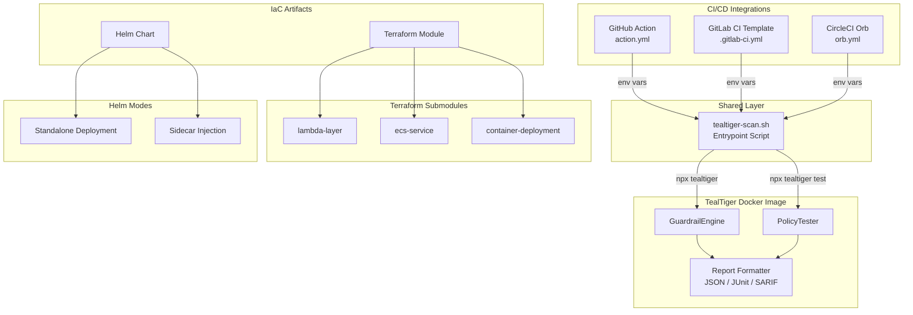

# Design Document: CI/CD and IaC Integration Artifacts for TealTiger v1.1.x

## Overview

This design covers the creation of six concrete integration artifacts that the existing launch pipeline (CICDPublisher, IaCPublisher) is already wired to publish but which do not yet exist:

1. **Shared Scan Entrypoint Script** (`tealtiger-scan.sh`) — single source of truth for scan execution logic
2. **GitHub Action** — Docker-based composite action for GitHub Marketplace
3. **GitLab CI Template** — reusable `.gitlab-ci.yml` with `include:` support
4. **CircleCI Orb** — reusable orb with commands, jobs, and executor
5. **Terraform Module** — root module with `lambda-layer`, `ecs-service`, and `container-deployment` submodules
6. **Helm Chart** — Kubernetes chart supporting standalone and sidecar deployment modes

All three CI/CD integrations (GitHub Action, GitLab CI, CircleCI Orb) delegate scan execution to the shared entrypoint script, ensuring consistent behavior. The IaC artifacts (Terraform, Helm) deploy TealTiger infrastructure using the official Docker image (`tealtigeradmin/tealtiger-docker` on Docker Hub, `ghcr.io/agentguard-ai/tealtiger` on GHCR).

### Design Rationale

- **Shared entrypoint**: A single bash script avoids duplicating scan/policy-test logic across three CI platforms. Each CI integration maps its platform-specific inputs to environment variables and calls `tealtiger-scan.sh`.
- **Docker-based GitHub Action**: Uses the existing TealTiger Docker image directly, avoiding a separate build step and ensuring the action always runs the same code as the container image.
- **Terraform submodules**: Separate submodules for Lambda layer, ECS, and generic container keep concerns isolated and allow users to adopt only what they need.
- **Helm dual-mode**: Supporting both standalone Deployment and sidecar injection covers the two dominant Kubernetes deployment patterns for security sidecars.

## Architecture



### File Layout

```
integrations/
├── cicd/
│   ├── shared/
│   │   └── tealtiger-scan.sh          # Shared entrypoint (Req 6)
│   ├── github-action/
│   │   ├── action.yml                 # GitHub Action metadata (Req 1)
│   │   ├── Dockerfile                 # Thin wrapper around TealTiger image
│   │   ├── README.md
│   │   ├── LICENSE                    # Apache 2.0
│   │   └── examples/
│   │       ├── basic-scan.yml
│   │       └── advanced-policy-sarif.yml
│   ├── gitlab-ci/
│   │   ├── .gitlab-ci.yml            # Reusable template (Req 2)
│   │   ├── README.md
│   │   ├── LICENSE
│   │   └── examples/
│   │       ├── basic-scan.yml
│   │       └── advanced-policy-codequality.yml
│   └── circleci-orb/
│       ├── orb.yml                    # CircleCI Orb definition (Req 3)
│       ├── README.md
│       └── LICENSE
├── terraform/
│   ├── main.tf                        # Root module (Req 4)
│   ├── variables.tf
│   ├── outputs.tf
│   ├── versions.tf
│   ├── README.md
│   ├── LICENSE
│   ├── modules/
│   │   ├── lambda-layer/
│   │   │   ├── main.tf
│   │   │   ├── variables.tf
│   │   │   └── outputs.tf
│   │   ├── ecs-service/
│   │   │   ├── main.tf
│   │   │   ├── variables.tf
│   │   │   └── outputs.tf
│   │   └── container-deployment/
│   │       ├── main.tf
│   │       ├── variables.tf
│   │       └── outputs.tf
│   └── examples/
│       ├── lambda-layer.tfvars
│       ├── ecs-service.tfvars
│       └── container-deployment.tfvars
└── helm/
    └── tealtiger/
        ├── Chart.yaml                 # Helm chart metadata (Req 5)
        ├── values.yaml
        ├── values.schema.json
        ├── README.md
        ├── LICENSE
        ├── templates/
        │   ├── _helpers.tpl
        │   ├── deployment.yaml
        │   ├── service.yaml
        │   ├── configmap.yaml
        │   ├── serviceaccount.yaml
        │   ├── ingress.yaml
        │   └── NOTES.txt
        └── examples/
            ├── standalone-values.yaml
            └── sidecar-values.yaml
```

## Components and Interfaces

### 1. Shared Scan Entrypoint (`tealtiger-scan.sh`)

The entrypoint script is a POSIX-compatible bash script that all CI/CD integrations invoke. It reads configuration from environment variables and delegates to the TealTiger CLI inside the Docker container.

**Environment Variable Interface:**

| Variable | Type | Default | Description |
|---|---|---|---|
| `TEALTIGER_SCAN_PATH` | string | (required) | Directory or glob of files to scan |
| `TEALTIGER_GUARDRAILS` | string | `pii,prompt-injection,content-moderation` | Comma-separated guardrails |
| `TEALTIGER_SENSITIVITY` | enum | `medium` | `low`, `medium`, or `high` |
| `TEALTIGER_POLICY_FILE` | string | (empty) | Path to policy config file |
| `TEALTIGER_FAIL_ON_FINDING` | boolean | `true` | Exit non-zero on violations |
| `TEALTIGER_REPORT_FORMAT` | enum | `json` | `json`, `junit`, or `sarif` |
| `TEALTIGER_REPORT_OUTPUT` | string | `./tealtiger-report` | Output directory for reports |

**Exit Codes:**
- `0` — scan passed (no violations, or `TEALTIGER_FAIL_ON_FINDING=false`)
- `1` — scan found violations and `TEALTIGER_FAIL_ON_FINDING=true`
- `2` — invalid configuration (missing scan path, path doesn't exist, etc.)

**Script Flow:**
1. Validate `TEALTIGER_SCAN_PATH` exists and is non-empty
2. Apply defaults for unset variables
3. Run guardrail scan: `npx tealtiger scan --path "$TEALTIGER_SCAN_PATH" --guardrails "$TEALTIGER_GUARDRAILS" --sensitivity "$TEALTIGER_SENSITIVITY" --format "$TEALTIGER_REPORT_FORMAT" --output "$TEALTIGER_REPORT_OUTPUT/scan-report"`
4. If `TEALTIGER_POLICY_FILE` is set, run policy test: `npx tealtiger test "$TEALTIGER_POLICY_FILE" --format "$TEALTIGER_REPORT_FORMAT" --output "$TEALTIGER_REPORT_OUTPUT/policy-report"`
5. Merge exit codes (any failure = failure)
6. Exit with appropriate code

### 2. GitHub Action (`action.yml`)

Docker-based action that wraps the TealTiger image and invokes the shared entrypoint.

**Inputs** (mapped to env vars for `tealtiger-scan.sh`):
- `scan-path` (required) → `TEALTIGER_SCAN_PATH`
- `guardrails` (default: `pii,prompt-injection,content-moderation`) → `TEALTIGER_GUARDRAILS`
- `sensitivity` (default: `medium`) → `TEALTIGER_SENSITIVITY`
- `policy-file` (default: empty) → `TEALTIGER_POLICY_FILE`
- `fail-on-finding` (default: `true`) → `TEALTIGER_FAIL_ON_FINDING`
- `report-format` (default: `json`) → `TEALTIGER_REPORT_FORMAT`

**Outputs**:
- `report` — path to the generated scan report file
- `findings-count` — number of violations found
- `passed` — `true` or `false`

**Dockerfile**: Thin wrapper that copies `tealtiger-scan.sh` into the TealTiger base image and sets it as the entrypoint.

```dockerfile
FROM tealtigeradmin/tealtiger-docker:latest
COPY tealtiger-scan.sh /usr/local/bin/tealtiger-scan.sh
RUN chmod +x /usr/local/bin/tealtiger-scan.sh
ENTRYPOINT ["/usr/local/bin/tealtiger-scan.sh"]
```

### 3. GitLab CI Template (`.gitlab-ci.yml`)

Reusable template defining two jobs in the `test` stage:

- **`tealtiger-scan`**: Runs guardrail scan, produces JUnit and Code Quality artifacts
- **`tealtiger-policy-test`**: Runs policy tests, produces JUnit artifact

Both jobs use the TealTiger Docker image and invoke `tealtiger-scan.sh` via a `before_script` that downloads the shared entrypoint from the release assets or embeds it inline.

**Artifact Configuration:**
- JUnit report: `artifacts.reports.junit` pointing to the JUnit XML output
- Code Quality: `artifacts.reports.codequality` pointing to a GitLab Code Quality JSON file

### 4. CircleCI Orb (`orb.yml`)

Defines:
- **Executor** `tealtiger`: Docker executor using the TealTiger image
- **Command** `scan`: Runs guardrail scan with configurable parameters
- **Command** `policy-test`: Runs policy tests with configurable parameters
- **Job** `full-scan`: Combines `scan` and `policy-test` commands, stores test results via `store_test_results`

Parameters mirror the GitHub Action inputs for consistency.

### 5. Terraform Module

**Root module** (`integrations/terraform/`) acts as a facade, accepting common variables and routing to submodules.

**Submodules:**

| Submodule | Purpose | Key Resources |
|---|---|---|
| `lambda-layer` | AWS Lambda layer with TealTiger SDK | `aws_lambda_layer_version` |
| `ecs-service` | ECS Fargate service running TealTiger container | `aws_ecs_service`, `aws_ecs_task_definition`, `aws_ecs_cluster` (optional) |
| `container-deployment` | Generic container deployment | `aws_ecs_task_definition` with configurable env vars |

**Common Variables:**
- `tealtiger_version` (string, default: `"1.1.1"`)
- `guardrails` (list of strings, default: `["pii", "prompt-injection", "content-moderation"]`)
- `policy_file_path` (string, default: `""`)
- `tags` (map of strings)

**Outputs:**
- `lambda_layer_arn` — from lambda-layer submodule
- `ecs_service_arn` — from ecs-service submodule
- `container_endpoint_url` — from container-deployment submodule

### 6. Helm Chart

**Chart.yaml:**
- `apiVersion: v2`
- `name: tealtiger`
- `version: 1.1.1`
- `appVersion: 1.1.1`
- `type: application`

**Deployment Modes** (controlled by `mode` value):

| Mode | Resources Created |
|---|---|
| `standalone` | Deployment, Service, ServiceAccount, ConfigMap, optional Ingress |
| `sidecar` | ConfigMap with sidecar container spec, ServiceAccount |

**Key values.yaml structure:**
```yaml
mode: standalone  # or sidecar
image:
  repository: tealtigeradmin/tealtiger-docker
  tag: "1.1.1"
  pullPolicy: IfNotPresent
guardrails:
  pii: true
  promptInjection: true
  contentModeration: true
sensitivity: medium
policyConfig: {}
resources:
  requests:
    memory: 128Mi
    cpu: 100m
  limits:
    memory: 256Mi
    cpu: 500m
probes:
  liveness:
    path: /healthz
    port: 8080
    initialDelaySeconds: 10
  readiness:
    path: /readyz
    port: 8080
    initialDelaySeconds: 5
serviceAccount:
  create: true
  name: ""
ingress:
  enabled: false
```

## Data Models

### Scan Report (JSON format)

```typescript
interface ScanReport {
  version: string;           // TealTiger version
  timestamp: string;         // ISO 8601
  scanPath: string;
  guardrails: string[];
  sensitivity: 'low' | 'medium' | 'high';
  summary: {
    totalFiles: number;
    filesScanned: number;
    findingsCount: number;
    passed: boolean;
  };
  findings: Finding[];
  policyResults?: PolicyTestResult;
}

interface Finding {
  guardrail: 'pii' | 'prompt-injection' | 'content-moderation';
  severity: 'low' | 'medium' | 'high' | 'critical';
  file: string;
  line?: number;
  column?: number;
  message: string;
  details: Record<string, unknown>;
}

interface PolicyTestResult {
  policyFile: string;
  totalTests: number;
  passed: number;
  failed: number;
  results: PolicyTestCase[];
}

interface PolicyTestCase {
  name: string;
  passed: boolean;
  expected: string;
  actual: string;
  duration: number;
}
```

### JUnit XML Report

Standard JUnit XML format where:
- Each guardrail is a `<testsuite>`
- Each scanned file is a `<testcase>`
- Findings are `<failure>` elements with guardrail details

### SARIF Report

SARIF v2.1.0 format compatible with GitHub Code Scanning:
- `tool.driver.name`: `"TealTiger"`
- `tool.driver.rules[]`: One rule per guardrail type
- `results[]`: One result per finding with `physicalLocation`

### GitLab Code Quality Report

GitLab Code Quality JSON format:
- Array of issue objects with `description`, `fingerprint`, `severity`, `location.path`, `location.lines.begin`

### Terraform Variables Schema

```hcl
variable "tealtiger_version" {
  type        = string
  default     = "1.1.1"
  description = "TealTiger SDK version to deploy"
  validation {
    condition     = can(regex("^\\d+\\.\\d+\\.\\d+$", var.tealtiger_version))
    error_message = "Version must be valid semver (e.g., 1.1.1)"
  }
}

variable "guardrails" {
  type        = list(string)
  default     = ["pii", "prompt-injection", "content-moderation"]
  description = "Guardrails to enable"
}

variable "policy_file_path" {
  type        = string
  default     = ""
  description = "Path to TealTiger policy configuration file"
}
```

### Helm Values Schema (`values.schema.json`)

JSON Schema validating:
- `mode` must be `"standalone"` or `"sidecar"`
- `image.repository` must be a non-empty string
- `image.tag` must be a non-empty string
- `guardrails.*` must be booleans
- `sensitivity` must be one of `"low"`, `"medium"`, `"high"`
- `resources.requests.memory` and `resources.limits.memory` must be valid Kubernetes resource quantities
- `probes.liveness` and `probes.readiness` must have `path`, `port`, `initialDelaySeconds`


## Correctness Properties

*A property is a characteristic or behavior that should hold true across all valid executions of a system — essentially, a formal statement about what the system should do. Properties serve as the bridge between human-readable specifications and machine-verifiable correctness guarantees.*

### Property 1: SARIF Report Schema Validity

*For any* set of scan findings (including zero findings), when the report format is `sarif`, the generated report SHALL be valid SARIF v2.1.0 JSON that includes `tool.driver.name` equal to `"TealTiger"`, a `tool.driver.rules[]` array with one entry per guardrail type, and a `results[]` array with one entry per finding containing a valid `physicalLocation`.

**Validates: Requirements 1.12**

### Property 2: Cross-Artifact Parameter Consistency

*For any* configurable parameter defined in the GitHub Action's `action.yml` inputs (scan-path, guardrails, sensitivity, policy-file, fail-on-finding, report-format), the CircleCI Orb SHALL define a matching parameter with the same name (or kebab-case equivalent), same type semantics, and same default value. The GitLab CI Template SHALL reference the corresponding `TEALTIGER_*` environment variable for each parameter.

**Validates: Requirements 3.5, 6.2**

### Property 3: Helm Values Schema Validates Defaults

*For any* `values.yaml` that conforms to the `values.schema.json` JSON Schema, the Helm chart SHALL template without error. Additionally, the shipped default `values.yaml` SHALL pass validation against `values.schema.json`.

**Validates: Requirements 5.10**

### Property 4: Entrypoint Default Configuration

*For any* invocation of `tealtiger-scan.sh` where a subset of the optional environment variables (`TEALTIGER_GUARDRAILS`, `TEALTIGER_SENSITIVITY`, `TEALTIGER_FAIL_ON_FINDING`, `TEALTIGER_REPORT_FORMAT`) are unset, the script SHALL apply the correct defaults: guardrails=`pii,prompt-injection,content-moderation`, sensitivity=`medium`, fail-on-finding=`true`, report-format=`json`.

**Validates: Requirements 6.3, 6.4, 6.5, 6.6**

### Property 5: Entrypoint Exit Code Correctness

*For any* execution of `tealtiger-scan.sh`:
- If `TEALTIGER_SCAN_PATH` does not exist or is empty, the exit code SHALL be `2`.
- If the scan completes with zero violations, the exit code SHALL be `0` regardless of `TEALTIGER_FAIL_ON_FINDING`.
- If the scan completes with one or more violations and `TEALTIGER_FAIL_ON_FINDING` is `true`, the exit code SHALL be `1`.
- If the scan completes with one or more violations and `TEALTIGER_FAIL_ON_FINDING` is `false`, the exit code SHALL be `0`.

**Validates: Requirements 6.7, 6.8, 6.10**

### Property 6: Report File Output

*For any* valid `TEALTIGER_REPORT_OUTPUT` path and any scan execution that completes (exit code 0 or 1), the entrypoint script SHALL write a report file to the specified output directory. The report file SHALL be parseable in the format specified by `TEALTIGER_REPORT_FORMAT`.

**Validates: Requirements 6.9**

## Error Handling

### Entrypoint Script Errors

| Condition | Exit Code | Behavior |
|---|---|---|
| `TEALTIGER_SCAN_PATH` not set or empty string | 2 | Print error: `"Error: TEALTIGER_SCAN_PATH is required but not set or empty"` |
| `TEALTIGER_SCAN_PATH` path does not exist | 2 | Print error: `"Error: Scan path does not exist: <path>"` |
| Invalid `TEALTIGER_SENSITIVITY` value | 2 | Print error: `"Error: Invalid sensitivity '<value>'. Must be low, medium, or high"` |
| Invalid `TEALTIGER_REPORT_FORMAT` value | 2 | Print error: `"Error: Invalid report format '<value>'. Must be json, junit, or sarif"` |
| Invalid `TEALTIGER_GUARDRAILS` value | 2 | Print error: `"Error: Invalid guardrail '<value>'. Valid: pii, prompt-injection, content-moderation"` |
| TealTiger CLI not found in container | 2 | Print error: `"Error: TealTiger CLI not found. Ensure you are running inside the TealTiger Docker image"` |
| Scan execution failure (internal error) | 3 | Print error with details, write partial report if possible |
| Report output directory not writable | 2 | Print error: `"Error: Cannot write to output directory: <path>"` |

### CI/CD Integration Error Handling

Each CI/CD integration handles errors by:
1. Mapping platform-specific error reporting (GitHub Actions `::error::`, GitLab CI job failure, CircleCI step failure)
2. Ensuring the scan report is always uploaded as an artifact even on failure
3. Providing clear error messages that reference TealTiger documentation

### Terraform Module Error Handling

- Variable validation blocks in `variables.tf` catch invalid inputs at `terraform plan` time
- Submodules use `precondition` blocks on resources to validate runtime requirements
- Outputs use `depends_on` to ensure resources are fully created before exposing identifiers

### Helm Chart Error Handling

- `values.schema.json` catches invalid values at `helm install` time
- Template `required` function calls ensure mandatory values are provided
- `_helpers.tpl` includes validation helpers for mode selection
- NOTES.txt includes troubleshooting guidance

## Testing Strategy

### Unit Tests (Example-Based)

Unit tests verify specific structural and content requirements for each artifact:

**GitHub Action tests:**
- `action.yml` is valid YAML with `runs.using: docker`
- All 6 inputs are defined with correct types and defaults
- All 3 outputs are defined
- Branding icon and color are set
- README.md contains usage examples and quickstart snippet
- LICENSE is Apache 2.0
- Examples directory contains basic-scan.yml and advanced-policy-sarif.yml

**GitLab CI Template tests:**
- `.gitlab-ci.yml` is valid YAML
- `tealtiger-scan` and `tealtiger-policy-test` jobs are defined
- Both jobs use the TealTiger Docker image
- Both jobs are in the `test` stage
- JUnit and Code Quality artifact reports are configured
- All `TEALTIGER_*` variables are referenced

**CircleCI Orb tests:**
- `orb.yml` is valid CircleCI orb YAML
- `scan` and `policy-test` commands are defined
- `full-scan` job is defined
- `tealtiger` executor is defined with correct Docker image
- `store_test_results` step is present
- Inline examples are present

**Terraform Module tests:**
- `versions.tf` requires Terraform >= 1.5 and AWS provider >= 5.0
- All three submodule directories exist with main.tf, variables.tf, outputs.tf
- Root module variables include `tealtiger_version`, `guardrails`, `policy_file_path`
- Root module outputs include `lambda_layer_arn`, `ecs_service_arn`, `container_endpoint_url`
- Example `.tfvars` files exist for all three scenarios
- `terraform validate` passes on root module (with mock provider)

**Helm Chart tests:**
- `Chart.yaml` has apiVersion v2, correct name and version
- `values.yaml` has correct defaults (128Mi request, 256Mi limit, mode=standalone)
- `values.schema.json` is valid JSON Schema
- All template files exist (_helpers.tpl, deployment.yaml, service.yaml, configmap.yaml, serviceaccount.yaml, ingress.yaml, NOTES.txt)
- `helm lint` passes without errors
- Standalone mode templates produce Deployment + Service
- Sidecar mode templates produce ConfigMap with sidecar spec

**Entrypoint Script tests:**
- Script is valid bash (shellcheck passes)
- Script references all 6 `TEALTIGER_*` environment variables
- All three CI/CD integrations reference `tealtiger-scan.sh`

### Property-Based Tests

Property-based tests use `fast-check` (TypeScript) to verify universal properties across generated inputs. Each test runs a minimum of 100 iterations.

**Property test implementations:**

1. **SARIF Report Validity** (Property 1)
   - Generate random sets of findings (0 to N findings, random guardrail types, random file paths)
   - Call the SARIF formatter
   - Validate output against SARIF v2.1.0 JSON Schema
   - Tag: `Feature: cicd-iac-integrations, Property 1: SARIF report schema validity`

2. **Cross-Artifact Parameter Consistency** (Property 2)
   - Parse action.yml, orb.yml, and .gitlab-ci.yml
   - For each parameter in action.yml, verify matching parameter exists in orb.yml with same default
   - For each parameter in action.yml, verify corresponding TEALTIGER_* variable is referenced in .gitlab-ci.yml
   - Tag: `Feature: cicd-iac-integrations, Property 2: Cross-artifact parameter consistency`

3. **Helm Values Schema Validates Defaults** (Property 3)
   - Generate random valid values.yaml configurations conforming to the schema
   - Validate each against values.schema.json using a JSON Schema validator
   - Verify the default values.yaml passes validation
   - Tag: `Feature: cicd-iac-integrations, Property 3: Helm values schema validates defaults`

4. **Entrypoint Default Configuration** (Property 4)
   - Generate random subsets of the 4 optional environment variables to leave unset
   - For each unset variable, verify the script applies the correct default
   - Tag: `Feature: cicd-iac-integrations, Property 4: Entrypoint default configuration`

5. **Entrypoint Exit Code Correctness** (Property 5)
   - Generate random combinations of: scan path validity (exists/missing/empty), finding count (0 to N), fail-on-finding (true/false)
   - Verify exit code matches the specification: 2 for invalid path, 1 for violations+fail-on-finding, 0 otherwise
   - Tag: `Feature: cicd-iac-integrations, Property 5: Entrypoint exit code correctness`

6. **Report File Output** (Property 6)
   - Generate random output paths and report formats
   - Execute the scan and verify a parseable report file exists at the specified path
   - Tag: `Feature: cicd-iac-integrations, Property 6: Report file output`

### Testing Library

- **Property-based testing**: `fast-check` (TypeScript) — well-maintained, integrates with Jest/Vitest
- **Unit testing**: Jest (already used in the project)
- **YAML validation**: `js-yaml` for parsing action.yml, orb.yml, .gitlab-ci.yml
- **JSON Schema validation**: `ajv` for validating SARIF output and Helm values
- **Shell testing**: `shellcheck` for static analysis of `tealtiger-scan.sh`, `bats` for behavioral tests
- **Helm testing**: `helm lint` and `helm template` for chart validation
- **Terraform testing**: `terraform validate` for HCL syntax validation
