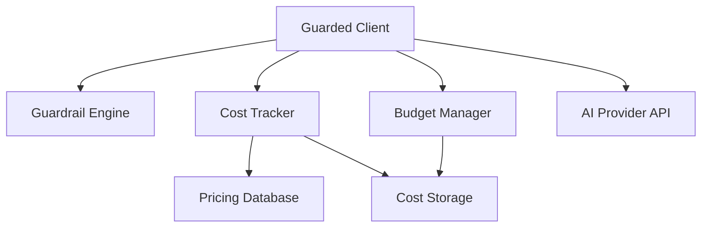

# Design Document

## Overview

This design specifies the implementation of cost tracking, budget management, and guarded client wrappers for the Python SDK to achieve feature parity with the TypeScript SDK v0.2.2. The implementation will follow Python idioms (async/await, snake_case, Pydantic models) while maintaining API compatibility with the TypeScript SDK's patterns.

The design ports six major components:
1. **Cost Tracking System** - Calculate and track AI model costs
2. **Cost Storage** - Persist cost records for analytics
3. **Budget Management** - Enforce spending limits with alerts
4. **GuardedOpenAI Client** - OpenAI wrapper with security and cost tracking
5. **GuardedAnthropic Client** - Anthropic wrapper with security and cost tracking
6. **GuardedAzureOpenAI Client** - Azure OpenAI wrapper with security and cost tracking

## Architecture

### Module Structure

```
src/agentguard/
├── cost/
│   ├── __init__.py
│   ├── types.py           # Pydantic models for cost tracking
│   ├── pricing.py         # Model pricing database
│   ├── tracker.py         # CostTracker class
│   ├── storage.py         # Storage interfaces and implementations
│   ├── budget.py          # BudgetManager class
│   └── utils.py           # Utility functions
├── clients/
│   ├── __init__.py
│   ├── guarded_openai.py      # GuardedOpenAI client
│   ├── guarded_anthropic.py   # GuardedAnthropic client
│   └── guarded_azure_openai.py # GuardedAzureOpenAI client
└── (existing modules)
```

### Component Interactions




## Components and Interfaces

### 1. Cost Tracking Types (cost/types.py)

Define Pydantic models for all cost tracking data structures:

```python
from pydantic import BaseModel, Field
from typing import Literal, Optional, Dict, Any, List
from datetime import datetime

ModelProvider = Literal['openai', 'anthropic', 'azure-openai', 'google', 'cohere', 'custom']

class ModelPricing(BaseModel):
    model: str
    provider: ModelProvider
    input_cost_per_1k: float
    output_cost_per_1k: float
    image_cost: Optional[float] = None
    audio_cost_per_second: Optional[float] = None
    last_updated: str

class TokenUsage(BaseModel):
    input_tokens: int
    output_tokens: int
    total_tokens: int
    images: Optional[int] = None
    audio_duration: Optional[float] = None

class CostBreakdown(BaseModel):
    input_cost: float
    output_cost: float
    image_cost: Optional[float] = None
    audio_cost: Optional[float] = None

class CostEstimate(BaseModel):
    estimated_cost: float
    model: str
    provider: ModelProvider
    estimated_tokens: TokenUsage
    breakdown: CostBreakdown
    timestamp: str

class CostRecord(BaseModel):
    id: str
    request_id: str
    agent_id: str
    model: str
    provider: ModelProvider
    actual_tokens: TokenUsage
    actual_cost: float
    breakdown: CostBreakdown
    timestamp: str
    metadata: Optional[Dict[str, Any]] = None

BudgetPeriod = Literal['hourly', 'daily', 'weekly', 'monthly', 'total']
BudgetAction = Literal['alert', 'block', 'throttle']

class BudgetScope(BaseModel):
    type: Literal['agent', 'project', 'organization']
    id: str

class BudgetConfig(BaseModel):
    id: str
    name: str
    limit: float
    period: BudgetPeriod
    alert_thresholds: List[int]
    action: BudgetAction
    scope: Optional[BudgetScope] = None
    enabled: bool = True
    created_at: str
    updated_at: str

class BudgetStatus(BaseModel):
    budget: BudgetConfig
    current_spending: float
    remaining: float
    percentage_used: float
    is_exceeded: bool
    active_alerts: List[int]
    period_start: str
    period_end: str
    last_updated: str

AlertSeverity = Literal['info', 'warning', 'critical']

class CostAlert(BaseModel):
    id: str
    budget_id: str
    threshold: int
    current_spending: float
    limit: float
    message: str
    severity: AlertSeverity
    timestamp: str
    acknowledged: bool = False

class CostSummary(BaseModel):
    total_cost: float
    total_requests: int
    average_cost_per_request: float
    by_model: Dict[str, float]
    by_provider: Dict[ModelProvider, float]
    by_agent: Dict[str, float]
    period: Dict[str, str]
    total_tokens: Dict[str, int]
```


### 2. Pricing Database (cost/pricing.py)

Maintain a comprehensive pricing database for all supported models:

```python
from typing import Dict, List, Optional
from .types import ModelPricing, ModelProvider

# Pricing database with 30+ models
MODEL_PRICING: Dict[str, ModelPricing] = {
    # OpenAI GPT-4 models
    'gpt-4': ModelPricing(
        model='gpt-4',
        provider='openai',
        input_cost_per_1k=0.03,
        output_cost_per_1k=0.06,
        last_updated='2026-01-31'
    ),
    'gpt-4-turbo': ModelPricing(
        model='gpt-4-turbo',
        provider='openai',
        input_cost_per_1k=0.01,
        output_cost_per_1k=0.03,
        last_updated='2026-01-31'
    ),
    # ... (30+ models total)
}

def get_model_pricing(model: str, provider: Optional[ModelProvider] = None) -> Optional[ModelPricing]:
    """Get pricing for a model with fuzzy matching."""
    # Exact match
    if model in MODEL_PRICING:
        return MODEL_PRICING[model]
    
    # Case-insensitive match
    normalized = model.lower().strip()
    for key, pricing in MODEL_PRICING.items():
        if key.lower() == normalized:
            return pricing
    
    # Partial match for versioned models
    for key, pricing in MODEL_PRICING.items():
        if normalized.startswith(key.lower()) or key.lower().startswith(normalized):
            if not provider or pricing.provider == provider:
                return pricing
    
    return None

def get_provider_models(provider: ModelProvider) -> List[ModelPricing]:
    """Get all models for a provider."""
    return [p for p in MODEL_PRICING.values() if p.provider == provider]

def is_model_supported(model: str) -> bool:
    """Check if a model has pricing data."""
    return get_model_pricing(model) is not None

def get_supported_models() -> List[str]:
    """Get list of all supported models."""
    return list(MODEL_PRICING.keys())

def get_supported_providers() -> List[ModelProvider]:
    """Get list of all supported providers."""
    providers = set(p.provider for p in MODEL_PRICING.values())
    return list(providers)
```


### 3. Cost Tracker (cost/tracker.py)

Core component for calculating costs:

```python
from typing import Optional, Dict
from .types import (
    CostEstimate, CostRecord, TokenUsage, ModelProvider, 
    ModelPricing, CostBreakdown
)
from .pricing import get_model_pricing
from .utils import generate_id
from datetime import datetime
import logging

logger = logging.getLogger(__name__)

class CostTrackerConfig(BaseModel):
    enabled: bool = True
    persist_records: bool = True
    custom_pricing: Optional[Dict[str, ModelPricing]] = None
    default_provider: Optional[ModelProvider] = None
    enable_budgets: bool = True
    enable_alerts: bool = True

class CostTracker:
    def __init__(self, config: Optional[CostTrackerConfig] = None):
        self.config = config or CostTrackerConfig()
        self.custom_pricing: Dict[str, ModelPricing] = {}
        
        if config and config.custom_pricing:
            self.custom_pricing = config.custom_pricing
    
    def estimate_cost(
        self,
        model: str,
        estimated_tokens: TokenUsage,
        provider: Optional[ModelProvider] = None
    ) -> CostEstimate:
        """Estimate cost before API call."""
        if not self.config.enabled:
            return self._create_zero_estimate(model, provider or 'openai', estimated_tokens)
        
        pricing = self._get_pricing(model, provider)
        if not pricing:
            logger.warning(f"No pricing found for model: {model}")
            return self._create_zero_estimate(model, provider or 'custom', estimated_tokens)
        
        breakdown = self._calculate_breakdown(pricing, estimated_tokens)
        total_cost = sum(v for v in breakdown.dict().values() if v is not None)
        
        return CostEstimate(
            estimated_cost=total_cost,
            model=pricing.model,
            provider=pricing.provider,
            estimated_tokens=estimated_tokens,
            breakdown=breakdown,
            timestamp=datetime.utcnow().isoformat()
        )
    
    def calculate_actual_cost(
        self,
        request_id: str,
        agent_id: str,
        model: str,
        actual_tokens: TokenUsage,
        provider: Optional[ModelProvider] = None,
        metadata: Optional[Dict] = None
    ) -> CostRecord:
        """Calculate actual cost after API call."""
        if not self.config.enabled:
            return self._create_zero_record(
                request_id, agent_id, model, provider or 'openai', actual_tokens
            )
        
        pricing = self._get_pricing(model, provider)
        if not pricing:
            logger.warning(f"No pricing found for model: {model}")
            return self._create_zero_record(
                request_id, agent_id, model, provider or 'custom', actual_tokens
            )
        
        breakdown = self._calculate_breakdown(pricing, actual_tokens)
        total_cost = sum(v for v in breakdown.dict().values() if v is not None)
        
        return CostRecord(
            id=generate_id(),
            request_id=request_id,
            agent_id=agent_id,
            model=pricing.model,
            provider=pricing.provider,
            actual_tokens=actual_tokens,
            actual_cost=total_cost,
            breakdown=breakdown,
            timestamp=datetime.utcnow().isoformat(),
            metadata=metadata
        )
    
    def add_custom_pricing(self, model: str, pricing: ModelPricing):
        """Add custom pricing for a model."""
        self.custom_pricing[model] = pricing
    
    def remove_custom_pricing(self, model: str):
        """Remove custom pricing for a model."""
        self.custom_pricing.pop(model, None)
    
    def get_pricing(self, model: str) -> Optional[ModelPricing]:
        """Get pricing for a model (custom or default)."""
        return self._get_pricing(model)
    
    def _get_pricing(self, model: str, provider: Optional[ModelProvider] = None) -> Optional[ModelPricing]:
        """Internal method to get pricing."""
        return self.custom_pricing.get(model) or get_model_pricing(model, provider)
    
    def _calculate_breakdown(self, pricing: ModelPricing, tokens: TokenUsage) -> CostBreakdown:
        """Calculate cost breakdown."""
        input_cost = (tokens.input_tokens / 1000) * pricing.input_cost_per_1k
        output_cost = (tokens.output_tokens / 1000) * pricing.output_cost_per_1k
        
        image_cost = None
        if tokens.images and pricing.image_cost:
            image_cost = tokens.images * pricing.image_cost
        
        audio_cost = None
        if tokens.audio_duration and pricing.audio_cost_per_second:
            audio_cost = tokens.audio_duration * pricing.audio_cost_per_second
        
        return CostBreakdown(
            input_cost=input_cost,
            output_cost=output_cost,
            image_cost=image_cost,
            audio_cost=audio_cost
        )
    
    def _create_zero_estimate(self, model: str, provider: ModelProvider, tokens: TokenUsage) -> CostEstimate:
        """Create zero-cost estimate."""
        return CostEstimate(
            estimated_cost=0.0,
            model=model,
            provider=provider,
            estimated_tokens=tokens,
            breakdown=CostBreakdown(input_cost=0.0, output_cost=0.0),
            timestamp=datetime.utcnow().isoformat()
        )
    
    def _create_zero_record(
        self, request_id: str, agent_id: str, model: str, 
        provider: ModelProvider, tokens: TokenUsage
    ) -> CostRecord:
        """Create zero-cost record."""
        return CostRecord(
            id=generate_id(),
            request_id=request_id,
            agent_id=agent_id,
            model=model,
            provider=provider,
            actual_tokens=tokens,
            actual_cost=0.0,
            breakdown=CostBreakdown(input_cost=0.0, output_cost=0.0),
            timestamp=datetime.utcnow().isoformat()
        )
```


### 4. Cost Storage (cost/storage.py)

Abstract interface and in-memory implementation:

```python
from abc import ABC, abstractmethod
from typing import List, Optional, Dict
from datetime import datetime
from .types import CostRecord, CostSummary, ModelProvider

class CostStorage(ABC):
    """Abstract interface for cost storage."""
    
    @abstractmethod
    async def store(self, record: CostRecord) -> None:
        """Store a cost record."""
        pass
    
    @abstractmethod
    async def get(self, id: str) -> Optional[CostRecord]:
        """Get a cost record by ID."""
        pass
    
    @abstractmethod
    async def get_by_request_id(self, request_id: str) -> List[CostRecord]:
        """Get cost records by request ID."""
        pass
    
    @abstractmethod
    async def get_by_agent_id(
        self, agent_id: str, 
        start_date: Optional[datetime] = None,
        end_date: Optional[datetime] = None
    ) -> List[CostRecord]:
        """Get cost records by agent ID."""
        pass
    
    @abstractmethod
    async def get_by_date_range(
        self, start_date: datetime, end_date: datetime
    ) -> List[CostRecord]:
        """Get cost records within a time range."""
        pass
    
    @abstractmethod
    async def get_summary(
        self, start_date: datetime, end_date: datetime,
        agent_id: Optional[str] = None
    ) -> CostSummary:
        """Get cost summary for a time period."""
        pass
    
    @abstractmethod
    async def delete_older_than(self, before_date: datetime) -> int:
        """Delete cost records older than a date."""
        pass
    
    @abstractmethod
    async def clear(self) -> None:
        """Clear all cost records."""
        pass

class InMemoryCostStorage(CostStorage):
    """In-memory cost storage implementation."""
    
    def __init__(self):
        self.records: Dict[str, CostRecord] = {}
    
    async def store(self, record: CostRecord) -> None:
        self.records[record.id] = record
    
    async def get(self, id: str) -> Optional[CostRecord]:
        return self.records.get(id)
    
    async def get_by_request_id(self, request_id: str) -> List[CostRecord]:
        return [r for r in self.records.values() if r.request_id == request_id]
    
    async def get_by_agent_id(
        self, agent_id: str,
        start_date: Optional[datetime] = None,
        end_date: Optional[datetime] = None
    ) -> List[CostRecord]:
        records = [r for r in self.records.values() if r.agent_id == agent_id]
        
        if start_date:
            records = [r for r in records if datetime.fromisoformat(r.timestamp) >= start_date]
        if end_date:
            records = [r for r in records if datetime.fromisoformat(r.timestamp) <= end_date]
        
        return records
    
    async def get_by_date_range(
        self, start_date: datetime, end_date: datetime
    ) -> List[CostRecord]:
        return [
            r for r in self.records.values()
            if start_date <= datetime.fromisoformat(r.timestamp) <= end_date
        ]
    
    async def get_summary(
        self, start_date: datetime, end_date: datetime,
        agent_id: Optional[str] = None
    ) -> CostSummary:
        records = await self.get_by_date_range(start_date, end_date)
        
        if agent_id:
            records = [r for r in records if r.agent_id == agent_id]
        
        total_cost = sum(r.actual_cost for r in records)
        total_requests = len(records)
        avg_cost = total_cost / total_requests if total_requests > 0 else 0.0
        
        by_model: Dict[str, float] = {}
        by_provider: Dict[ModelProvider, float] = {}
        by_agent: Dict[str, float] = {}
        
        for r in records:
            by_model[r.model] = by_model.get(r.model, 0.0) + r.actual_cost
            by_provider[r.provider] = by_provider.get(r.provider, 0.0) + r.actual_cost
            by_agent[r.agent_id] = by_agent.get(r.agent_id, 0.0) + r.actual_cost
        
        total_tokens = {
            'input': sum(r.actual_tokens.input_tokens for r in records),
            'output': sum(r.actual_tokens.output_tokens for r in records),
            'total': sum(r.actual_tokens.total_tokens for r in records)
        }
        
        return CostSummary(
            total_cost=total_cost,
            total_requests=total_requests,
            average_cost_per_request=avg_cost,
            by_model=by_model,
            by_provider=by_provider,
            by_agent=by_agent,
            period={'start': start_date.isoformat(), 'end': end_date.isoformat()},
            total_tokens=total_tokens
        )
    
    async def delete_older_than(self, before_date: datetime) -> int:
        to_delete = [
            id for id, r in self.records.items()
            if datetime.fromisoformat(r.timestamp) < before_date
        ]
        for id in to_delete:
            del self.records[id]
        return len(to_delete)
    
    async def clear(self) -> None:
        self.records.clear()
    
    def size(self) -> int:
        """Get total number of records."""
        return len(self.records)
```


### 5. Budget Manager (cost/budget.py)

Budget enforcement and alert management:

```python
from typing import Dict, List, Optional
from datetime import datetime, timedelta
from .types import (
    BudgetConfig, BudgetStatus, CostAlert, CostRecord,
    BudgetPeriod, AlertSeverity
)
from .storage import CostStorage
from .utils import generate_id

class BudgetEnforcementResult(BaseModel):
    allowed: bool
    blocked_by: Optional[BudgetConfig] = None
    alerts: List[CostAlert] = []
    status: Optional[BudgetStatus] = None

class BudgetManager:
    def __init__(self, storage: CostStorage):
        self.budgets: Dict[str, BudgetConfig] = {}
        self.alerts: Dict[str, List[CostAlert]] = {}
        self.storage = storage
    
    def create_budget(
        self,
        name: str,
        limit: float,
        period: BudgetPeriod,
        alert_thresholds: List[int],
        action: str = 'block',
        scope: Optional[Dict] = None,
        enabled: bool = True
    ) -> BudgetConfig:
        """Create a new budget."""
        now = datetime.utcnow().isoformat()
        budget = BudgetConfig(
            id=generate_id(),
            name=name,
            limit=limit,
            period=period,
            alert_thresholds=alert_thresholds,
            action=action,
            scope=scope,
            enabled=enabled,
            created_at=now,
            updated_at=now
        )
        self.budgets[budget.id] = budget
        self.alerts[budget.id] = []
        return budget
    
    def update_budget(self, id: str, **updates) -> Optional[BudgetConfig]:
        """Update an existing budget."""
        budget = self.budgets.get(id)
        if not budget:
            return None
        
        updated_data = budget.dict()
        updated_data.update(updates)
        updated_data['updated_at'] = datetime.utcnow().isoformat()
        
        updated_budget = BudgetConfig(**updated_data)
        self.budgets[id] = updated_budget
        return updated_budget
    
    def delete_budget(self, id: str) -> bool:
        """Delete a budget."""
        self.alerts.pop(id, None)
        return self.budgets.pop(id, None) is not None
    
    def get_budget(self, id: str) -> Optional[BudgetConfig]:
        """Get a budget by ID."""
        return self.budgets.get(id)
    
    def get_all_budgets(self) -> List[BudgetConfig]:
        """Get all budgets."""
        return list(self.budgets.values())
    
    def get_budgets_by_scope(self, scope_type: str, scope_id: str) -> List[BudgetConfig]:
        """Get budgets for a specific scope."""
        return [
            b for b in self.budgets.values()
            if b.scope and b.scope.type == scope_type and b.scope.id == scope_id
        ]
    
    async def check_budget(
        self, agent_id: str, estimated_cost: float
    ) -> BudgetEnforcementResult:
        """Check if a cost would exceed any budgets."""
        relevant_budgets = self._get_relevant_budgets(agent_id)
        alerts: List[CostAlert] = []
        blocked_by: Optional[BudgetConfig] = None
        
        for budget in relevant_budgets:
            if not budget.enabled:
                continue
            
            status = await self.get_budget_status(budget.id)
            if not status:
                continue
            
            projected_spending = status.current_spending + estimated_cost
            projected_percentage = (projected_spending / budget.limit) * 100
            
            # Check for threshold alerts
            for threshold in budget.alert_thresholds:
                if projected_percentage >= threshold and status.percentage_used < threshold:
                    alert = self._create_alert(budget, threshold, projected_spending)
                    alerts.append(alert)
                    self._add_alert(budget.id, alert)
            
            # Check if budget would be exceeded
            if projected_spending > budget.limit and budget.action == 'block':
                blocked_by = budget
                break
        
        return BudgetEnforcementResult(
            allowed=blocked_by is None,
            blocked_by=blocked_by,
            alerts=alerts,
            status=await self.get_budget_status(blocked_by.id) if blocked_by else None
        )
    
    async def record_cost(self, record: CostRecord) -> None:
        """Record a cost and update budget tracking."""
        relevant_budgets = self._get_relevant_budgets(record.agent_id)
        
        for budget in relevant_budgets:
            if not budget.enabled:
                continue
            
            status = await self.get_budget_status(budget.id)
            if not status:
                continue
            
            existing_alerts = self.get_alerts(budget.id)
            existing_thresholds = {a.threshold for a in existing_alerts}
            
            for threshold in budget.alert_thresholds:
                if status.percentage_used >= threshold and threshold not in existing_thresholds:
                    alert = self._create_alert(budget, threshold, status.current_spending)
                    self._add_alert(budget.id, alert)
    
    async def get_budget_status(self, budget_id: str) -> Optional[BudgetStatus]:
        """Get budget status."""
        budget = self.budgets.get(budget_id)
        if not budget:
            return None
        
        start, end = self._get_period_dates(budget.period)
        records = await self.storage.get_by_date_range(start, end)
        
        # Filter by scope
        if budget.scope:
            if budget.scope.type == 'agent':
                records = [r for r in records if r.agent_id == budget.scope.id]
        
        current_spending = sum(r.actual_cost for r in records)
        remaining = max(0.0, budget.limit - current_spending)
        percentage_used = (current_spending / budget.limit) * 100
        is_exceeded = current_spending > budget.limit
        active_alerts = [t for t in budget.alert_thresholds if percentage_used >= t]
        
        return BudgetStatus(
            budget=budget,
            current_spending=current_spending,
            remaining=remaining,
            percentage_used=percentage_used,
            is_exceeded=is_exceeded,
            active_alerts=active_alerts,
            period_start=start.isoformat(),
            period_end=end.isoformat(),
            last_updated=datetime.utcnow().isoformat()
        )
    
    def get_alerts(self, budget_id: str) -> List[CostAlert]:
        """Get all alerts for a budget."""
        return self.alerts.get(budget_id, [])
    
    def acknowledge_alert(self, alert_id: str) -> bool:
        """Acknowledge an alert."""
        for alerts in self.alerts.values():
            for alert in alerts:
                if alert.id == alert_id:
                    alert.acknowledged = True
                    return True
        return False
    
    def clear_alerts(self, budget_id: str) -> None:
        """Clear all alerts for a budget."""
        self.alerts[budget_id] = []
    
    def _get_relevant_budgets(self, agent_id: str) -> List[BudgetConfig]:
        """Get relevant budgets for an agent."""
        return [
            b for b in self.budgets.values()
            if b.enabled and (
                not b.scope or
                (b.scope.type == 'agent' and b.scope.id == agent_id)
            )
        ]
    
    def _get_period_dates(self, period: BudgetPeriod) -> tuple[datetime, datetime]:
        """Get period start and end dates."""
        now = datetime.utcnow()
        end = now
        
        if period == 'hourly':
            start = now.replace(minute=0, second=0, microsecond=0)
        elif period == 'daily':
            start = now.replace(hour=0, minute=0, second=0, microsecond=0)
        elif period == 'weekly':
            start = now - timedelta(days=now.weekday())
            start = start.replace(hour=0, minute=0, second=0, microsecond=0)
        elif period == 'monthly':
            start = now.replace(day=1, hour=0, minute=0, second=0, microsecond=0)
        else:  # total
            start = datetime(1970, 1, 1)
        
        return start, end
    
    def _create_alert(
        self, budget: BudgetConfig, threshold: int, current_spending: float
    ) -> CostAlert:
        """Create an alert."""
        severity: AlertSeverity = (
            'critical' if threshold >= 100 else
            'warning' if threshold >= 90 else
            'info'
        )
        
        return CostAlert(
            id=generate_id(),
            budget_id=budget.id,
            threshold=threshold,
            current_spending=current_spending,
            limit=budget.limit,
            message=f'Budget "{budget.name}" has reached {threshold}% ({current_spending:.4f} / {budget.limit} USD)',
            severity=severity,
            timestamp=datetime.utcnow().isoformat(),
            acknowledged=False
        )
    
    def _add_alert(self, budget_id: str, alert: CostAlert) -> None:
        """Add an alert to the budget."""
        if budget_id not in self.alerts:
            self.alerts[budget_id] = []
        self.alerts[budget_id].append(alert)
```


### 6. Guarded Clients

All three guarded clients follow the same pattern with provider-specific adaptations.

#### GuardedOpenAI (clients/guarded_openai.py)

```python
from typing import Optional, List, Dict, Any
from openai import AsyncOpenAI
from ..guardrails import GuardrailEngine, GuardrailEngineResult
from ..cost import CostTracker, BudgetManager, CostStorage, CostRecord
from ..cost.types import TokenUsage
from ..cost.utils import generate_id

class GuardedOpenAIConfig(BaseModel):
    api_key: str
    agent_id: Optional[str] = 'default-agent'
    enable_guardrails: bool = True
    enable_cost_tracking: bool = True
    guardrail_engine: Optional[GuardrailEngine] = None
    cost_tracker: Optional[CostTracker] = None
    budget_manager: Optional[BudgetManager] = None
    cost_storage: Optional[CostStorage] = None
    base_url: Optional[str] = None
    organization: Optional[str] = None

class ChatCompletionMessage(BaseModel):
    role: str
    content: str
    name: Optional[str] = None

class ChatCompletionRequest(BaseModel):
    model: str
    messages: List[ChatCompletionMessage]
    temperature: Optional[float] = None
    top_p: Optional[float] = None
    n: Optional[int] = None
    stream: Optional[bool] = None
    stop: Optional[List[str]] = None
    max_tokens: Optional[int] = None
    presence_penalty: Optional[float] = None
    frequency_penalty: Optional[float] = None
    user: Optional[str] = None

class SecurityMetadata(BaseModel):
    guardrail_result: Optional[GuardrailEngineResult] = None
    cost_record: Optional[CostRecord] = None
    budget_check: Optional[Dict] = None

class ChatCompletionResponse(BaseModel):
    id: str
    object: str
    created: int
    model: str
    choices: List[Dict]
    usage: Dict[str, int]
    security: Optional[SecurityMetadata] = None

class GuardedOpenAI:
    def __init__(self, config: GuardedOpenAIConfig):
        self.config = config
        self.client = AsyncOpenAI(
            api_key=config.api_key,
            base_url=config.base_url,
            organization=config.organization
        )
        self.guardrail_engine = config.guardrail_engine
        self.cost_tracker = config.cost_tracker
        self.budget_manager = config.budget_manager
        self.cost_storage = config.cost_storage
    
    @property
    def chat(self):
        return ChatCompletions(self)

class ChatCompletions:
    def __init__(self, parent: GuardedOpenAI):
        self.parent = parent
    
    async def create(self, **kwargs) -> ChatCompletionResponse:
        """Create a chat completion with security and cost tracking."""
        request_id = generate_id()
        agent_id = self.parent.config.agent_id
        security = SecurityMetadata()
        
        try:
            # 1. Run input guardrails
            if self.parent.config.enable_guardrails and self.parent.guardrail_engine:
                user_messages = '\n'.join(
                    m['content'] for m in kwargs['messages'] if m['role'] == 'user'
                )
                guardrail_result = await self.parent.guardrail_engine.execute(user_messages)
                security.guardrail_result = guardrail_result
                
                if not guardrail_result.passed:
                    failed = ', '.join(guardrail_result.get_failed_guardrails())
                    raise ValueError(f"Guardrail check failed: {failed}")
            
            # 2. Estimate cost and check budget
            if self.parent.config.enable_cost_tracking and self.parent.cost_tracker:
                input_text = '\n'.join(m['content'] for m in kwargs['messages'])
                estimated_input_tokens = len(input_text) // 4
                estimated_output_tokens = kwargs.get('max_tokens', 500)
                
                estimate = self.parent.cost_tracker.estimate_cost(
                    kwargs['model'],
                    TokenUsage(
                        input_tokens=estimated_input_tokens,
                        output_tokens=estimated_output_tokens,
                        total_tokens=estimated_input_tokens + estimated_output_tokens
                    ),
                    'openai'
                )
                
                if self.parent.budget_manager:
                    budget_check = await self.parent.budget_manager.check_budget(
                        agent_id, estimate.estimated_cost
                    )
                    security.budget_check = budget_check.dict()
                    
                    if not budget_check.allowed:
                        raise ValueError(f"Budget exceeded: {budget_check.blocked_by.name}")
            
            # 3. Make actual API call
            response = await self.parent.client.chat.completions.create(**kwargs)
            
            # 4. Run output guardrails
            if self.parent.config.enable_guardrails and self.parent.guardrail_engine:
                assistant_message = response.choices[0].message.content
                output_result = await self.parent.guardrail_engine.execute(assistant_message)
                
                if not output_result.passed:
                    failed = ', '.join(output_result.get_failed_guardrails())
                    raise ValueError(f"Output guardrail check failed: {failed}")
            
            # 5. Track actual cost
            if self.parent.config.enable_cost_tracking and self.parent.cost_tracker:
                cost_record = self.parent.cost_tracker.calculate_actual_cost(
                    request_id,
                    agent_id,
                    kwargs['model'],
                    TokenUsage(
                        input_tokens=response.usage.prompt_tokens,
                        output_tokens=response.usage.completion_tokens,
                        total_tokens=response.usage.total_tokens
                    ),
                    'openai'
                )
                security.cost_record = cost_record
                
                if self.parent.cost_storage:
                    await self.parent.cost_storage.store(cost_record)
                
                if self.parent.budget_manager:
                    await self.parent.budget_manager.record_cost(cost_record)
            
            # 6. Return response with security metadata
            return ChatCompletionResponse(
                id=response.id,
                object=response.object,
                created=response.created,
                model=response.model,
                choices=[c.dict() for c in response.choices],
                usage=response.usage.dict(),
                security=security
            )
        
        except Exception as e:
            raise ValueError(f"GuardedOpenAI error: {str(e)}")
```


#### GuardedAnthropic (clients/guarded_anthropic.py)

Similar structure to GuardedOpenAI with Anthropic-specific adaptations:

```python
from anthropic import AsyncAnthropic
# Similar pattern with:
# - messages.create() method
# - Handle both string and array message content
# - Use Anthropic's usage format (input_tokens, output_tokens)
# - Provider set to 'anthropic'
```

#### GuardedAzureOpenAI (clients/guarded_azure_openai.py)

Similar structure with Azure-specific features:

```python
from openai import AsyncAzureOpenAI
# Similar pattern with:
# - chat.completions.create() method
# - deployments.chat.completions.create() method
# - Deployment-to-model mapping for pricing
# - Azure AD token support
# - Provider set to 'openai' (Azure uses OpenAI pricing)
```

### 7. Utility Functions (cost/utils.py)

```python
import uuid

def generate_id() -> str:
    """Generate a unique ID."""
    return str(uuid.uuid4())[:8]
```

## Data Models

All data models use Pydantic for validation and type safety. Key models include:

- **ModelPricing**: Pricing information for a specific model
- **TokenUsage**: Token counts for input/output
- **CostEstimate**: Pre-execution cost estimate
- **CostRecord**: Post-execution cost record
- **BudgetConfig**: Budget configuration
- **BudgetStatus**: Current budget status
- **CostAlert**: Budget alert
- **CostSummary**: Aggregated cost analytics


## Correctness Properties

A property is a characteristic or behavior that should hold true across all valid executions of a system—essentially, a formal statement about what the system should do. Properties serve as the bridge between human-readable specifications and machine-verifiable correctness guarantees.

### Property Reflection

After analyzing all acceptance criteria, I identified the following testable properties. Some redundant properties were consolidated:

- Properties 1.1 and 1.2 (cost estimation and calculation) are distinct - one is pre-execution, one is post-execution
- Properties 2.4, 2.5, 2.6 (querying by different criteria) are distinct - each tests a different query type
- Property 3.6 is redundant with 3.5 (alert generation) - consolidated into 3.5
- Properties 4.2-4.13 for GuardedOpenAI are distinct and necessary for comprehensive testing
- Similar patterns apply to GuardedAnthropic and GuardedAzureOpenAI

### Cost Tracking Properties

Property 1: Cost estimation accuracy
*For any* model with pricing data and any token usage, the estimated cost should equal (input_tokens / 1000 * input_cost_per_1k) + (output_tokens / 1000 * output_cost_per_1k)
**Validates: Requirements 1.1**

Property 2: Actual cost calculation accuracy
*For any* model with pricing data and any actual token usage, the calculated cost should equal (input_tokens / 1000 * input_cost_per_1k) + (output_tokens / 1000 * output_cost_per_1k)
**Validates: Requirements 1.2**

Property 3: Custom pricing override
*For any* model with custom pricing, cost calculations should use the custom pricing values instead of default pricing
**Validates: Requirements 1.7**

Property 4: Cost breakdown consistency
*For any* cost calculation, the sum of input_cost and output_cost (and optional image_cost and audio_cost) should equal the total cost
**Validates: Requirements 1.9**

### Cost Storage Properties

Property 5: Unique ID assignment
*For any* cost record stored, retrieving it by ID should return a record with a unique ID that matches the stored record
**Validates: Requirements 2.3**

Property 6: Request ID query correctness
*For any* set of cost records with various request IDs, querying by a specific request ID should return only records matching that request ID
**Validates: Requirements 2.4**

Property 7: Agent ID query correctness
*For any* set of cost records with various agent IDs, querying by a specific agent ID should return only records matching that agent ID
**Validates: Requirements 2.5**

Property 8: Date range query correctness
*For any* set of cost records with various timestamps, querying by a date range should return only records with timestamps within that range
**Validates: Requirements 2.6**

Property 9: Cost summary accuracy
*For any* set of cost records, the summary total cost should equal the sum of all individual record costs
**Validates: Requirements 2.7**

Property 10: Old record deletion
*For any* set of cost records with various timestamps, deleting records older than a date should remove only records with timestamps before that date
**Validates: Requirements 2.8**

### Budget Management Properties

Property 11: Budget period calculation
*For any* budget with a specific period, the calculated spending should only include records within the current period boundaries
**Validates: Requirements 3.3**

Property 12: Budget blocking
*For any* budget check where estimated cost plus current spending exceeds the budget limit, the check should return allowed=False
**Validates: Requirements 3.4**

Property 13: Alert threshold generation
*For any* budget where current spending crosses a threshold percentage, an alert should be generated with the correct threshold value
**Validates: Requirements 3.5**

Property 14: Agent-scoped budget isolation
*For any* agent-scoped budget, budget checks for different agents should not affect each other's spending calculations
**Validates: Requirements 3.7**

Property 15: Budget status calculation
*For any* budget, the status remaining amount should equal limit minus current spending, and percentage_used should equal (current_spending / limit) * 100
**Validates: Requirements 3.10**

Property 16: Cost recording updates budget
*For any* cost record, after recording it with the budget manager, the budget's current spending should increase by the record's actual cost
**Validates: Requirements 3.11**

### GuardedOpenAI Properties

Property 17: Input guardrail execution
*For any* request with guardrails enabled, the guardrail engine should execute on the user messages before the API call
**Validates: Requirements 4.2**

Property 18: Input guardrail blocking
*For any* request where input guardrails fail, the request should be blocked and raise an error before making the API call
**Validates: Requirements 4.3**

Property 19: Cost estimation before API call
*For any* request with cost tracking enabled, cost estimation should occur before the API call
**Validates: Requirements 4.4**

Property 20: Budget verification before API call
*For any* request with budget checking enabled, budget verification should occur before the API call
**Validates: Requirements 4.5**

Property 21: Budget exceeded blocking
*For any* request where the budget check fails, the request should be blocked and raise an error before making the API call
**Validates: Requirements 4.6**

Property 22: Output guardrail execution
*For any* response with guardrails enabled, the guardrail engine should execute on the assistant message after the API call
**Validates: Requirements 4.8**

Property 23: Output guardrail blocking
*For any* response where output guardrails fail, an error should be raised after the API call
**Validates: Requirements 4.9**

Property 24: Actual cost calculation after API call
*For any* response with cost tracking enabled, actual cost calculation should occur using the response's token usage
**Validates: Requirements 4.10**

Property 25: Cost record storage
*For any* response with cost storage configured, the cost record should be stored in the storage system
**Validates: Requirements 4.11**

Property 26: Cost recording with budget manager
*For any* response with budget manager configured, the cost should be recorded with the budget manager
**Validates: Requirements 4.12**

Property 27: Security metadata presence
*For any* response, the response should include security metadata with guardrail results, cost records, and budget checks (when enabled)
**Validates: Requirements 4.13**

### GuardedAnthropic Properties

Property 28: Anthropic input guardrail execution
*For any* Anthropic request with guardrails enabled, the guardrail engine should execute on the user messages before the API call
**Validates: Requirements 5.2**

Property 29: Anthropic input guardrail blocking
*For any* Anthropic request where input guardrails fail, the request should be blocked and raise an error
**Validates: Requirements 5.3**

Property 30: Anthropic cost estimation
*For any* Anthropic request with cost tracking enabled, cost estimation should occur using the 'anthropic' provider
**Validates: Requirements 5.4**

Property 31: Anthropic budget verification
*For any* Anthropic request with budget checking enabled, budget verification should occur before the API call
**Validates: Requirements 5.5**

Property 32: Anthropic budget blocking
*For any* Anthropic request where the budget check fails, the request should be blocked and raise an error
**Validates: Requirements 5.6**

Property 33: Anthropic output guardrail execution
*For any* Anthropic response with guardrails enabled, the guardrail engine should execute on the assistant message
**Validates: Requirements 5.8**

Property 34: Anthropic output guardrail blocking
*For any* Anthropic response where output guardrails fail, an error should be raised
**Validates: Requirements 5.9**

Property 35: Anthropic actual cost calculation
*For any* Anthropic response with cost tracking enabled, actual cost calculation should occur using the response's token usage
**Validates: Requirements 5.10**

Property 36: Anthropic message content extraction
*For any* Anthropic message content (string or array format), text extraction should correctly handle both formats
**Validates: Requirements 5.15**

### GuardedAzureOpenAI Properties

Property 37: Azure deployment to model mapping
*For any* Azure deployment name, the mapping function should return a valid OpenAI model name for pricing
**Validates: Requirements 6.5**

Property 38: Azure input guardrail execution
*For any* Azure request with guardrails enabled, the guardrail engine should execute on the user messages before the API call
**Validates: Requirements 6.3**

Property 39: Azure cost estimation with deployment mapping
*For any* Azure request with cost tracking enabled, cost estimation should use the mapped model name for pricing
**Validates: Requirements 6.6**

Property 40: Azure budget verification
*For any* Azure request with budget checking enabled, budget verification should occur before the API call
**Validates: Requirements 6.7**

Property 41: Azure budget blocking
*For any* Azure request where the budget check fails, the request should be blocked and raise an error
**Validates: Requirements 6.8**

Property 42: Azure output guardrail execution
*For any* Azure response with guardrails enabled, the guardrail engine should execute on the assistant message
**Validates: Requirements 6.10**

Property 43: Azure actual cost calculation
*For any* Azure response with cost tracking enabled, actual cost calculation should use the mapped model name
**Validates: Requirements 6.12**


## Error Handling

### Cost Tracking Errors

1. **Missing Pricing Data**: When a model has no pricing data, return zero cost and log a warning (don't raise an error)
2. **Invalid Token Usage**: Validate that token counts are non-negative integers
3. **Custom Pricing Validation**: Validate custom pricing has required fields (input_cost_per_1k, output_cost_per_1k)

### Budget Management Errors

1. **Budget Exceeded**: Raise `ValueError` with clear message indicating which budget was exceeded
2. **Invalid Budget Configuration**: Validate budget limits are positive, thresholds are 0-100, periods are valid
3. **Missing Budget**: Return None when querying non-existent budget (don't raise error)

### Guarded Client Errors

1. **Guardrail Failures**: Raise `ValueError` with failed guardrail names and risk scores
2. **Budget Exceeded**: Raise `ValueError` with budget name and limit
3. **API Errors**: Propagate underlying API errors with context (e.g., "GuardedOpenAI error: ...")
4. **Configuration Errors**: Validate API keys, endpoints, and required configuration at initialization

### Storage Errors

1. **Storage Failures**: Log errors but don't block API calls (cost tracking is non-critical)
2. **Query Errors**: Return empty lists for failed queries (don't raise errors)
3. **Date Parsing Errors**: Handle invalid ISO format dates gracefully

## Testing Strategy

### Dual Testing Approach

The implementation requires both unit tests and property-based tests:

**Unit Tests** (pytest):
- Specific examples demonstrating correct behavior
- Edge cases (empty inputs, missing pricing, zero costs)
- Error conditions (invalid configurations, failed guardrails)
- Integration points between components
- Mock API responses for guarded clients

**Property-Based Tests** (Hypothesis):
- Universal properties across all inputs
- Comprehensive input coverage through randomization
- Minimum 100 iterations per property test
- Each property test references its design document property

### Property-Based Testing Configuration

Use Hypothesis library for Python property-based testing:

```python
from hypothesis import given, strategies as st
from hypothesis import settings

@settings(max_examples=100)
@given(
    model=st.sampled_from(['gpt-4', 'gpt-3.5-turbo', 'claude-3-opus-20240229']),
    input_tokens=st.integers(min_value=1, max_value=10000),
    output_tokens=st.integers(min_value=1, max_value=10000)
)
def test_cost_estimation_accuracy(model, input_tokens, output_tokens):
    """
    Feature: python-sdk-feature-parity, Property 1: Cost estimation accuracy
    For any model with pricing data and any token usage, the estimated cost 
    should equal (input_tokens / 1000 * input_cost_per_1k) + 
    (output_tokens / 1000 * output_cost_per_1k)
    """
    # Test implementation
```

### Test Organization

```
tests/
├── cost/
│   ├── test_tracker.py          # CostTracker unit tests
│   ├── test_tracker_properties.py  # CostTracker property tests
│   ├── test_storage.py          # CostStorage unit tests
│   ├── test_storage_properties.py  # CostStorage property tests
│   ├── test_budget.py           # BudgetManager unit tests
│   ├── test_budget_properties.py   # BudgetManager property tests
│   └── test_integration.py      # Cost system integration tests
├── clients/
│   ├── test_guarded_openai.py   # GuardedOpenAI unit tests
│   ├── test_guarded_openai_properties.py  # GuardedOpenAI property tests
│   ├── test_guarded_anthropic.py
│   ├── test_guarded_anthropic_properties.py
│   ├── test_guarded_azure_openai.py
│   └── test_guarded_azure_openai_properties.py
└── examples/
    ├── test_cost_tracking_demo.py
    ├── test_budget_demo.py
    └── test_guarded_clients_demo.py
```

### Coverage Requirements

- Minimum 80% code coverage
- All public methods must have tests
- All error paths must be tested
- All properties must have property-based tests

### Testing Balance

- Focus unit tests on specific examples and edge cases
- Use property tests for comprehensive input coverage
- Avoid writing too many unit tests - property tests handle many inputs
- Unit tests should focus on:
  - Specific examples that demonstrate correct behavior
  - Integration points between components
  - Edge cases and error conditions
- Property tests should focus on:
  - Universal properties that hold for all inputs
  - Comprehensive input coverage through randomization

