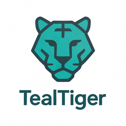

# AI Logo Generation Guide for TealTiger

Step-by-step guide to generate a professional logo using AI tools.

---

## 🎯 Best AI Tools for Logo Generation

### Option 1: ChatGPT with DALL-E 3 (Recommended)
- **Cost:** $20/month (ChatGPT Plus subscription)
- **Quality:** Excellent
- **Speed:** Instant
- **Best for:** Quick iterations, high quality

### Option 2: Microsoft Copilot (Free!)
- **Cost:** FREE
- **Quality:** Good (uses DALL-E 3)
- **Speed:** Instant
- **Best for:** No budget, same quality as ChatGPT

### Option 3: Midjourney
- **Cost:** $10/month (Basic plan)
- **Quality:** Excellent, artistic
- **Speed:** Fast
- **Best for:** More artistic, stylized logos

### Option 4: Adobe Firefly
- **Cost:** Free tier available
- **Quality:** Good
- **Speed:** Fast
- **Best for:** Adobe ecosystem users

---

## ⚡ Quick Start: Microsoft Copilot (FREE)

**This is the fastest free option!**

### Step 1: Go to Copilot (2 min)
1. Open browser
2. Go to: https://copilot.microsoft.com/
3. Sign in with Microsoft account (or create free account)

### Step 2: Use These Prompts (5 min)

**Copy and paste each prompt, generate, and save the best results:**

#### Prompt 1: Geometric Tiger Head
```
Create a minimalist logo for "TealTiger" software company. 
Design a geometric tiger head icon using simple shapes and clean lines. 
Use teal color (#14B8A6) as the primary color with dark gray accents. 
Modern, flat design style. Professional tech company aesthetic. 
White background. The logo should work well at small sizes. 
Vector-style illustration.
```

#### Prompt 2: Tiger + Shield
```
Design a professional logo combining a stylized tiger and shield shape for "TealTiger" AI security SDK. 
Use teal (#14B8A6) and dark gray colors. 
Minimalist, modern style with clean geometric shapes. 
Security and protection theme. 
White background. Should be recognizable at 32x32 pixels.
```

#### Prompt 3: Abstract Tiger Mark
```
Create an abstract, geometric logo mark representing a tiger for "TealTiger" tech brand. 
Use teal (#14B8A6) as primary color. 
Circular or square badge format. 
Modern, minimal design with bold shapes. 
Professional software company branding. 
White background. Simple enough to work as an app icon.
```

#### Prompt 4: Tiger Stripes Pattern
```
Design a modern logo featuring tiger stripes pattern integrated with code brackets {} for "TealTiger" developer tool. 
Teal (#14B8A6) and dark colors. 
Tech-forward, minimalist aesthetic. 
Clean lines, geometric shapes. 
White background. Professional and memorable.
```

### Step 3: Generate Multiple Variations (10 min)
1. Try each prompt
2. Generate 2-3 variations per prompt
3. Save all images you like
4. Total: 8-12 logo options

### Step 4: Select Best Logo (5 min)
**Evaluation criteria:**
- ✅ Looks professional
- ✅ Recognizable at small sizes
- ✅ Works in teal color
- ✅ Represents security/power (tiger theme)
- ✅ Modern and clean

### Step 5: Download (1 min)
- Right-click on chosen logo
- Save image as PNG
- Save to your computer

---

## 🎨 Alternative: ChatGPT Plus (If You Have It)

### Step 1: Open ChatGPT
1. Go to https://chat.openai.com/
2. Make sure you're using GPT-4 (with DALL-E 3)

### Step 2: Use This Prompt
```
I need a professional logo for "TealTiger", an AI security and cost control SDK for developers.

Design requirements:
- Geometric tiger head or abstract tiger mark
- Primary color: Teal (#14B8A6)
- Style: Minimalist, modern, flat design
- Must work at small sizes (32x32px)
- Professional tech company aesthetic
- White background

Please generate 4 different logo concepts:
1. Geometric tiger head with shield
2. Abstract tiger mark in circular badge
3. Tiger stripes with code brackets
4. Minimalist tiger icon

Make them clean, professional, and suitable for a developer tool brand.
```

### Step 3: Iterate
If you don't like the results:
```
Can you make version 2 more minimalist and geometric? 
Use simpler shapes and bolder lines.
```

Or:
```
I like version 3, but can you make the tiger more abstract 
and use a darker teal color?
```

---

## 🛠️ After Generation: Processing Your Logo

### Step 1: Download the Image
- Save as PNG (highest resolution available)
- Filename: `tealtiger-logo-original.png`

### Step 2: Remove Background (If Needed)
If the background isn't pure white:

**Tool:** https://www.remove.bg/
1. Upload your logo
2. Download with transparent background
3. Save as `tealtiger-logo-transparent.png`

### Step 3: Create Different Sizes

**Tool:** https://www.iloveimg.com/resize-image

Create these sizes:
- 512x512px → `tealtiger-logo-512.png`
- 256x256px → `tealtiger-logo-256.png`
- 128x128px → `tealtiger-logo-128.png`
- 64x64px → `tealtiger-logo-64.png`
- 32x32px → `tealtiger-logo-32.png`

### Step 4: Convert to SVG (Vector)

**Tool:** https://www.vectorizer.io/
1. Upload your PNG logo
2. Download as SVG
3. Save as `tealtiger-logo.svg`

**Alternative:** https://convertio.co/png-svg/

### Step 5: Create Favicon

**Tool:** https://www.favicon-generator.org/
1. Upload your logo PNG
2. Generate favicon package
3. Download `favicon.ico`

---

## 📁 File Organization

Create this folder structure:

```
tealtiger/
├── .github/
│   └── logo/
│       ├── tealtiger-logo.svg          # Vector (main)
│       ├── tealtiger-logo-512.png      # High-res
│       ├── tealtiger-logo-256.png      # Medium
│       ├── tealtiger-logo-128.png      # Small
│       ├── tealtiger-logo-64.png       # Icon
│       ├── tealtiger-logo-32.png       # Tiny
│       ├── favicon.ico                 # Website favicon
│       ├── dark-mode/
│       │   └── tealtiger-logo-dark.png # Dark mode version
│       └── light-mode/
│           └── tealtiger-logo-light.png # Light mode version
```

---

## 🎨 Creating Dark/Light Mode Versions

### For Dark Mode (Logo on Dark Background)
**Option 1: Use AI**
```
Take this logo and create a version optimized for dark backgrounds. 
Use white or light teal colors instead of dark colors. 
Keep the same design but adjust colors for dark mode.
```

**Option 2: Manual Edit**
- Use Canva or Photoshop
- Change dark elements to white/light teal
- Keep teal elements as-is or lighten them

### For Light Mode (Logo on Light Background)
- Usually your original logo works fine
- Ensure good contrast with white background

---

## 📝 Adding Logo to GitHub README

### Step 1: Upload Logo to Repository
```bash
# In your tealtiger repository
mkdir -p .github/logo
# Copy your logo files to .github/logo/
git add .github/logo/
git commit -m "feat: add TealTiger logo"
git push origin main
```

### Step 2: Update README.md

Add this at the top of your README:

```markdown
<div align="center">
  
  
  # TealTiger
  
  **AI Security & Cost Control Platform**
  
  [](https://www.npmjs.com/package/tealtiger)
  [](https://pypi.org/project/tealtiger/)
  [](https://opensource.org/licenses/MIT)
</div>
```

---

## 🌐 Adding Logo to Other Platforms

### NPM Package
1. Add logo to package: `logo.png` in root
2. Update `package.json`:
```json
{
  "name": "tealtiger",
  "icon": "logo.png"
}
```

### PyPI Package
1. Add logo to package
2. Reference in `README.md` (PyPI displays README)

### GitHub Social Preview
1. Go to repository Settings
2. Scroll to "Social preview"
3. Upload `tealtiger-logo-512.png`
4. Recommended size: 1280x640px (create wider version if needed)

### Twitter/X Profile
1. Go to profile settings
2. Upload as profile picture
3. Use 400x400px version

### LinkedIn
1. Company page → Logo
2. Upload 300x300px version

---

## ✅ Complete Checklist

### Generation Phase
- [ ] Choose AI tool (Copilot, ChatGPT, Midjourney)
- [ ] Generate 8-12 logo variations
- [ ] Select best logo
- [ ] Download high-resolution PNG

### Processing Phase
- [ ] Remove background (if needed)
- [ ] Create 5 different sizes (512, 256, 128, 64, 32)
- [ ] Convert to SVG
- [ ] Create favicon.ico
- [ ] Create dark mode version
- [ ] Create light mode version

### Implementation Phase
- [ ] Upload to GitHub (.github/logo/)
- [ ] Update README with logo
- [ ] Add to NPM package
- [ ] Add to PyPI package
- [ ] Set GitHub social preview
- [ ] Update social media profiles

---

## 🎯 Quick Start (Do This Now - 30 Minutes)

**Step-by-step for immediate results:**

1. **Go to Microsoft Copilot** (5 min)
   - https://copilot.microsoft.com/
   - Sign in (free)

2. **Generate logos** (10 min)
   - Copy Prompt 1 (Geometric Tiger Head)
   - Paste and generate
   - Save the image
   - Repeat with Prompts 2-4

3. **Pick best logo** (5 min)
   - Review all generated logos
   - Choose the most professional one

4. **Process logo** (10 min)
   - Remove background: https://www.remove.bg/
   - Resize: https://www.iloveimg.com/resize-image
   - Create 512px, 256px, 128px versions

5. **Add to GitHub** (5 min)
   - Upload to `.github/logo/`
   - Update README
   - Commit and push

**Total time: 30 minutes**
**Cost: FREE**
**Result: Professional logo ready to use**

---

## 💡 Pro Tips

### Tip 1: Generate Multiple Options
- Don't settle for the first result
- Generate 10-15 variations
- Pick the absolute best

### Tip 2: Test at Small Sizes
- View logo at 32x32px
- If details are lost, it's too complex
- Simpler is better for logos

### Tip 3: Get Feedback
- Show to 2-3 people
- Ask: "Does this look professional?"
- Ask: "What does this represent to you?"

### Tip 4: Consistency
- Use the same logo everywhere
- Don't create multiple versions
- Stick with one design

---

## 🚀 Ready to Start?

**Your immediate action:**

1. Open https://copilot.microsoft.com/ RIGHT NOW
2. Copy Prompt 1 from above
3. Generate your first logo
4. Come back and show me the results!

**I'll help you:**
- Refine the prompts if needed
- Choose the best logo
- Process and implement it

**Let's create your TealTiger logo in the next 30 minutes!** 🎨
