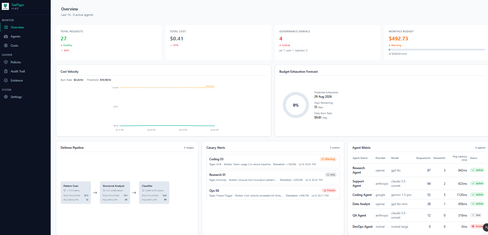

# TealTiger

<div align="center">


**AI Agent Security & Governance SDK**

Deterministic governance, guardrails, cost tracking, and policy management for LLM applications.
Open source. TypeScript + Python. Works with any provider.

[](https://www.npmjs.com/package/tealtiger)
[](https://pypi.org/project/tealtiger/)
[](https://opensource.org/licenses/Apache-2.0)
[](https://discord.gg/X2ePf8QAj)
[](https://github.com/agentguard-ai/tealtiger)
[](https://github.com/agentguard-ai/tealtiger)
[](https://securityscorecards.dev/viewer/?uri=github.com/agentguard-ai/tealtiger)

<br>

<a href="https://www.nvidia.com/en-us/startups/">
  
</a>

<br>

[Website](https://tealtiger.co.in) · [Documentation](#documentation) · [Examples](#examples) · [Discord](https://discord.gg/X2ePf8QAj) · [Contributing](#-build-with-us)

</div>

---

## ⚡ 60-second quickstart

Install: `npm install tealtiger` or `pip install tealtiger`, then wrap one existing OpenAI call:

```typescript
import { TealOpenAI } from 'tealtiger';
const client = new TealOpenAI({ apiKey: process.env.OPENAI_API_KEY, guardrails: { promptInjection: true } });
const res = await client.chat.completions.create({ model: 'gpt-4o-mini', messages: [{ role: 'user', content: 'Hello!' }] });
console.log(res.security?.decision ?? 'ALLOW');
```

```python
import os
from tealtiger import TealOpenAI
client = TealOpenAI(api_key=os.environ["OPENAI_API_KEY"], guardrails={"prompt_injection": True})
print(client.chat.completions.create(model="gpt-4o-mini", messages=[{"role": "user", "content": "Hello!"}]).security.decision)
```

```text
ALLOW
Governance receipt emitted; cost and guardrails tracked.
```

Next: [full Quick Start](#-quick-start) and [examples](./examples).

---

## 🔭 observe() — Zero-Config Instrumentation (v1.4)

One line adds cost tracking, audit logging, PII detection, and behavioral baselines to any LLM client. No config files, no policy definitions.

```typescript
import { observe, freeze } from 'tealtiger';
const client = observe(new OpenAI());  // done — all calls are now instrumented
console.log(client.getCost());         // { totalCost: 0.0023, requestCount: 1, ... }
```

```python
from tealtiger.observe import observe, freeze
client = observe(OpenAI())             # done — all calls are now instrumented
print(client.get_cost())               # ObserveCostSummary(total_cost=0.0023, ...)
```

**What you get automatically:** per-request cost tracking across 12 providers, structured audit log with correlation IDs, behavioral baseline (P50/P95/P99), PII detection in REPORT_ONLY mode, and an instant kill switch via `freeze()`. Under 5ms overhead per call.

See [examples/observe-quickstart.ts](./examples/observe-quickstart.ts) and [examples/observe_quickstart.py](./examples/observe_quickstart.py).

---

---

## 📊 Governance Dashboard (v1.4)

Real-time visibility into your AI agent fleet — security posture, cost governance, and behavioral alerts in one view.

<div align="center">
  
</div>


**What you see at a glance:**
- **KPI Row** — Total requests, cost, governance denials, budget consumption with color-coded indicators
- **Cost Velocity & Budget Forecast** — Burn rate trends and exhaustion projection
- **Defense Pipeline** — 3-stage security evaluation flow with short-circuit rates and latency per stage
- **Canary Alerts** — Behavioral drift detection with agent freeze status and deviation percentages
- **Agent Matrix** — Fleet status table (active/idle/frozen) with per-agent request metrics
- **Cost Savings** — Optimization recommendations ranked by impact
- **Model Routing** — Source-to-target routing with per-request savings
- **Protocol Governance** — ENFORCE/MONITOR/REPORT_ONLY policy cards with denial counts

Every panel is independently data-fetched with fault isolation — one widget failure never cascades to others.

Run locally: `cd dashboard/api && npm run dev` then `cd dashboard/web && npm run dev` (API on :3100, UI on :3000)

### Progressive Disclosure Path

| Level | Entry Point | What You Get |
|-------|-------------|--------------|
| 0 | `observe(client)` | Cost tracking, audit trail, PII detection, behavioral baseline, kill switch |
| 1 | + guardrails config | Prompt injection, content moderation, secret detection |
| 2 | + TealEngine policies | ENFORCE/MONITOR/REPORT_ONLY per rule, deterministic decisions |
| 3 | + TealFlow workflows | Org-level governance inheritance, declarative YAML |


## What is TealTiger?

TealTiger is an open-source SDK that provides **deterministic governance** for AI agents. It enforces security policies, tracks costs, and produces structured evidence — all at runtime, with no infrastructure required.

> **Looking for the source code?** This is the hub repo. The SDK source lives in the language-specific repos:
> - **TypeScript SDK**: [tealtiger-typescript-prod](https://github.com/agentguard-ai/tealtiger-typescript-prod)
> - **Python SDK**: [tealtiger-python-prod](https://github.com/agentguard-ai/tealtiger-python-prod)
>
> Or clone this repo with submodules: `git clone --recurse-submodules https://github.com/agentguard-ai/tealtiger.git`

Unlike probabilistic safety filters, TealTiger uses **deterministic policy evaluation**: same input + same policy = same decision, every time. Every governance verdict is reconstructable, traceable to the human who authored the policy, and exportable as structured evidence (SARIF, JUnit XML, JSON).

**Key principle:** Governance should be an engineering property embedded in the runtime — not a document reviewed after the fact.

---

## 🚀 Quick Start

### TypeScript

```bash
npm install tealtiger
```

```typescript
import { TealOpenAI } from 'tealtiger';

const client = new TealOpenAI({
  apiKey: process.env.OPENAI_API_KEY,
  guardrails: {
    piiDetection: true,
    promptInjection: true,
    contentModeration: true,
  },
  budget: {
    maxCostPerRequest: 0.50,
    maxCostPerDay: 10.00,
  },
});

const response = await client.chat.completions.create({
  model: 'gpt-4',
  messages: [{ role: 'user', content: 'Hello!' }],
});
// Guardrails enforced. Cost tracked. Evidence produced.
```

### Python

```bash
pip install tealtiger
```

```python
from tealtiger import TealOpenAI

client = TealOpenAI(
    api_key=os.getenv("OPENAI_API_KEY"),
    guardrails={
        "pii_detection": True,
        "prompt_injection": True,
        "content_moderation": True,
    },
    budget={
        "max_cost_per_request": 0.50,
        "max_cost_per_day": 10.00,
    },
)

response = client.chat.completions.create(
    model="gpt-4",
    messages=[{"role": "user", "content": "Hello!"}],
)
# Guardrails enforced. Cost tracked. Evidence produced.
```

---

## ✨ Features

### 🛡️ Security Guardrails
- **PII Detection** — Detect and redact sensitive information automatically
- **Prompt Injection Prevention** — Block malicious prompt injection attempts
- **Content Moderation** — Filter toxic, harmful, or inappropriate content
- **Secret Detection** — 500+ patterns across 9 categories with confidence scoring
- **Custom Rules** — Define your own security policies

### 💰 Cost Governance
- **Budget Enforcement** — Hard limits per request, session, and day
- **Cost Tracking** — Real-time monitoring across all providers
- **Cost Alerts** — Notifications at configurable thresholds
- **Circuit Breakers** — Prevent runaway cost loops automatically

### 🔌 12 LLM Providers
- **OpenAI** — GPT-4, GPT-4o, GPT-3.5
- **Anthropic** — Claude 3.5, Claude 3
- **Google Gemini** — Multimodal support
- **AWS Bedrock** — Claude, Titan, Jurassic, Command, Llama
- **Azure OpenAI** — Deployment-based routing
- **Cohere** — Chat, RAG, embeddings
- **Mistral AI** — European data residency
- **DeepSeek** — Cost-efficient reasoning models
- **Groq** — Ultra-low latency inference
- **Together AI** — Open-source model hosting
- **HuggingFace TGI** — Self-hosted inference
- **xAI (Grok)** — Real-time knowledge

### 🔌 Platform Adapters
- **AWS Bedrock Agents** — Native guardrail adapter
- **AWS AgentCore** — Pre/post action governance plugin
- **Azure AI Agent Service** — Tool-call pipeline middleware

### 🏗️ Governance Architecture
- **Deterministic Policy Evaluation** — No LLM in the governance path
- **Structured Evidence** — Every decision produces a reconstructable record
- **Cryptographic Proof** — Merkle trees + RFC 3161 timestamping (TealProof)
- **Non-Human Identity (NHI)** — Agent lifecycle, scope enforcement, Zero Standing Privilege
- **FREEZE Rules** — Immutable emergency kill switches with tamper detection
- **Correlation IDs** — End-to-end traceability across the decision chain
- **Policy Traceability** — Every verdict traces to the human policy author
- **OWASP Agentic Top 10** — Zero-config policy pack covering all 10 ASI risks

---

## 🗺️ Governance Coverage

| Dimension | What it does | Module |
|-----------|-------------|--------|
| 🛡️ **Security** | Secret detection (500+ patterns), prompt injection, PII, content moderation, Unicode normalization, encoded output detection | `TealSecrets` `TealGuard` |
| 🔑 **Identity** | Non-Human Identity lifecycle, scope enforcement, Zero Standing Privilege, agent attestation | `TealEngine (NHI)` |
| ⚡ **Reliability** | Circuit breakers, retry budgets, fallback chains, deterministic degradation | `TealCircuit` `TealReliability` |
| 🧠 **Memory** | Write provenance, instruction injection detection, exfiltration prevention, scope enforcement | `TealMemory` |
| 💰 **Cost** | Governance-owned ceilings, anomaly detection, reasoning-token budgets, per-agent attribution | `TealMonitor` |
| 📋 **Evidence** | Cryptographic receipts (Merkle + RFC 3161), SARIF export, OTel spans, SIEM integration | `TealProof` `TealAudit` |
| ⚙️ **Policy** | FREEZE rules, PLAN_ONLY mode, hot-swap bundles, anti-tamper, automation levels | `TealEngine` |
| 🔄 **Workflow** | Declarative YAML governance workflows, org-level inheritance, floor enforcement | `TealFlow` |
| 📊 **Drift** | Behavioral drift detection, statistical baselines, model output regression | `TealDrift` |
| ⏱️ **Temporal** | Session TTL, cooldown periods, time-of-day restrictions | `TealTemporal` |
| 🔍 **Registry** | MCP definition-drift monitoring, tool description scanning, adapter composition allowlist | `TealRegistry` |
| 🧠 **Classification** | Local ONNX ML inference (≤20ms), ensemble modes, regex+ML combination | `TealClassifier` |

> **Design principle:** No LLM in the governance path. Same input + same policy = same decision, every time.

---

## 📦 SDKs

| Language | Source Code | Package | Install |
|----------|------------|---------|---------|
| TypeScript | [tealtiger-typescript-prod](https://github.com/agentguard-ai/tealtiger-typescript-prod) | [npm](https://www.npmjs.com/package/tealtiger) | `npm install tealtiger` |
| Python | [tealtiger-python-prod](https://github.com/agentguard-ai/tealtiger-python-prod) | [PyPI](https://pypi.org/project/tealtiger/) | `pip install tealtiger` |

### 🔌 Framework Adapters

| Framework | Package | Install |
|-----------|---------|---------|
| LangChain | [langchain-tealtiger](https://github.com/agentguard-ai/tealtiger/tree/main/packages/langchain-tealtiger) | `pip install langchain-tealtiger` |
| Vercel AI SDK | [tealtiger-ai-sdk](https://github.com/agentguard-ai/tealtiger/tree/main/packages/tealtiger-ai-sdk) | `npm install tealtiger-ai-sdk` |
| PydanticAI | [pydanticai-tealtiger](https://github.com/agentguard-ai/tealtiger/tree/main/packages/pydanticai-tealtiger) | `pip install pydanticai-tealtiger` |
| Haystack | [haystack-tealtiger](https://github.com/agentguard-ai/tealtiger/tree/main/packages/haystack-tealtiger) | `pip install haystack-tealtiger` |
| CAMEL-AI | [camelai-tealtiger](https://github.com/agentguard-ai/tealtiger/tree/main/packages/camelai-tealtiger) | `pip install camelai-tealtiger` |

### 🔗 Infrastructure Integrations

| Platform | What it provides | Install |
|----------|-----------------|---------|
| [Dakera](https://github.com/Dakera-AI/dakera-py) | Persistent governance state backend (cost storage, decision receipts, delegation chains via KG) | `pip install dakera[tealtiger]` | [Docs](https://dakera.ai/integrations/tealtiger) |
| [AG2 Beta](https://github.com/ag2ai/ag2) | Governance middleware Extension for AG2 Beta agents | `pip install ag2-tealtiger` |
| [Portkey Gateway](https://github.com/Portkey-AI/gateway) | Webhook guardrail for Portkey AI Gateway | [Example](https://github.com/agentguard-ai/tealtiger/tree/main/examples/portkey-webhook-guardrail) |
| [Daytona](https://github.com/daytonaio/daytona) | Pre-execution governance for sandboxed code execution | [Example](https://github.com/agentguard-ai/tealtiger/tree/main/examples/daytona-governed-sandbox) |

---

## 📚 Documentation

- [Why your AI agent needs a budget — cost governance for LLM apps](./docs/blog/cost-governance-for-llm-apps.md)
- [OWASP Agentic Top 10 — practical defenses with TealTiger](./docs/blog/owasp-agentic-top-10-defenses.md)
- [Quick Start Guide](#-quick-start)
- [Security Guardrails](#️-security-guardrails)
- [Cost Governance](#-cost-governance)
- [Provider Setup](#-7-llm-providers)
- [FAQ](./docs/faq.md)
- [Why TealTiger?](./docs/why-tealtiger.md)
- [Cross-SDK Feature Parity Matrix](./docs/cross-sdk-feature-parity-matrix.md)
- [Governance Event Store Indexes](./docs/governance-event-store-indexes.md)
- [Error Code Reference](./docs/error-code-reference.md)
- [Troubleshooting](./docs/troubleshooting.md)
- [Contributing Guide](./CONTRIBUTING.md)
- [Security Policy](./SECURITY.md)
- [Code of Conduct](./CODE_OF_CONDUCT.md)
- [Roadmap](./ROADMAP.md)

### Badge

Use the TealTiger badge to show that a project is governed by deterministic
agent security and cost policies.

Light badge:

```md
[](https://github.com/agentguard-ai/tealtiger)
```

Dark badge:

```md
[](https://github.com/agentguard-ai/tealtiger)
```
### Python Hugging Face TGI Quickstart

Use `examples/python/huggingface_tgi_quickstart.py` to try the guarded
Hugging Face Text Generation Inference provider from the Python SDK.

```bash
export HF_API_TOKEN="your-hugging-face-token"
export HF_TGI_ENDPOINT="https://your-endpoint.endpoints.huggingface.cloud"
export HF_TGI_MODEL="meta-llama/Meta-Llama-3.1-8B-Instruct"

python examples/python/huggingface_tgi_quickstart.py
```

The example enables guardrail and cost-tracking configuration, sends one sample
chat request, then prints the response, token usage, estimated cost, provider,
and correlation ID. Use placeholder values in docs and `.env.example` files;
never commit a real `HF_API_TOKEN`.

### TealEngine Policy Schema

Use [`schemas/tealtiger-policy.schema.json`](./schemas/tealtiger-policy.schema.json) for editor autocomplete and validation when authoring TealEngine policy JSON or YAML files. JSON policy files can include:

```json
{
  "$schema": "./schemas/tealtiger-policy.schema.json"
}
```

For YAML policies, configure your editor's YAML schema mapping to point policy files such as `tealtiger-policy.yml` at `./schemas/tealtiger-policy.schema.json`.

### Validate Policy Files

Use the policy validator script to check a TealTiger policy JSON file before
using it in CI/CD or runtime governance:

```bash
npm install
npx ts-node scripts/validate-policy.ts ./my-policy.json
```

You can also run the npm script:

```bash
npm run validate:policy -- ./my-policy.json
```

The validator loads
[`schemas/tealtiger-policy.schema.json`](./schemas/tealtiger-policy.schema.json),
prints schema validation errors, exits `0` when the policy is valid, and exits
`1` when the policy is invalid.

---

## 🐯 Build With Us — Early Contributor Program

TealTiger is open source and we're looking for early contributors to shape the future of AI agent governance.

### What You Can Work On

| Area | Examples | Difficulty |
|------|----------|------------|
| 🔍 Secret Detection | New detection patterns, custom categories | 🟢 Beginner |
| 📝 Documentation | Guides, examples, API docs, typo fixes | 🟢 Beginner |
| 🧪 Tests | Unit tests, property-based tests, integration tests | 🟡 Intermediate |
| 🔌 Integrations | LangChain, CrewAI, AG2, LlamaIndex middleware | 🟡 Intermediate |
| 💾 Memory Adapters | Redis, Pinecone, Weaviate, ChromaDB adapters | 🟡 Intermediate |
| 🔄 CI/CD Templates | Jenkins, Azure Pipelines, Bitbucket Pipelines | 🟡 Intermediate |
| 🏗️ Core Modules | Governance engine, evidence export, policy evaluation | 🔴 Advanced |

### What Early Contributors Get

- 🏆 **Named in CONTRIBUTORS.md** and release notes
- 🎖️ **"Founding Contributor" badge** — first 25 merged PRs get permanent recognition
- 📣 **Shoutout on TealTiger social channels** (LinkedIn, X, Dev.to)
- 🔑 **Early access** to upcoming governance features before public release
- 💬 **Direct access** to the core team via GitHub Discussions
- 📝 **Co-authorship opportunity** on technical blog posts

### Get Started

```bash
# 1. Star this repo (it helps!)

# 2. Fork and clone the SDK you want to contribute to:
# TypeScript SDK:
git clone https://github.com/agentguard-ai/tealtiger-typescript-prod.git
# Python SDK:
git clone https://github.com/agentguard-ai/tealtiger-python-prod.git

# 3. Pick a "good first issue"
# https://github.com/agentguard-ai/tealtiger/issues?q=label%3A%22good+first+issue%22

# 4. Submit a PR
# 5. Join the team 🐯
```

See [CONTRIBUTING.md](./CONTRIBUTING.md) for detailed guidelines.

---

## 🗺️ Roadmap

**Current:** v1.4.0 — Zero-Config Adoption & Governance Dashboard (Released July 9, 2026)
- `observe(client)` — 1-line auto-instrumentation for 12 providers, zero config
- `freeze()` / `unfreeze()` — instant kill switch, zero policy required
- Behavioral baseline — P50/P95/P99 profiling built from first 100 requests
- PII detection in REPORT_ONLY mode — passive scanning without blocking
- Governance Dashboard — redesigned with light theme, security widgets, error isolation
- Under 5ms overhead per call — in-process, deterministic, offline-capable

**Previous:** v1.3.0 — Autonomous Agent Governance (Released May 18, 2026)


**Planned:** v1.5.0 — Enterprise Platform (Q4 2026)
- Multi-tenancy with complete data isolation
- RBAC (Owner, Admin, Policy Author, Viewer, Auditor)
- SSO via SAML 2.0 / OIDC (Okta, Azure AD, Google)
- SIEM export (Splunk, Elastic, Sentinel, Datadog)
- Policy staging, dry-run mode, canary deployments
- Scheduled compliance reports & executive dashboard

**Future:** v2.0.0 — SaaS Security Platform (Q1 2027)
- Full SaaS control plane (CSPM/CWPP model for AI agents)
- CISO executive console with governance health scoring
- TealTiger Operator & Agent for Kubernetes
- Shadow AI detection (discover ungoverned agents)
- Remote kill switch from SaaS console
- CloudEvents, OpenTelemetry, Backstage plugin

---

## 🌟 Community

- **Discord**: [Join TealTiger Community](https://discord.gg/X2ePf8QAj)
- **GitHub Discussions**: [Ask questions, share ideas](https://github.com/agentguard-ai/tealtiger/discussions)
- **LinkedIn**: [TealTiger](https://www.linkedin.com/company/tealtiger)
- **X (Twitter)**: [@TealtigerAI](https://x.com/TealtigerAI)
- **Documentation**: [docs.tealtiger.ai](https://docs.tealtiger.ai)
- **Blog**: [blogs.tealtiger.ai](https://blogs.tealtiger.ai)
- **Playground**: [playground.tealtiger.ai](https://playground.tealtiger.ai)
- **Email**: reachout@tealtiger.ai

---

## 🔒 Security

TealTiger is committed to responsible open-source security practices.

[](https://securityscorecards.dev/viewer/?uri=github.com/agentguard-ai/tealtiger)
[](https://www.bestpractices.dev/projects/10824)
[](https://github.com/agentguard-ai/tealtiger/security/dependabot)
[](https://github.com/agentguard-ai/tealtiger/actions/workflows/codeql.yml)

For vulnerability reports, see our [Security Policy](./SECURITY.md).

---

## 📄 License

TealTiger is [Apache 2.0 licensed](./LICENSE).

---

## 🙏 Acknowledgments

Built with ❤️ by the TealTiger team and [contributors](./CONTRIBUTORS.md).

---

## 👥 Contributors

[](https://github.com/agentguard-ai/tealtiger/graphs/contributors)

Want to contribute? Check out our [CONTRIBUTING.md](./CONTRIBUTING.md) guide!

---

<div align="center">

**⭐ Star this repo if you believe AI agents need governance, not just guardrails.**

[Report Bug](https://github.com/agentguard-ai/tealtiger/issues/new?template=bug_report.md) · [Request Feature](https://github.com/agentguard-ai/tealtiger/issues/new?template=feature_request.md) · [Ask Question](https://github.com/agentguard-ai/tealtiger/issues/new?template=question.md)

</div>
