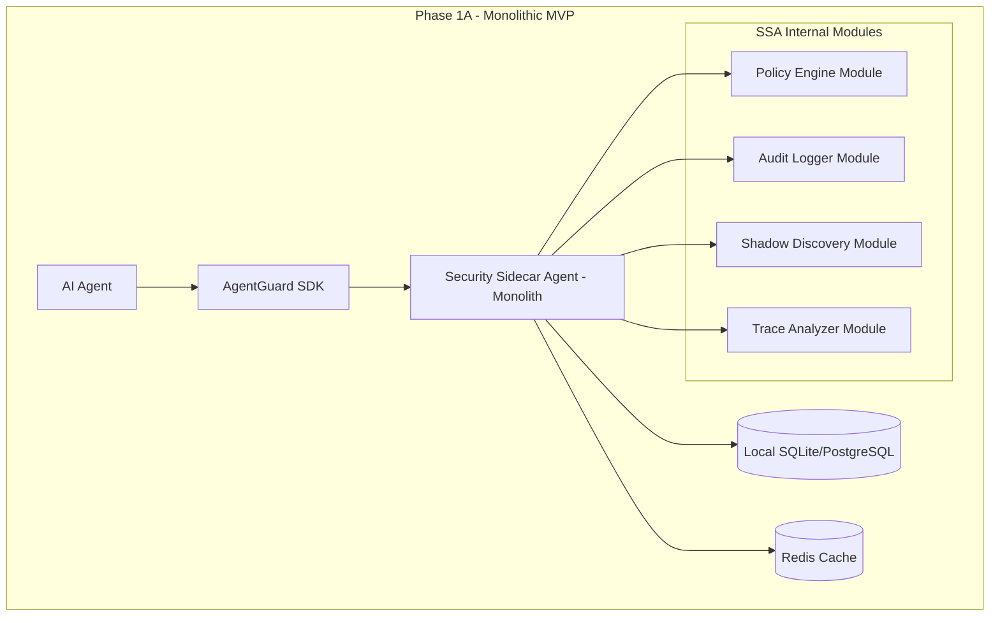
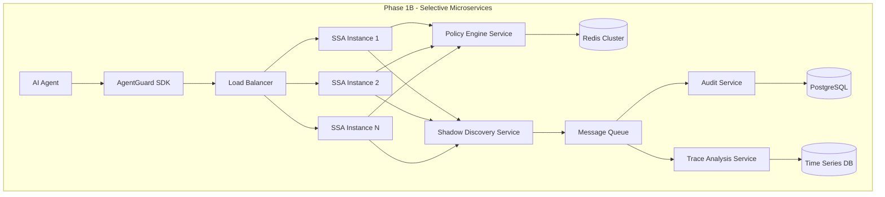
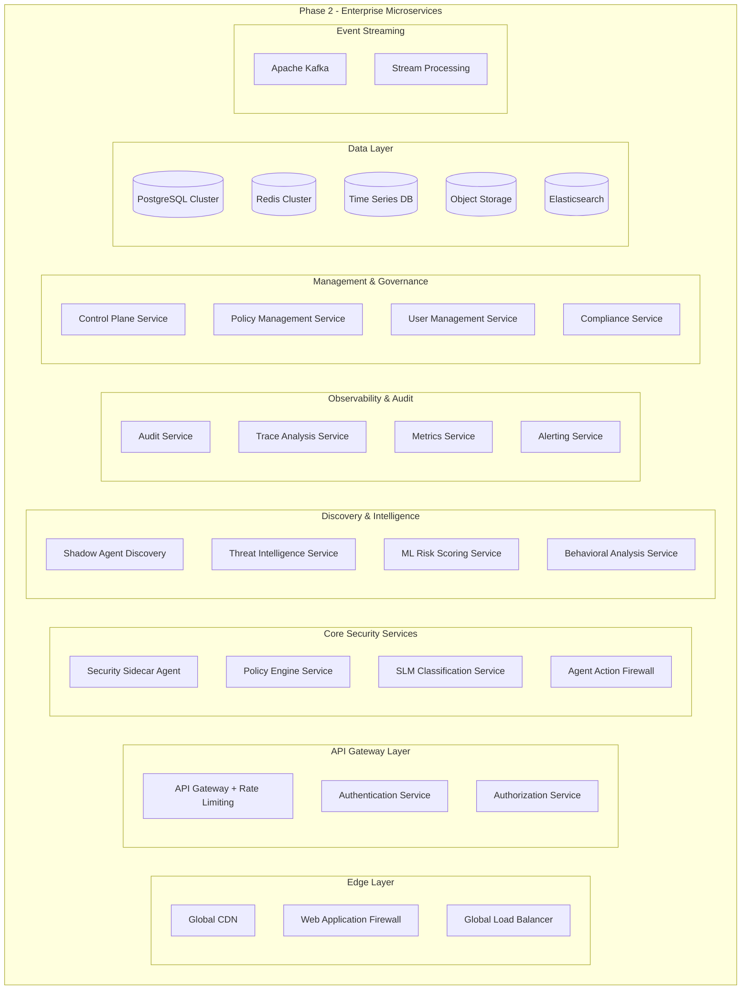
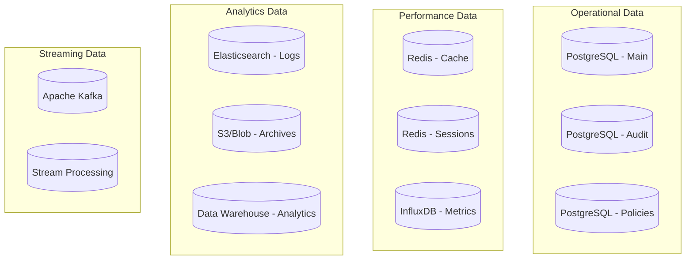
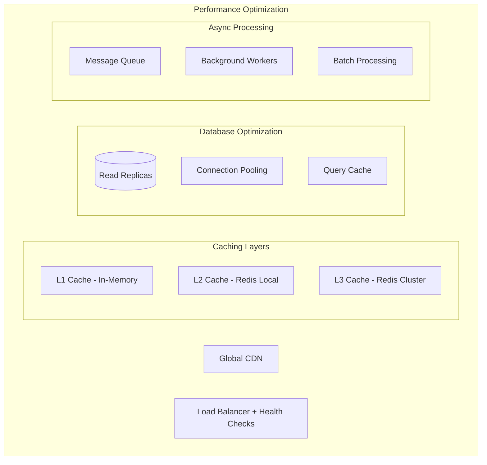
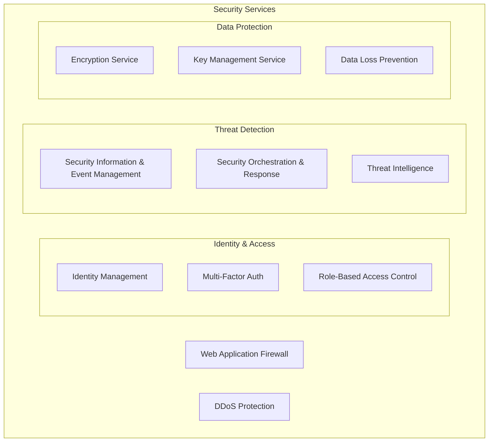

# Architecture Refinement Analysis

## Executive Summary

After comprehensive review of our requirements, design, and tasks documents, along with the VC feedback analysis, I've identified several critical architecture improvements needed to strengthen our platform for Series A funding and enterprise adoption.

## Key Findings & Recommendations

### 🚨 **Critical Issues Identified**

1. **Microservices Complexity vs. MVP Reality**: Current design shows 8+ microservices but MVP tasks suggest monolithic approach
2. **Missing Performance Architecture**: No dedicated performance/caching layer for sub-100ms requirements
3. **Incomplete Shadow Agent Discovery Integration**: New requirement not fully integrated into architecture
4. **Scalability Bottlenecks**: Single SSA instance could become bottleneck at enterprise scale
5. **Missing Real-Time Components**: No event streaming or real-time processing architecture

### 🏗️ **Recommended Architecture Evolution**

## Phase 1A: Simplified Monolithic Architecture (Current MVP)

**Problem**: Current design shows microservices but MVP implementation is monolithic.

**Solution**: Align architecture documentation with MVP reality.



**Benefits**:
- Simpler deployment and development
- Faster MVP delivery
- Easier debugging and testing
- Lower operational complexity

## Phase 1B: Service Decomposition (Enhanced MVP)

**Problem**: Need to scale individual components independently.

**Solution**: Extract high-load components into separate services.



**Benefits**:
- Independent scaling of components
- Better fault isolation
- Performance optimization per service
- Preparation for enterprise scale

## Phase 2: Full Microservices (Enterprise)

**Problem**: Enterprise customers need full observability, compliance, and multi-tenancy.

**Solution**: Complete microservices architecture with enterprise features.



### 🔧 **New Microservices Recommendations**

Based on analysis, we need these additional services:

#### 1. **Performance Cache Service**
**Why**: Sub-100ms latency requirement needs dedicated caching layer.
```typescript
interface CacheService {
  // Policy decision caching
  getPolicyDecision(agentId: string, toolCall: string): Promise<Decision>;
  cachePolicyDecision(key: string, decision: Decision, ttl: number): Promise<void>;
  
  // Agent behavior caching
  getAgentBaseline(agentId: string): Promise<BehaviorBaseline>;
  updateAgentBaseline(agentId: string, behavior: BehaviorData): Promise<void>;
  
  // Threat intelligence caching
  getThreatIntelligence(indicator: string): Promise<ThreatData>;
}
```

#### 2. **Event Streaming Service**
**Why**: Real-time processing for shadow agent discovery and threat detection.
```typescript
interface EventStreamingService {
  // Real-time agent events
  publishAgentEvent(event: AgentEvent): Promise<void>;
  subscribeToAgentEvents(callback: (event: AgentEvent) => void): void;
  
  // Security events
  publishSecurityEvent(event: SecurityEvent): Promise<void>;
  subscribeToSecurityEvents(callback: (event: SecurityEvent) => void): void;
  
  // Discovery events
  publishDiscoveryEvent(event: DiscoveryEvent): Promise<void>;
}
```

#### 3. **ML Risk Scoring Service**
**Why**: Advanced risk assessment beyond simple rule-based policies.
```typescript
interface MLRiskScoringService {
  // Real-time risk scoring
  scoreAgentRequest(request: AgentRequest, context: AgentContext): Promise<RiskScore>;
  
  // Behavioral risk assessment
  assessBehavioralRisk(agentId: string, behavior: BehaviorData): Promise<RiskAssessment>;
  
  // Model management
  updateRiskModel(modelId: string, modelData: MLModel): Promise<void>;
  getModelMetrics(modelId: string): Promise<ModelMetrics>;
}
```

#### 4. **Threat Intelligence Service**
**Why**: Proactive threat detection and prevention.
```typescript
interface ThreatIntelligenceService {
  // Threat feed integration
  updateThreatFeeds(): Promise<void>;
  queryThreatIntelligence(indicator: string): Promise<ThreatData>;
  
  // Attack pattern detection
  detectAttackPatterns(trace: ExecutionTrace): Promise<AttackPattern[]>;
  
  // IOC management
  addIOC(ioc: IndicatorOfCompromise): Promise<void>;
  checkIOCs(data: any): Promise<IOCMatch[]>;
}
```

#### 5. **Compliance Reporting Service**
**Why**: Enterprise customers need automated compliance reporting.
```typescript
interface ComplianceReportingService {
  // Report generation
  generateComplianceReport(framework: string, timeRange: TimeRange): Promise<ComplianceReport>;
  
  // Evidence collection
  collectAuditEvidence(requirement: string): Promise<AuditEvidence>;
  
  // Continuous monitoring
  assessCompliancePosture(): Promise<CompliancePosture>;
  
  // Certification support
  prepareCertificationPackage(certification: string): Promise<CertificationPackage>;
}
```

### 📊 **Data Architecture Improvements**

#### Current Issues:
- Single PostgreSQL instance won't scale
- No time-series data for performance metrics
- No search capability for audit logs

#### Recommended Data Architecture:



### 🚀 **Performance Architecture**

#### Current Gap:
No dedicated performance optimization architecture.

#### Recommended Performance Stack:



### 🔐 **Security Architecture Enhancements**

#### Current Gaps:
- No dedicated security services
- Missing zero-trust implementation
- No security event correlation

#### Enhanced Security Architecture:



## Implementation Roadmap

### Phase 1A (Months 1-3): MVP Monolith
- [ ] Implement monolithic SSA with embedded modules
- [ ] Add basic shadow agent discovery
- [ ] Implement simple caching with Redis
- [ ] Create developer SDK and documentation

### Phase 1B (Months 4-6): Selective Decomposition
- [ ] Extract Policy Engine as separate service
- [ ] Extract Shadow Discovery as separate service
- [ ] Add message queue for async processing
- [ ] Implement horizontal scaling for SSA

### Phase 2 (Months 7-12): Enterprise Microservices
- [ ] Full microservices decomposition
- [ ] Add ML Risk Scoring Service
- [ ] Implement Threat Intelligence Service
- [ ] Add Compliance Reporting Service
- [ ] Deploy multi-region architecture

## Resource Requirements

### Development Team Scaling
- **Phase 1A**: 5-8 engineers (current)
- **Phase 1B**: 12-15 engineers (+backend, +DevOps)
- **Phase 2**: 20-25 engineers (+ML, +security, +frontend)

### Infrastructure Costs
- **Phase 1A**: $2K/month (basic cloud resources)
- **Phase 1B**: $10K/month (multi-service deployment)
- **Phase 2**: $50K/month (enterprise-grade infrastructure)

## Risk Mitigation

### Technical Risks
1. **Complexity Management**: Gradual service decomposition vs. big-bang approach
2. **Performance Degradation**: Extensive load testing at each phase
3. **Data Consistency**: Event sourcing and CQRS patterns for distributed data

### Business Risks
1. **Over-Engineering**: Focus on customer value, not technical perfection
2. **Resource Constraints**: Prioritize services based on customer feedback
3. **Market Timing**: Balance feature completeness with time-to-market

## Success Metrics

### Phase 1A Success Criteria
- [ ] <100ms P95 latency for security decisions
- [ ] 95%+ agent discovery rate in test environments
- [ ] 5,000+ developer SDK downloads
- [ ] 99.9% uptime for core services

### Phase 1B Success Criteria
- [ ] <50ms P95 latency with horizontal scaling
- [ ] 99%+ agent discovery rate in production
- [ ] 50+ enterprise pilot customers
- [ ] 99.95% uptime with multi-instance deployment

### Phase 2 Success Criteria
- [ ] <25ms P95 latency with global deployment
- [ ] Universal agent discovery across all platforms
- [ ] 500+ enterprise customers
- [ ] 99.99% uptime with multi-region deployment

## Conclusion

This architecture refinement provides a clear evolution path from MVP to enterprise scale while addressing the critical VC concerns about performance, scalability, and shadow agent discovery. The phased approach balances technical excellence with business pragmatism, ensuring we can deliver value quickly while building a foundation for long-term success.

The key insight is that our current documentation shows the end-state architecture, but our implementation should follow a more pragmatic evolution. This refinement aligns our technical strategy with our business goals and funding timeline.