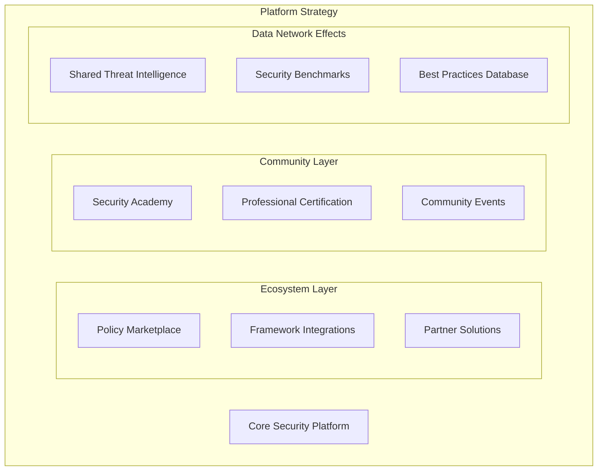
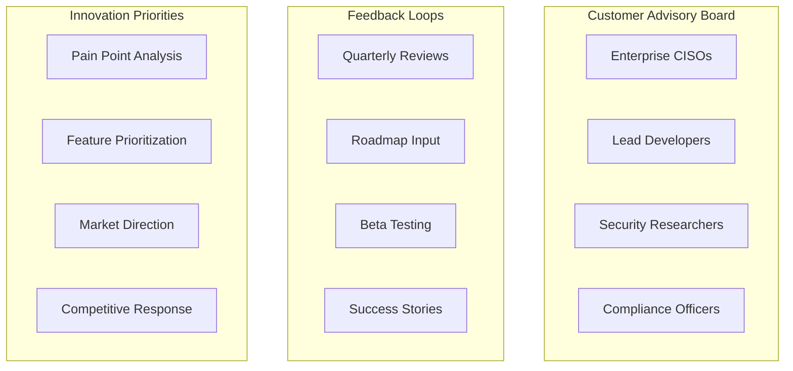
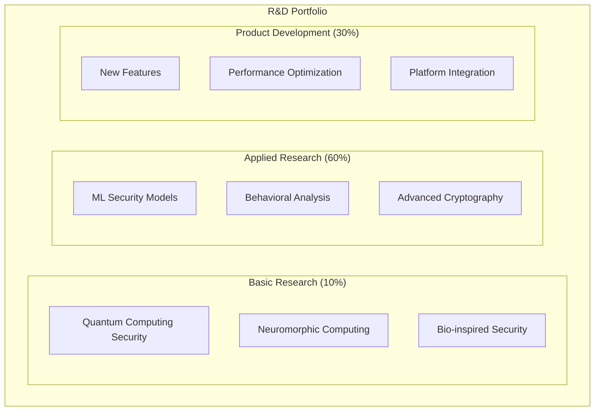
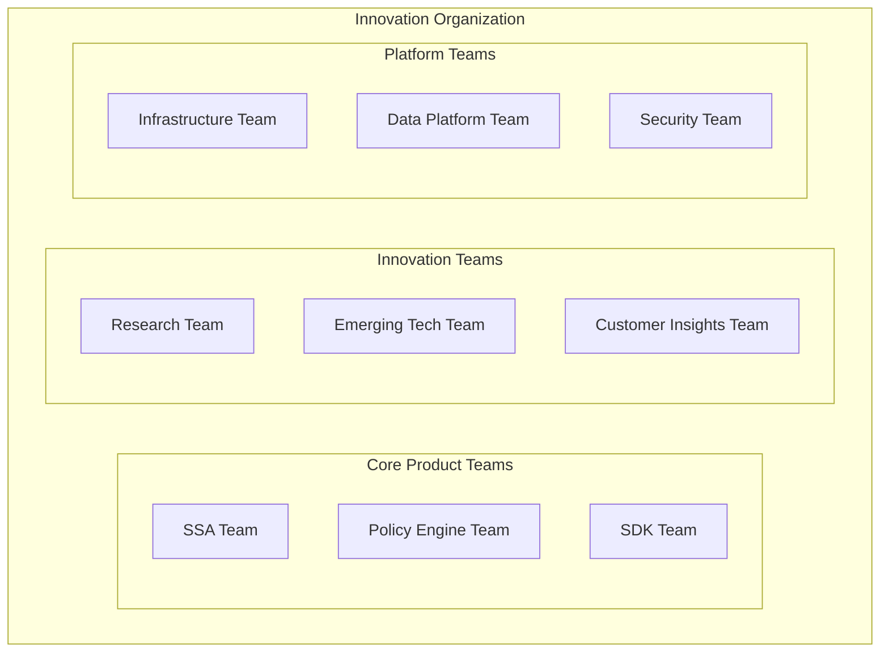

# Competitive Strategy: Staying Ahead in the Evolving AI Security Landscape

## Executive Summary

Successful technology companies don't just build great products—they build systems for continuous innovation and market adaptation. This document outlines proven strategies from market leaders like Microsoft, Google, Amazon, and emerging AI companies for maintaining competitive advantage in rapidly evolving markets.

## How Market Leaders Stay Competitive

### 🔬 **1. Systematic Technology Intelligence**

#### **Amazon's Approach: "Day 1" Mentality**
- **Principle**: Maintain startup agility even at scale
- **Practice**: Continuous experimentation with emerging technologies
- **Application for Us**: Dedicated R&D budget (15-20% of revenue) for emerging AI security technologies

#### **Microsoft's Strategy: Research-to-Product Pipeline**
- **Microsoft Research**: 1,000+ researchers feeding product innovation
- **Academic Partnerships**: Deep collaboration with universities
- **Application for Us**: Partner with AI security research labs, sponsor PhD research

#### **Google's Method: Moonshot Projects**
- **Google X**: Dedicated innovation lab for breakthrough technologies
- **20% Time**: Engineers spend 20% on experimental projects
- **Application for Us**: Innovation time for engineers, internal hackathons

### 📊 **2. Market Intelligence Systems**

#### **Successful Companies Track:**

**Technology Trends**:
- Patent filings in adjacent spaces
- Academic paper publications
- Open source project momentum
- Startup funding patterns
- Conference presentations and themes

**Competitive Intelligence**:
- Competitor product releases and roadmaps
- Hiring patterns (especially key talent)
- Partnership announcements
- Customer wins and losses
- Pricing strategy changes

**Customer Evolution**:
- Changing customer needs and pain points
- Emerging use cases and workflows
- Technology adoption patterns
- Regulatory and compliance changes

### 🏗️ **3. Platform Strategy for Defensibility**

#### **Amazon Web Services Model**:
- **Ecosystem Creation**: Build platform that others depend on
- **Network Effects**: More users = more value for everyone
- **Switching Costs**: Deep integration makes switching expensive

#### **Salesforce's Approach**:
- **AppExchange**: Third-party ecosystem
- **Trailhead**: Education and certification
- **Community**: User groups and evangelists

#### **Application for AI Agent Security**:


## Proven Competitive Strategies

### 🚀 **1. Innovation Velocity Strategy**

#### **Netflix's Approach: Continuous Reinvention**
- **Original Strategy**: DVD-by-mail
- **Pivot 1**: Streaming service
- **Pivot 2**: Content creation
- **Pivot 3**: Global expansion
- **Current**: AI-powered personalization

#### **Key Principles**:
- **Cannibalize Yourself**: Replace your own products before competitors do
- **Fail Fast**: Rapid experimentation with quick pivots
- **Customer Obsession**: Innovation driven by customer needs, not technology

#### **Application for Us**:
```typescript
interface InnovationPipeline {
  // Horizon 1: Core business (70% of resources)
  coreProduct: {
    agentSecurity: "Current SSA and policy engine";
    shadowDiscovery: "Agent discovery and management";
    compliance: "Regulatory compliance features";
  };
  
  // Horizon 2: Emerging opportunities (20% of resources)
  emergingTech: {
    quantumSecurity: "Post-quantum cryptography";
    aiGovernance: "AI model governance";
    edgeComputing: "Edge-based agent security";
  };
  
  // Horizon 3: Transformational bets (10% of resources)
  moonshots: {
    autonomousDefense: "Self-healing security systems";
    predictiveSecurity: "Preventing attacks before they happen";
    universalAgent: "Cross-platform agent orchestration";
  };
}
```

### 🎯 **2. Customer-Centric Innovation**

#### **Apple's Strategy: User Experience First**
- **Principle**: Technology serves user experience, not vice versa
- **Practice**: Obsessive focus on user journey and pain points
- **Result**: Premium pricing and customer loyalty

#### **Amazon's Customer Obsession**:
- **Working Backwards**: Start with press release, work backwards to product
- **Customer Feedback Loops**: Continuous customer input integration
- **Long-term Thinking**: Sacrifice short-term profits for customer value

#### **Application for AI Agent Security**:

**Customer Advisory Board Structure**:


### 🔄 **3. Ecosystem and Partnership Strategy**

#### **Microsoft's Partner Ecosystem**:
- **Technology Partners**: Deep integrations with complementary solutions
- **Channel Partners**: Resellers and system integrators
- **Developer Ecosystem**: Third-party applications and extensions

#### **Successful Partnership Models**:

**Strategic Alliances**:
- **Cloud Providers**: Azure, AWS, GCP native integrations
- **Security Vendors**: SIEM/SOAR partnerships
- **Consulting Firms**: Implementation and professional services

**Technology Integrations**:
- **Agent Frameworks**: LangChain, AutoGen, CrewAI
- **Development Tools**: VS Code, GitHub, CI/CD platforms
- **Enterprise Software**: ServiceNow, Jira, Slack

**Academic Partnerships**:
- **Research Collaboration**: Joint research projects
- **Talent Pipeline**: Internship and hiring programs
- **Thought Leadership**: Conference presentations and publications

### 📈 **4. Data-Driven Competitive Intelligence**

#### **Successful Companies Use**:

**Market Intelligence Tools**:
- **CB Insights**: Startup and funding tracking
- **Gartner/Forrester**: Market analysis and positioning
- **Patent Databases**: Technology trend analysis
- **Social Listening**: Brand and competitor monitoring

**Competitive Analysis Framework**:
```typescript
interface CompetitiveIntelligence {
  competitors: {
    direct: Competitor[];
    indirect: Competitor[];
    emerging: Competitor[];
    potential: Competitor[]; // Big tech entering market
  };
  
  monitoring: {
    productReleases: ProductRelease[];
    pricingChanges: PricingUpdate[];
    partnerships: Partnership[];
    hiring: HiringPattern[];
    funding: FundingRound[];
  };
  
  analysis: {
    strengthsWeaknesses: SWOT;
    marketPositioning: PositioningMap;
    customerOverlap: CustomerAnalysis;
    threatAssessment: ThreatLevel;
  };
}
```

## Technology Evolution Tracking

### 🔬 **Research and Development Strategy**

#### **Bell Labs Model** (Historical but Instructive):
- **Basic Research**: 10-15% of budget on fundamental research
- **Applied Research**: 60-70% on product-relevant research
- **Development**: 15-25% on product development

#### **Modern R&D Approach**:


### 📊 **Technology Trend Monitoring**

#### **Key Areas to Track for AI Security**:

**AI/ML Evolution**:
- New model architectures (Transformers → ?)
- Training methodologies (supervised → unsupervised → reinforcement)
- Deployment patterns (cloud → edge → hybrid)
- Security vulnerabilities (prompt injection → model poisoning → ?)

**Security Landscape**:
- Threat evolution (traditional → AI-powered attacks)
- Regulatory changes (GDPR → AI Act → ?)
- Compliance requirements (SOC 2 → AI-specific standards)
- Industry standards (NIST → IEEE → ISO)

**Technology Infrastructure**:
- Computing paradigms (CPU → GPU → TPU → Quantum)
- Network evolution (5G → 6G → satellite)
- Storage technologies (disk → SSD → memory → quantum)
- Programming languages (Python → Rust → domain-specific)

### 🎯 **Strategic Response Framework**

#### **When New Technology Emerges**:

**Phase 1: Assessment (Weeks 1-4)**
- Technical feasibility analysis
- Market impact assessment
- Competitive threat evaluation
- Resource requirement estimation

**Phase 2: Experimentation (Months 1-6)**
- Proof of concept development
- Customer feedback collection
- Partnership exploration
- Investment decision

**Phase 3: Integration (Months 6-18)**
- Product roadmap integration
- Team scaling and hiring
- Go-to-market strategy
- Competitive positioning

**Phase 4: Market Leadership (Months 18+)**
- Thought leadership establishment
- Standard setting participation
- Ecosystem development
- Market education

## Organizational Structures for Innovation

### 🏢 **Innovation-Friendly Organization Design**

#### **Google's Approach**:
- **Flat Hierarchy**: Reduce bureaucracy and decision delays
- **Cross-Functional Teams**: Break down silos
- **OKRs**: Objective and Key Results for alignment
- **Psychological Safety**: Encourage experimentation and failure

#### **Amazon's Two-Pizza Teams**:
- **Small Teams**: Maximum 8 people (fed by two pizzas)
- **Full Ownership**: End-to-end responsibility
- **Customer Focus**: Direct customer feedback loops
- **Rapid Iteration**: Weekly/bi-weekly releases

#### **Application for AI Agent Security**:

**Team Structure**:


### 🔄 **Continuous Learning Culture**

#### **Netflix's Culture of Learning**:
- **Freedom and Responsibility**: High autonomy with accountability
- **Keeper Test**: Only keep employees who are exceptional
- **Context, Not Control**: Provide context for decision-making
- **Innovation Time**: Dedicated time for learning and experimentation

#### **Implementation Strategies**:

**Learning and Development**:
- **Conference Budget**: $5K/year per engineer for conferences
- **Internal Tech Talks**: Weekly presentations on new technologies
- **Hackathons**: Quarterly innovation events
- **Research Papers**: Monthly paper reading and discussion

**Knowledge Sharing**:
- **Tech Blog**: Regular posts on innovations and learnings
- **Open Source**: Contribute to and maintain open source projects
- **Speaking**: Encourage team to speak at conferences
- **Mentorship**: Senior engineers mentor junior team members

## Competitive Response Playbook

### ⚡ **Rapid Response to Competitive Threats**

#### **Threat Categories and Responses**:

**Direct Competition**:
- **Response Time**: 30-60 days
- **Strategy**: Feature parity + differentiation
- **Tactics**: Accelerated roadmap, customer retention programs

**Big Tech Entry**:
- **Response Time**: 90-180 days
- **Strategy**: Platform partnerships + niche focus
- **Tactics**: Ecosystem building, customer lock-in

**Disruptive Innovation**:
- **Response Time**: 6-12 months
- **Strategy**: Acquire or build competing solution
- **Tactics**: Talent acquisition, technology licensing

**Regulatory Changes**:
- **Response Time**: 12-24 months
- **Strategy**: Compliance leadership + influence standards
- **Tactics**: Regulatory engagement, industry leadership

### 🎯 **Competitive Positioning Strategy**

#### **Positioning Framework**:
```typescript
interface CompetitivePositioning {
  // Core differentiation
  uniqueValue: {
    independent: "Neutral third-party security auditor";
    comprehensive: "Complete agent lifecycle security";
    research: "Academic research foundation";
    performance: "Sub-100ms latency guarantee";
  };
  
  // Competitive advantages
  moats: {
    networkEffects: "Shared threat intelligence";
    switchingCosts: "Deep platform integration";
    dataAdvantage: "Behavioral analysis database";
    ecosystem: "Partner and developer community";
  };
  
  // Market positioning
  messaging: {
    vsIncumbents: "Built for AI agents, not retrofitted";
    vsBigTech: "Independent and conflict-free";
    vsStartups: "Production-ready and enterprise-grade";
    vsOpenSource: "Managed service with enterprise support";
  };
}
```

## Success Metrics and KPIs

### 📊 **Innovation Metrics**

**Leading Indicators**:
- R&D investment as % of revenue (target: 15-20%)
- Patent applications per year (target: 10-15)
- Research paper publications (target: 5-10)
- Conference presentations (target: 20-30)

**Innovation Pipeline**:
- Ideas generated per quarter (target: 50+)
- Proof of concepts initiated (target: 10-15)
- Features shipped from innovation (target: 30%)
- Time from idea to market (target: <6 months)

**Market Intelligence**:
- Competitive analysis updates (monthly)
- Technology trend reports (quarterly)
- Customer advisory board meetings (quarterly)
- Market research studies (bi-annually)

### 🎯 **Competitive Health Metrics**

**Market Position**:
- Market share growth (target: +5% annually)
- Customer acquisition rate (target: +50% annually)
- Customer retention rate (target: >95%)
- Net Promoter Score (target: >50)

**Innovation Impact**:
- Revenue from new features (target: 30%)
- Time to market vs. competitors (target: 50% faster)
- Feature adoption rate (target: >70%)
- Customer satisfaction with innovation (target: >4.5/5)

## Implementation Roadmap

### 🚀 **Phase 1: Foundation (Months 1-6)**
- [ ] Establish competitive intelligence system
- [ ] Create customer advisory board
- [ ] Set up innovation time and hackathons
- [ ] Begin academic partnerships

### 📈 **Phase 2: Acceleration (Months 6-12)**
- [ ] Launch research and development program
- [ ] Implement systematic technology tracking
- [ ] Build partner ecosystem
- [ ] Establish thought leadership

### 🏆 **Phase 3: Market Leadership (Months 12-24)**
- [ ] Lead industry standards development
- [ ] Acquire or build disruptive technologies
- [ ] Expand global market presence
- [ ] Influence regulatory frameworks

## Conclusion

Staying competitive in rapidly evolving technology markets requires systematic approaches to innovation, customer focus, and market intelligence. The most successful companies don't just react to change—they anticipate and shape it.

For AI Agent Security, this means:
1. **Continuous Innovation**: 15-20% R&D investment in emerging technologies
2. **Customer Obsession**: Deep customer advisory board engagement
3. **Ecosystem Building**: Platform strategy with network effects
4. **Market Intelligence**: Systematic competitive and technology tracking
5. **Organizational Agility**: Innovation-friendly culture and processes

The key is building these capabilities early, while we're still small and agile, so they become part of our DNA as we scale to market leadership.

---

*"The best way to predict the future is to invent it." - Alan Kay*

*This strategy document should be reviewed and updated quarterly to reflect changing market conditions and competitive landscape.*