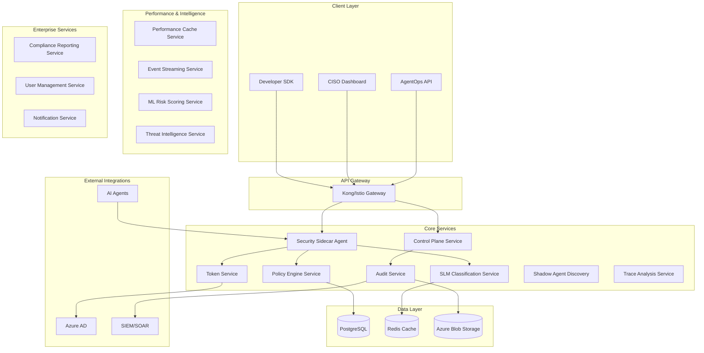
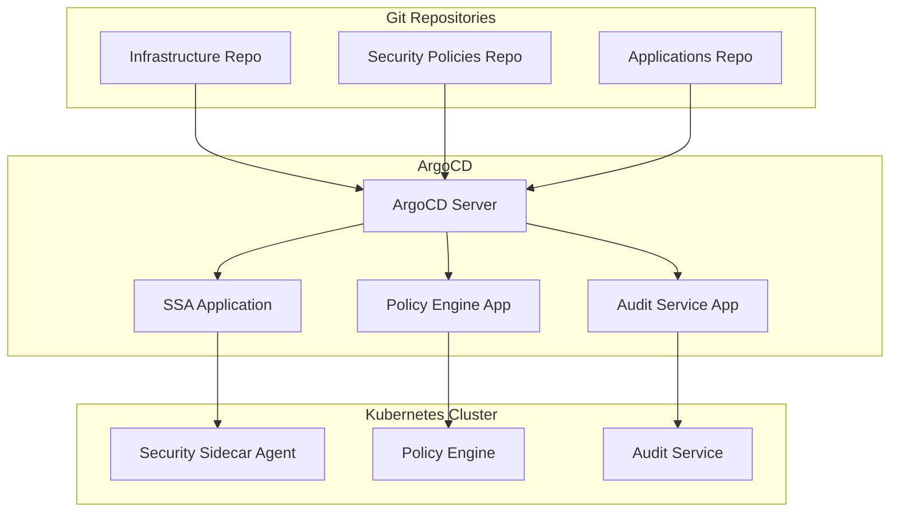

# AI Agent Security Platform - Design Document

> **⚠️ IMPORTANT NOTE**: This document represents the **long-term vision** for the AgentGuard platform (v0.3.0+) and includes research-inspired features planned for future releases. For the current implementation roadmap, see:
> - **v0.1.1** (Current): Basic MVP - See `packages/agent-guard-sdk/`
> - **v0.2.0** (In Progress): Competitive features - See `.kiro/specs/competitive-features-implementation/`
> - **v0.3.0** (Future): Research-inspired features - This document
>
> Many features described here (Trace Analysis, Shadow Agent Discovery, ML Risk Scoring, etc.) are **not part of v0.2.0** and will be implemented in future releases.

## Overview

The AI Agent Security Platform is a production-grade security and governance solution for autonomous AI agents. Built on a microservices architecture, it provides three distinct product offerings: a Developer SDK, AgentOps Runtime Security, and CISO Governance UI.

**Current Status**: This design document describes the complete vision including research-inspired advanced security features planned for v0.3.0 and beyond.

### Design Principles

- **Security by Design**: Every component implements zero-trust principles
- **Cloud Native**: Kubernetes-first with multi-cloud support
- **Developer First**: Seamless integration with existing workflows
- **Compliance Ready**: Built-in support for major regulatory frameworks
- **Performance Focused**: Sub-second response times with horizontal scaling
- **12-Factor Compliant**: Follows all twelve-factor app methodology principles

### 12-Factor App Compliance

1. **Codebase**: Single codebase per service, tracked in Git, deployed across environments
2. **Dependencies**: All dependencies explicitly declared in package.json/requirements.txt/go.mod
3. **Config**: Configuration stored in environment variables, never in code
4. **Backing Services**: Database, cache, message queues treated as attached resources via URLs
5. **Build/Release/Run**: Strict separation with immutable releases and unique version tags
6. **Processes**: Services are stateless; session state stored in Redis/database
7. **Port Binding**: Each service exports HTTP via port binding (no web server dependencies)
8. **Concurrency**: Horizontal scaling via process replication in Kubernetes pods
9. **Disposability**: Fast startup/shutdown with graceful termination handling
10. **Dev/Prod Parity**: Identical environments using containers and infrastructure-as-code
11. **Logs**: Treat logs as event streams, output to stdout, aggregated by log management
12. **Admin Processes**: One-off admin tasks run as separate containers in same environment

## Architecture

### High-Level Architecture



### Service Architecture

The platform follows a microservices architecture with clear service boundaries and 12-factor app compliance:

#### Core Services

1. **Security Sidecar Agent (SSA)**
   - Primary entry point for all agent requests
   - Orchestrates security workflow
   - Implements Agent Action Firewall (AAF)
   - **NEW: Collects execution traces for analysis** (AgentArmor-inspired)
   - **12-Factor**: Stateless, config via env vars, logs to stdout

2. **SLM Classification Service**
   - Runs small language models for intent analysis
   - Provides risk scoring and recommendations
   - Caches frequent classifications in Redis
   - **12-Factor**: Horizontally scalable, backing services via URLs

3. **Policy Engine Service**
   - Evaluates deterministic security policies
   - Supports Rego/Cedar policy languages
   - Manages policy versioning and rollback
   - **NEW: Integrates with trace analysis findings** (research-inspired)
   - **12-Factor**: Immutable deployments, config externalized

4. **Control Plane Service**
   - Manages service attestation and health
   - Distributes signed policy bundles
   - Implements kill switches and emergency controls
   - **12-Factor**: Admin processes as separate containers

5. **Audit Service**
   - Records all security decisions and actions
   - Implements PQC-sealed tamper-evident logs
   - Exports to SIEM/SOAR systems
   - **NEW: Stores execution traces and analysis results** (Research-inspired)
   - **12-Factor**: Logs as event streams, disposable processes

6. **Token Service**
   - Issues OAuth 2.0 tokens with RAR/Resource Indicators
   - Implements token introspection (RFC 7662)
   - Manages JIT scope provisioning
   - **12-Factor**: Port binding, dev/prod parity

7. **Trace Analysis Service** (NEW - Research-Inspired)
   - Converts execution traces to graph representations (CFG, DFG, PDG)
   - Performs program analysis for security pattern detection
   - Maintains property registry for tool security metadata
   - Provides forensic analysis and attack reconstruction
   - **Research Foundation:** Based on AgentArmor program analysis techniques (Wang et al., 2025)
   - **12-Factor**: Stateless processing, horizontally scalable

8. **Shadow Agent Discovery Service** (NEW - VC-Critical)
   - Continuously scans environment for unknown agents
   - Performs network traffic analysis and process monitoring
   - Maintains comprehensive agent registry and inventory
   - Provides agent fingerprinting and risk classification
   - Supports automated integration of discovered agents
   - **Business Critical:** Addresses key VC concern about securing unknown agents
   - **12-Factor**: Event-driven architecture, horizontally scalable

9. **Performance Cache Service** (NEW - Performance Critical)
   - Dedicated caching layer for sub-100ms latency requirements
   - Policy decision caching with intelligent invalidation
   - Agent behavior baseline caching for anomaly detection
   - Threat intelligence caching for real-time lookups
   - **Performance Critical:** Enables <100ms P95 latency SLA
   - **12-Factor**: Stateless, horizontally scalable, backing services via URLs

10. **Event Streaming Service** (NEW - Real-Time Processing)
    - Real-time event processing for agent activities
    - Security event correlation and alerting
    - Discovery event streaming for continuous monitoring
    - Integration with external SIEM/SOAR systems
    - **Real-Time Critical:** Enables immediate threat response
    - **12-Factor**: Event-driven, disposable processes, logs as streams

11. **ML Risk Scoring Service** (NEW - Advanced Intelligence)
    - Machine learning models for advanced risk assessment
    - Behavioral analysis and anomaly detection
    - Predictive risk scoring based on patterns
    - Model management and continuous learning
    - **Intelligence Critical:** Beyond rule-based policies
    - **12-Factor**: Stateless processing, model artifacts as backing services

12. **Threat Intelligence Service** (NEW - Proactive Security)
    - Integration with threat intelligence feeds
    - Attack pattern detection and IOC management
    - Proactive threat hunting and prevention
    - Custom threat modeling capabilities
    - **Security Critical:** Proactive vs. reactive security
    - **12-Factor**: External integrations as backing services

13. **Compliance Reporting Service** (NEW - Enterprise Required)
    - Automated compliance report generation
    - Evidence collection and audit support
    - Continuous compliance monitoring
    - Certification package preparation
    - **Enterprise Critical:** Required for enterprise sales
    - **12-Factor**: Admin processes as separate containers

## Components and Interfaces

### Security Sidecar Agent (SSA)

**Purpose**: Primary security enforcement point that mediates all agent tool/API calls.

**Key Interfaces**:
```typescript
interface AgentRequest {
  agentId: string;
  toolName: string;
  parameters: Record<string, any>;
  context: RequestContext;
}

interface SecurityDecision {
  action: 'allow' | 'deny' | 'transform';
  reason: string;
  transformedRequest?: AgentRequest;
  requiredScopes: string[];
  auditMetadata: AuditMetadata;
}
```

**Responsibilities**:
- Request interception and validation
- SLM consultation for risk assessment
- Policy engine evaluation
- Token acquisition and validation
- Audit trail generation

### SLM Classification Service

**Purpose**: Provides AI-powered intent classification and risk assessment.

**Key Interfaces**:
```typescript
interface ClassificationRequest {
  intent: string;
  toolMetadata: ToolMetadata;
  userContext: UserContext;
  environmentContext: EnvironmentContext;
}

interface ClassificationResponse {
  riskLevel: 'low' | 'medium' | 'high' | 'critical';
  intentCategory: string;
  recommendedAction: 'allow' | 'deny' | 'transform' | 'escalate';
  confidence: number;
  reasoning: string;
}
```

### Trace Analysis Service (NEW - Research-Inspired)

**Purpose**: Provides sophisticated program analysis of agent execution traces for advanced security detection.

**Research Foundation**: Implementation inspired by "AgentArmor: Enforcing Program Analysis on Agent Runtime Trace to Defend Against Prompt Injection" (Wang et al., 2025), with independent implementation and production-focused enhancements.

**Key Interfaces**:
```typescript
interface ExecutionTrace {
  agentId: string;
  requestId: string;
  toolCalls: ToolCall[];
  dataFlow: DataFlowEdge[];
  controlFlow: ControlFlowEdge[];
  dependencies: DependencyEdge[];
  timestamp: Date;
}

interface TraceAnalysisRequest {
  trace: ExecutionTrace;
  analysisType: 'prompt_injection' | 'anomaly_detection' | 'trust_boundary' | 'full';
  propertyRegistry: PropertyMetadata[];
}

interface TraceAnalysisResponse {
  riskLevel: 'low' | 'medium' | 'high' | 'critical';
  detectedPatterns: SecurityPattern[];
  graphAnalysis: {
    controlFlowGraph: CFGAnalysis;
    dataFlowGraph: DFGAnalysis;
    programDependencyGraph: PDGAnalysis;
  };
  forensicInfo: ForensicAnalysis;
  policyRecommendations: PolicyRecommendation[];
}
```

**Implementation Details**:
- Converts execution traces to graph-based intermediate representations
- Implements program analysis techniques for security pattern detection
- Maintains property registry with security-relevant metadata
- Provides detailed forensic analysis and attack reconstruction
- Supports both real-time and batch analysis modes

### Shadow Agent Discovery Service (NEW - VC-Critical)

**Purpose**: Provides comprehensive discovery and management of all agents in the environment, including unknown or shadow agents operating without proper governance.

**Business Critical**: Directly addresses the key VC concern: "How do you secure an agent you don't know exists?" - a critical differentiator for enterprise adoption and funding.

**Key Interfaces**:
```typescript
interface AgentDiscoveryRequest {
  scanType: 'network' | 'process' | 'filesystem' | 'comprehensive';
  environment: 'local' | 'container' | 'kubernetes' | 'cloud';
  filters?: DiscoveryFilter[];
}

interface DiscoveredAgent {
  agentId: string;
  discoveryMethod: 'network_scan' | 'process_monitor' | 'file_scan' | 'api_pattern';
  framework: 'langchain' | 'autogen' | 'crewai' | 'custom' | 'unknown';
  riskLevel: 'low' | 'medium' | 'high' | 'critical';
  securityStatus: 'secured' | 'unsecured' | 'unknown' | 'rogue';
  metadata: {
    processId?: number;
    networkPorts?: number[];
    configFiles?: string[];
    apiEndpoints?: string[];
    libraries?: string[];
  };
  firstSeen: Date;
  lastActivity: Date;
}

interface AgentRegistry {
  totalAgents: number;
  securedAgents: number;
  shadowAgents: number;
  rogueAgents: number;
  agents: DiscoveredAgent[];
  relationships: AgentRelationship[];
}

interface AgentIntegrationRequest {
  agentId: string;
  integrationMethod: 'automatic' | 'manual' | 'policy_injection';
  securityPolicies?: string[];
}
```

**Implementation Details**:
- **Network Discovery**: Scans for AI API calls (OpenAI, Anthropic, Azure OpenAI) and agent communication patterns
- **Process Monitoring**: Monitors Python/Node.js processes with AI libraries (langchain, openai, etc.)
- **File System Scanning**: Discovers agent configuration files, logs, and deployment artifacts
- **Agent Fingerprinting**: Classifies agents by framework, capabilities, and risk level
- **Continuous Monitoring**: Real-time detection of new agents and behavior changes
- **Automated Integration**: Attempts to bring discovered agents under governance
- **Relationship Mapping**: Tracks agent communications and dependencies
- **Risk Assessment**: Scores agents based on behavior, access patterns, and security posture

**Phase 1A Features (MVP)**:
- Basic network scanning and process monitoring
- Simple agent fingerprinting and registry
- Manual agent registration and classification
- Dashboard showing discovered vs. secured agents

**Phase 1B Features (Enhanced)**:
- Continuous real-time monitoring
- Automated integration attempts
- Agent behavior analysis and baselines
- Relationship mapping and ecosystem visualization

**Phase 2 Features (Enterprise)**:
- ML-powered agent classification
- Deep environment analysis (containers, cloud, K8s)
- Advanced threat detection for rogue agents
- Enterprise integration (CMDB, ITSM)

### Performance Cache Service (NEW - Performance Critical)

**Purpose**: Provides dedicated caching layer to achieve sub-100ms latency requirements for enterprise-scale deployments.

**Performance Critical**: Essential for meeting <100ms P95 latency SLA with thousands of concurrent agents.

**Key Interfaces**:
```typescript
interface PerformanceCacheService {
  // Policy decision caching
  getPolicyDecision(key: string): Promise<PolicyDecision | null>;
  cachePolicyDecision(key: string, decision: PolicyDecision, ttl: number): Promise<void>;
  
  // Agent behavior caching
  getAgentBaseline(agentId: string): Promise<BehaviorBaseline | null>;
  updateAgentBaseline(agentId: string, baseline: BehaviorBaseline): Promise<void>;
  
  // Threat intelligence caching
  getThreatData(indicator: string): Promise<ThreatData | null>;
  cacheThreatData(indicator: string, data: ThreatData, ttl: number): Promise<void>;
  
  // Cache management
  invalidateCache(pattern: string): Promise<void>;
  getCacheStats(): Promise<CacheStatistics>;
}
```

**Implementation Details**:
- **Multi-Level Caching**: L1 (in-memory), L2 (Redis local), L3 (Redis cluster)
- **Intelligent Invalidation**: Policy changes trigger selective cache invalidation
- **Cache Warming**: Proactive caching of frequently accessed data
- **Performance Monitoring**: Real-time cache hit rates and latency metrics
- **Distributed Consistency**: Cache coherence across multiple instances

### Event Streaming Service (NEW - Real-Time Processing)

**Purpose**: Provides real-time event processing and streaming for immediate threat response and continuous monitoring.

**Real-Time Critical**: Enables immediate threat detection and response within seconds of suspicious activity.

**Key Interfaces**:
```typescript
interface EventStreamingService {
  // Event publishing
  publishAgentEvent(event: AgentEvent): Promise<void>;
  publishSecurityEvent(event: SecurityEvent): Promise<void>;
  publishDiscoveryEvent(event: DiscoveryEvent): Promise<void>;
  
  // Event subscription
  subscribeToAgentEvents(callback: EventHandler<AgentEvent>): Subscription;
  subscribeToSecurityEvents(callback: EventHandler<SecurityEvent>): Subscription;
  subscribeToDiscoveryEvents(callback: EventHandler<DiscoveryEvent>): Subscription;
  
  // Stream processing
  createEventProcessor(config: ProcessorConfig): EventProcessor;
  deployProcessor(processor: EventProcessor): Promise<void>;
  
  // Integration
  connectSIEM(siemConfig: SIEMConfig): Promise<void>;
  connectSOAR(soarConfig: SOARConfig): Promise<void>;
}
```

**Implementation Details**:
- **Apache Kafka**: High-throughput, fault-tolerant event streaming
- **Stream Processing**: Real-time event correlation and pattern detection
- **Event Sourcing**: Complete audit trail through event logs
- **SIEM Integration**: Real-time security event forwarding
- **Scalable Architecture**: Horizontal scaling with partition-based processing

### ML Risk Scoring Service (NEW - Advanced Intelligence)

**Purpose**: Provides machine learning-powered risk assessment beyond traditional rule-based policies.

**Intelligence Critical**: Enables detection of sophisticated attacks that bypass rule-based systems.

**Key Interfaces**:
```typescript
interface MLRiskScoringService {
  // Real-time scoring
  scoreAgentRequest(request: AgentRequest, context: AgentContext): Promise<RiskScore>;
  scoreBehaviorPattern(pattern: BehaviorPattern): Promise<RiskAssessment>;
  
  // Model management
  deployModel(modelId: string, model: MLModel): Promise<void>;
  updateModel(modelId: string, updates: ModelUpdate): Promise<void>;
  getModelMetrics(modelId: string): Promise<ModelMetrics>;
  
  // Training and learning
  trainModel(trainingData: TrainingDataset): Promise<TrainingResult>;
  validateModel(validationData: ValidationDataset): Promise<ValidationResult>;
  
  // Feature engineering
  extractFeatures(data: RawData): Promise<FeatureVector>;
  updateFeatureStore(features: FeatureVector): Promise<void>;
}
```

**Implementation Details**:
- **Multiple ML Models**: Ensemble of models for different threat types
- **Feature Engineering**: Automated feature extraction from agent behavior
- **Continuous Learning**: Models improve with feedback and new data
- **A/B Testing**: Safe deployment of new models with performance comparison
- **Explainable AI**: Interpretable risk scores with reasoning

### Threat Intelligence Service (NEW - Proactive Security)

**Purpose**: Provides proactive threat detection through integration with threat intelligence feeds and attack pattern analysis.

**Security Critical**: Shifts from reactive to proactive security posture with predictive threat detection.

**Key Interfaces**:
```typescript
interface ThreatIntelligenceService {
  // Threat feed integration
  addThreatFeed(feedConfig: ThreatFeedConfig): Promise<void>;
  updateThreatFeeds(): Promise<UpdateResult>;
  queryThreatIntelligence(indicator: string): Promise<ThreatData>;
  
  // IOC management
  addIOC(ioc: IndicatorOfCompromise): Promise<void>;
  checkIOCs(data: any): Promise<IOCMatch[]>;
  updateIOCDatabase(): Promise<void>;
  
  // Attack pattern detection
  detectAttackPatterns(trace: ExecutionTrace): Promise<AttackPattern[]>;
  analyzeAttackChain(events: SecurityEvent[]): Promise<AttackChainAnalysis>;
  
  // Threat hunting
  huntThreats(huntingQuery: HuntingQuery): Promise<ThreatHuntResult>;
  createHuntingRule(rule: HuntingRule): Promise<void>;
}
```

**Implementation Details**:
- **Multiple Threat Feeds**: Integration with commercial and open-source feeds
- **IOC Database**: Comprehensive indicators of compromise database
- **Pattern Matching**: Advanced pattern detection algorithms
- **Threat Hunting**: Proactive threat hunting capabilities
- **Custom Intelligence**: Organization-specific threat intelligence

### Compliance Reporting Service (NEW - Enterprise Required)

**Purpose**: Provides automated compliance reporting and audit support for enterprise customers.

**Enterprise Critical**: Required for enterprise sales and regulatory compliance.

**Key Interfaces**:
```typescript
interface ComplianceReportingService {
  // Report generation
  generateComplianceReport(framework: ComplianceFramework, timeRange: TimeRange): Promise<ComplianceReport>;
  generateAuditReport(auditScope: AuditScope): Promise<AuditReport>;
  
  // Evidence collection
  collectAuditEvidence(requirement: ComplianceRequirement): Promise<AuditEvidence>;
  validateEvidence(evidence: AuditEvidence): Promise<ValidationResult>;
  
  // Continuous monitoring
  assessCompliancePosture(): Promise<CompliancePosture>;
  monitorComplianceMetrics(): Promise<ComplianceMetrics>;
  
  // Certification support
  prepareCertificationPackage(certification: CertificationType): Promise<CertificationPackage>;
  trackCertificationStatus(certificationId: string): Promise<CertificationStatus>;
}
```

**Implementation Details**:
- **Multiple Frameworks**: SOC 2, ISO 27001, HIPAA, PCI DSS, GDPR, NIST AI RMF
- **Automated Evidence**: Continuous evidence collection and validation
- **Real-Time Monitoring**: Continuous compliance posture assessment
- **Audit Support**: Complete audit trail and evidence packages
- **Certification Tracking**: Status tracking for multiple certifications

## Research Attribution

This design incorporates concepts and techniques from academic research, with all implementations developed independently for production use:

### Primary Research Foundation
- **Wang, P., Liu, Y., Lu, Y., et al.** (2025). "AgentArmor: Enforcing Program Analysis on Agent Runtime Trace to Defend Against Prompt Injection." *arXiv preprint arXiv:2508.01249*. 
  - **Concepts Used**: Graph-based trace analysis (CFG, DFG, PDG), property registry, program analysis for security
  - **Our Innovation**: Hybrid prevention+detection model, production-ready architecture, enterprise features

### Additional Research Influences
- **System-Level Observability**: AgentSight eBPF monitoring techniques adapted for security context
- **Multi-Agent Security**: Benchmarking research insights for cascading risk prevention
- **Graph-Based Detection**: SentinelAgent anomaly detection concepts adapted for trace analysis
- **Red Team Testing**: AgentVigil black-box testing approaches for continuous validation
- **Provable Security**: MELON trajectory analysis techniques for high-assurance environments

## Multi-Language SDK Architecture

### SDK Development Strategy

The platform follows a strategic multi-language approach prioritizing market timing and developer adoption:

#### Phase 1: JavaScript/TypeScript SDK (MVP)
**Target Audience**: AI agent developers, web developers, rapid prototyping
**Rationale**: 
- Aligns with AI agent ecosystem (LangChain, AutoGen, CrewAI)
- Faster development and market entry
- 17+ million JavaScript developers globally
- Lower barrier to entry for agent developers

```typescript
// JavaScript SDK Architecture
interface AgentGuardSDK {
  // Core security functions
  evaluateRequest(request: AgentRequest): Promise<SecurityDecision>;
  
  // Trace analysis integration
  enableTraceAnalysis(config: TraceConfig): void;
  
  // Policy management
  loadPolicies(policies: SecurityPolicy[]): void;
}
```

#### Phase 2: Java/Spring Boot SDK (Enterprise)
**Target Audience**: Enterprise customers, existing Java environments
**Rationale**:
- Enterprise Java dominance (60% of enterprise applications)
- Mature security ecosystem (Spring Security, Apache Shiro)
- Better enterprise integration capabilities
- Higher performance for CPU-intensive operations

```java
// Java SDK Architecture (Planned)
@Component
public class AgentGuardClient {
    
    @Autowired
    private SecurityEvaluator securityEvaluator;
    
    @Autowired
    private TraceAnalyzer traceAnalyzer;
    
    public SecurityDecision evaluateRequest(AgentRequest request) {
        // Enterprise-grade security evaluation
    }
}
```

#### Phase 3: Python SDK (AI/ML Integration)
**Target Audience**: AI/ML researchers, Python-heavy organizations
**Rationale**:
- Dominant language in AI/ML (60% of AI frameworks)
- Integration with existing Python agent frameworks
- Research community adoption

### Language-Agnostic API Design

All SDKs communicate with the same core API, ensuring consistent functionality:

```yaml
# Core API Endpoints (Language Agnostic)
POST /api/security/evaluate
GET  /api/security/policies  
POST /api/security/trace-analysis
GET  /api/security/audit/{agentId}
```

### Enterprise Java Considerations

#### Spring Boot Integration Features
- **Spring Security Integration**: Seamless authentication/authorization
- **Dependency Injection**: Native Spring IoC container support
- **Aspect-Oriented Programming**: Cross-cutting security concerns
- **Enterprise Monitoring**: JMX, Micrometer, Actuator integration
- **Configuration Management**: Spring Boot configuration properties

#### Java Ecosystem Advantages
- **Performance**: Better for CPU-intensive security operations
- **Concurrency**: Mature threading and async processing
- **Security Libraries**: Robust cryptographic and security frameworks
- **Enterprise Integration**: Better SAP, Oracle, IBM system integration
### GitOps Architecture with ArgoCD

#### ArgoCD Integration Strategy

The platform leverages ArgoCD for GitOps-based deployment and policy management:



#### ArgoCD Applications Structure

```yaml
# ArgoCD Application for Security Sidecar Agent
apiVersion: argoproj.io/v1alpha1
kind: Application
metadata:
  name: agentguard-ssa
  namespace: argocd
spec:
  project: agentguard
  source:
    repoURL: https://github.com/agentguard/infrastructure
    targetRevision: HEAD
    path: manifests/ssa
    helm:
      valueFiles:
      - values-production.yaml
  destination:
    server: https://kubernetes.default.svc
    namespace: agentguard-production
  syncPolicy:
    automated:
      prune: true
      selfHeal: true
    syncOptions:
    - CreateNamespace=true
```

#### Policy Management Through GitOps

**Security Policy Repository Structure:**
```
security-policies/
├── environments/
│   ├── dev/
│   │   ├── base-policies.json
│   │   └── kustomization.yaml
│   ├── staging/
│   │   ├── base-policies.json
│   │   └── kustomization.yaml
│   └── production/
│       ├── base-policies.json
│       └── kustomization.yaml
├── industry-packs/
│   ├── healthcare/
│   ├── finance/
│   └── pharma/
└── custom-policies/
    ├── customer-a/
    └── customer-b/
```

**Policy Deployment Workflow:**
1. **Policy Development**: Security team creates/updates policies in Git
2. **Review Process**: Pull request review and approval
3. **ArgoCD Sync**: Automatic deployment to target environments
4. **Validation**: Health checks and policy validation
5. **Rollback**: Automatic rollback if validation fails

#### Multi-Environment Management

```yaml
# Environment-specific ArgoCD Projects
apiVersion: argoproj.io/v1alpha1
kind: AppProject
metadata:
  name: agentguard-production
spec:
  description: AgentGuard Production Environment
  sourceRepos:
  - 'https://github.com/agentguard/*'
  destinations:
  - namespace: 'agentguard-*'
    server: https://kubernetes.default.svc
  clusterResourceWhitelist:
  - group: ''
    kind: Namespace
  - group: 'rbac.authorization.k8s.io'
    kind: ClusterRole
```

#### Deployment Strategies

**Progressive Deployment with ArgoCD:**
- **Blue-Green Deployments**: Zero-downtime policy updates
- **Canary Releases**: Gradual rollout of new security features
- **Feature Flags**: Environment-specific feature enablement
- **Rollback Automation**: Automatic rollback on health check failures

#### Enterprise Integration Benefits

1. **Compliance Audit Trail**: All changes tracked in Git with full history
2. **Change Management**: Integration with enterprise change approval processes
3. **Disaster Recovery**: Complete infrastructure recreation from Git repositories
4. **Multi-Tenant Support**: Separate ArgoCD applications per customer/environment
5. **Security**: RBAC integration with enterprise identity providers

### Policy Engine Service

**Purpose**: Evaluates deterministic security policies and makes final authorization decisions.

**Key Interfaces**:
```typescript
interface PolicyEvaluationRequest {
  slmRecommendation: ClassificationResponse;
  agentContext: AgentContext;
  resourceContext: ResourceContext;
  policyVersion: string;
}

interface PolicyDecision {
  allow: boolean;
  reason: string;
  requiredScopes: OAuth2Scope[];
  transformations: RequestTransformation[];
  auditRequirements: AuditRequirement[];
}
```

**Policy Language Support**:
- Open Policy Agent (Rego)
- Cedar policy language
- Custom JSON-based rules for simple cases

## Data Models

### Core Entities

#### Agent Registration
```typescript
interface Agent {
  id: string;
  name: string;
  version: string;
  owner: string;
  capabilities: string[];
  riskProfile: RiskProfile;
  attestationStatus: AttestationStatus;
  createdAt: Date;
  lastActive: Date;
}
```

#### Security Policy
```typescript
interface SecurityPolicy {
  id: string;
  name: string;
  version: string;
  language: 'rego' | 'cedar' | 'json';
  content: string;
  signature: string;
  effectiveDate: Date;
  expirationDate?: Date;
  industryPack?: string;
}
```

#### Audit Record
```typescript
interface AuditRecord {
  id: string;
  timestamp: Date;
  agentId: string;
  requestId: string;
  action: string;
  decision: SecurityDecision;
  executionResult?: ExecutionResult;
  pqcSeal: string;
  complianceFlags: string[];
}
```

### Database Schema

**PostgreSQL Tables** (Factor 4: Backing Services):
- `agents` - Agent registration and metadata
- `policies` - Security policies and versions
- `audit_records` - Security decisions and actions
- `tokens` - OAuth token metadata and status
- `compliance_mappings` - Framework-specific requirements

**Redis Cache** (Factor 4: Backing Services):
- SLM classification results (TTL: 1 hour)
- Policy evaluation cache (TTL: 30 minutes)
- Token introspection cache (TTL: 5 minutes)

**Environment Parity** (Factor 10: Dev/Prod Parity):
- Identical database schemas across all environments
- Same Redis configuration and versions
- Infrastructure-as-code for consistent provisioning
- Automated testing in production-like environments

### Configuration Management

Following 12-factor principles, all configuration is externalized:

```typescript
interface ServiceConfig {
  // Database connections (Factor 4: Backing Services)
  DATABASE_URL: string;
  REDIS_URL: string;
  BLOB_STORAGE_URL: string;
  
  // Service discovery (Factor 4)
  SLM_SERVICE_URL: string;
  POLICY_ENGINE_URL: string;
  TOKEN_SERVICE_URL: string;
  
  // Security settings (Factor 3: Config)
  JWT_SECRET: string;
  PQC_SIGNING_KEY: string;
  OAUTH_CLIENT_ID: string;
  
  // Performance tuning (Factor 3)
  MAX_CONCURRENT_REQUESTS: number;
  CACHE_TTL_SECONDS: number;
  REQUEST_TIMEOUT_MS: number;
  
  // Observability (Factor 11: Logs)
  LOG_LEVEL: 'debug' | 'info' | 'warn' | 'error';
  TELEMETRY_ENDPOINT: string;
  METRICS_PORT: number;
}
```

### Deployment Architecture

**Container Strategy** (Factor 5: Build/Release/Run):
- Each service built as immutable Docker container
- Semantic versioning for all releases
- Blue-green deployments with health checks
- Rollback capability to previous versions

**Process Model** (Factor 6: Processes):
- All services are stateless
- Session data stored in Redis
- File uploads streamed to blob storage
- No local filesystem dependencies

**Scaling Strategy** (Factor 8: Concurrency):
- Horizontal pod autoscaling in Kubernetes
- Load balancing across service instances
- Circuit breakers for service protection
- Queue-based processing for async operations

## Error Handling

### Error Categories

1. **Authentication Errors**
   - Invalid agent credentials
   - Expired certificates
   - Attestation failures

2. **Authorization Errors**
   - Policy violations
   - Insufficient permissions
   - Resource access denied

3. **System Errors**
   - Service unavailability
   - Network timeouts
   - Database connection failures

### Error Response Format

```typescript
interface ErrorResponse {
  error: {
    code: string;
    message: string;
    details?: Record<string, any>;
    retryable: boolean;
    suggestedAction?: string;
  };
  requestId: string;
  timestamp: Date;
}
```

### Failure Modes

- **Fail Closed**: Default behavior when security services are unavailable
- **Circuit Breaker**: Automatic service isolation during failures
- **Graceful Degradation**: Reduced functionality with basic security controls
- **Emergency Override**: Manual bypass for critical business operations

## Testing Strategy

### Unit Testing
- Individual service logic validation
- Policy evaluation correctness
- Error handling scenarios
- Mock external dependencies

### Integration Testing
- Service-to-service communication
- End-to-end security workflows
- Database transaction integrity
- External system integrations

### Property-Based Testing
- Security policy correctness across all inputs
- Token generation and validation properties
- Audit trail completeness and integrity
- Performance characteristics under load

**Testing Configuration**:
- Minimum 100 iterations per property test
- Use Hypothesis (Python) or fast-check (TypeScript)
- Each test tagged with: **Feature: ai-agent-security-platform, Property {N}: {description}**

### Performance Testing
- Load testing with realistic agent traffic
- Latency requirements: P95 < 100ms for authorization decisions
- Throughput requirements: 10,000 requests/second per SSA instance
- Stress testing for failure scenarios

## Correctness Properties

*A property is a characteristic or behavior that should hold true across all valid executions of a system—essentially, a formal statement about what the system should do. Properties serve as the bridge between human-readable specifications and machine-verifiable correctness guarantees.*

Based on the requirements analysis, the following properties ensure the system behaves correctly across all scenarios:

### Property 1: Complete SSA Mediation
*For any* agent tool/API call, the Security Sidecar Agent should intercept and mediate the request, ensuring no bypasses occur and maintaining at least 95% coverage across all agent actions.
**Validates: Requirements 1.1, 1.3, 9.3**

### Property 2: Identity Validation Consistency
*For any* incoming tool call request, the system should validate the agent's identity and authorization before proceeding with security evaluation.
**Validates: Requirements 1.2**

### Property 3: Fail-Closed Security Behavior
*For any* system state where the SSA is unavailable, all tool calls should be denied, ensuring security-first failure handling.
**Validates: Requirements 1.5**

### Property 4: SLM Analysis Completeness
*For any* tool call request received by the SSA, the SLM should perform intent analysis and generate structured JSON output that conforms to the defined schema.
**Validates: Requirements 2.1, 2.2, 2.3**

### Property 5: Risk Classification Consistency
*For any* SLM analysis output, the risk classification should fall into one of the defined categories (low, medium, high, critical) with valid reasoning.
**Validates: Requirements 2.4**

### Property 6: SLM Failure Handling
*For any* SLM analysis that fails or produces invalid output, the system should default to denying the request with appropriate logging.
**Validates: Requirements 2.5**

### Property 7: Policy Engine Authority
*For any* security decision, the Policy Engine should make the final authorization determination, potentially overriding SLM recommendations based on deterministic rules.
**Validates: Requirements 3.1**

### Property 8: Minimal Permission Token Generation
*For any* authorized request, the system should generate OAuth RAR tokens containing only the minimal required permissions and proper resource indicators.
**Validates: Requirements 3.3, 4.1, 4.2**

### Property 9: Authorization Denial Transparency
*For any* denied authorization request, the system should provide a clear, actionable reason for the denial.
**Validates: Requirements 3.4**

### Property 10: Request Transformation Correctness
*For any* request subject to transformation rules, the transformed request should preserve the original intent while reducing risk (e.g., write operations converted to read-only).
**Validates: Requirements 3.5**

### Property 11: Token Validation and Introspection
*For any* token validation operation, the system should use RFC 7662 introspection to verify active status and permissions, with failed validations resulting in request denial and token revocation.
**Validates: Requirements 4.3, 4.5**

### Property 12: JIT Scope Time Limits
*For any* just-in-time scope provisioning, the granted permissions should be properly time-limited and automatically expire according to policy.
**Validates: Requirements 4.4**

### Property 13: Comprehensive Audit Trail
*For any* agent action, the system should record a complete audit trail including SLM verdict, policy decision, and execution result with PQC tamper-evident sealing.
**Validates: Requirements 6.1, 6.2, 6.3**

### Property 14: Observability Integration
*For any* system operation, appropriate traces should be generated and exported to OpenTelemetry and Azure AI Foundry tracing systems.
**Validates: Requirements 6.4**

### Property 15: SIEM Export Compatibility
*For any* audit record, the data should be exportable in formats compatible with SIEM and SOAR systems.
**Validates: Requirements 6.5**

### Property 16: SLM Caching Efficiency
*For any* low-risk decision classification, the SLM should cache the result and reuse it for identical subsequent requests to minimize computational overhead.
**Validates: Requirements 9.4**

### Property 17: Registry Completeness
*For any* protected tool or API, it should be properly registered in the SSA registry and subject to security controls.
**Validates: Requirements 1.4**

### Property 18: Policy Language Support
*For any* security policy written in Rego or Cedar format, the Policy Engine should correctly parse and evaluate the rules.
**Validates: Requirements 3.2**

## Future Architecture Enhancements (Phase 2+ Roadmap)

*The following architectural components represent our strategic roadmap for addressing emerging threats and industry standards identified in 2025 research.*

### OWASP Top 10 Agentic Applications Architecture

#### Goal Integrity Monitor (ASI01 - Agent Goal Hijack)
```typescript
interface GoalIntegrityService {
  validateGoalConsistency(originalGoal: AgentGoal, currentActions: AgentAction[]): SecurityDecision;
  detectIntentManipulation(conversationHistory: Message[]): ThreatAssessment;
  monitorGoalDrift(agentId: string, timeWindow: number): GoalDriftAnalysis;
}
```

#### Tool Usage Validator (ASI02 - Tool Misuse & Exploitation)
```typescript
interface ToolSecurityService {
  validateToolInvocation(toolName: string, parameters: any, context: ExecutionContext): ValidationResult;
  assessToolRisk(toolCapabilities: ToolCapability[], userIntent: string): RiskAssessment;
  preventToolWeaponization(toolChain: ToolInvocation[]): SecurityDecision;
}
```

#### Memory Integrity Guard (ASI06 - Memory & Context Poisoning)
```typescript
interface MemorySecurityService {
  validateMemoryUpdate(update: MemoryUpdate, source: DataSource): ValidationResult;
  detectPoisoningPatterns(memoryContent: any, updateHistory: MemoryUpdate[]): ThreatAssessment;
  quarantineCorruptedMemory(memoryId: string, reason: string): QuarantineResult;
}
```

### Framework-Agnostic Security Layer

#### Universal Agent Interceptor
```typescript
interface UniversalAgentInterceptor {
  // Works across AutoGen, CrewAI, LangChain, custom frameworks
  interceptAgentCommunication(message: AgentMessage, framework: FrameworkType): InterceptionResult;
  normalizeFrameworkEvents(event: FrameworkEvent): StandardizedEvent;
  applyFrameworkSpecificPolicies(framework: FrameworkType, policies: SecurityPolicy[]): PolicySet;
}
```

#### Cross-Framework Audit Trail
```typescript
interface CrossFrameworkAuditor {
  logFrameworkAgnosticEvent(event: StandardizedEvent): AuditRecord;
  correlateMultiFrameworkAttacks(events: StandardizedEvent[]): AttackCorrelation;
  generateUnifiedSecurityReport(timeRange: TimeRange): SecurityReport;
}
```

### Advanced Threat Detection Architecture

#### Multi-Step Attack Chain Detector
```typescript
interface AttackChainDetector {
  analyzeActionSequence(actions: AgentAction[]): AttackChainAnalysis;
  detectBenignLookingMaliciousSequence(sequence: ActionSequence): ThreatAssessment;
  predictAttackProgression(partialChain: AgentAction[]): AttackPrediction;
}
```

#### Hallucinated Compliance Detector
```typescript
interface ComplianceAnalyzer {
  detectHallucinatedResponse(response: AgentResponse, context: ExecutionContext): HallucinationAnalysis;
  validateResponseAuthenticity(response: AgentResponse, expectedBehavior: BehaviorModel): AuthenticityCheck;
  classifyDefensiveBehavior(response: AgentResponse): DefensiveBehaviorType;
}
```

### Enterprise Integration Architecture

#### Microsoft Agent 365 Connector
```typescript
interface Agent365Integration {
  syncWithAgent365Governance(policies: SecurityPolicy[]): SyncResult;
  authenticateViaEntraID(agentIdentity: AgentIdentity): AuthenticationResult;
  reportToDefenderForCloud(securityEvent: SecurityEvent): ReportingResult;
}
```

#### NIST AI RMF 2.0 Compliance Engine
```typescript
interface NISTComplianceEngine {
  assessRiskCategories(agent: AgentProfile): NISTRiskAssessment;
  generateComplianceReport(timeRange: TimeRange): NISTComplianceReport;
  mapControlsToAgentBehavior(controls: NISTControl[]): ControlMapping;
}
```

### Deployment Strategy for Future Enhancements

#### Phased Implementation Approach
1. **Phase 2 (Months 2-3)**: OWASP Top 10 core protections
2. **Phase 3 (Months 4-6)**: Framework-agnostic security layer
3. **Phase 4 (Months 6-12)**: Advanced threat detection and enterprise integrations

#### Backward Compatibility Strategy
- All future enhancements designed as optional modules
- Existing APIs maintained for seamless upgrades
- Progressive enhancement model for enterprise customers
- Feature flags for gradual rollout of advanced capabilities

## Research Attribution

This design incorporates concepts and techniques from academic research, with all implementations developed independently for production use:

### Primary Research Foundation
- **Wang, P., Liu, Y., Lu, Y., et al.** (2025). "AgentArmor: Enforcing Program Analysis on Agent Runtime Trace to Defend Against Prompt Injection." *arXiv preprint arXiv:2508.01249*. 
  - **Concepts Used**: Graph-based trace analysis (CFG, DFG, PDG), property registry, program analysis for security
  - **Our Innovation**: Hybrid prevention+detection model, production-ready architecture, enterprise features

### Additional Research Influences
- **System-Level Observability**: AgentSight eBPF monitoring techniques adapted for security context
- **Multi-Agent Security**: Benchmarking research insights for cascading risk prevention
- **Graph-Based Detection**: SentinelAgent anomaly detection concepts adapted for trace analysis
- **Red Team Testing**: AgentVigil black-box testing approaches for continuous validation
- **Provable Security**: MELON trajectory analysis techniques for high-assurance environments

### 2025 Industry Standards Integration
- **OWASP Top 10 for Agentic Applications**: Industry-standard vulnerability framework
- **Microsoft Agent 365**: Enterprise governance and identity integration
- **NIST AI RMF 2.0**: Federal risk management framework compliance
- **Penetration Testing Research**: Framework-specific vulnerability mitigation

**Legal Note**: All research concepts have been independently implemented. No source code, datasets, or proprietary implementations from research papers have been directly copied. This design represents original work inspired by published academic concepts.

## User Interface Architecture

### Strategic UI Approach: Unified Dashboard

The platform follows a unified dashboard strategy rather than individual per-service UIs, based on industry best practices and enterprise user experience requirements.

#### Design Principles
- **Single Point of Entry**: One dashboard for all security operations
- **API-First**: All UI functionality available programmatically
- **Progressive Enhancement**: Phased UI development aligned with customer needs
- **Micro-Frontend Architecture**: Independent module development with unified experience
- **Role-Based Customization**: Different views for developers, security ops, and executives

### Phase 1A: CLI and API-First Approach

#### AgentGuard CLI Architecture
```bash
# Core CLI operations
agentguard auth login --api-key <key>
agentguard policy list --format json
agentguard policy create --file security-policy.json
agentguard agent status --agent-id <id>
agentguard audit export --start-date 2025-01-01 --format csv
agentguard health check --services all
```

#### CLI Implementation Structure
```typescript
interface AgentGuardCLI {
  // Authentication commands
  auth: {
    login(apiKey: string): Promise<AuthResult>;
    logout(): Promise<void>;
    status(): Promise<AuthStatus>;
  };
  
  // Policy management
  policy: {
    list(filters?: PolicyFilters): Promise<PolicyList>;
    create(policyFile: string): Promise<PolicyResult>;
    update(policyId: string, policyFile: string): Promise<PolicyResult>;
    delete(policyId: string): Promise<DeleteResult>;
    validate(policyFile: string): Promise<ValidationResult>;
  };
  
  // Agent operations
  agent: {
    list(filters?: AgentFilters): Promise<AgentList>;
    status(agentId: string): Promise<AgentStatus>;
    register(agentConfig: AgentConfig): Promise<RegistrationResult>;
    deregister(agentId: string): Promise<DeregistrationResult>;
  };
  
  // Audit and monitoring
  audit: {
    query(filters: AuditFilters): Promise<AuditResults>;
    export(format: ExportFormat, filters: AuditFilters): Promise<ExportResult>;
    stream(filters?: AuditFilters): AsyncIterable<AuditEvent>;
  };
  
  // System health
  health: {
    check(services?: string[]): Promise<HealthStatus>;
    metrics(): Promise<SystemMetrics>;
  };
}
```

### Phase 1B: Unified Admin Dashboard

#### Dashboard Architecture
```typescript
interface UnifiedDashboard {
  // Core navigation shell
  shell: {
    navigation: UnifiedNavigation;
    authentication: SingleSignOn;
    notifications: GlobalNotifications;
    userProfile: UserManagement;
  };
  
  // Main dashboard modules
  modules: {
    overview: SecurityOverviewModule;
    agents: AgentManagementModule;
    policies: PolicyManagementModule;
    audit: AuditTrailModule;
    alerts: SecurityAlertsModule;
    system: SystemHealthModule;
  };
}
```

#### Backend for Frontend (BFF) Pattern
```typescript
interface AgentGuardBFF {
  // Service orchestration for UI
  async getDashboardData(userId: string): Promise<DashboardData> {
    const [agents, policies, alerts, health] = await Promise.all([
      this.agentService.getAgentSummary(),
      this.policyService.getPolicySummary(),
      this.alertService.getActiveAlerts(),
      this.healthService.getSystemHealth()
    ]);
    
    return {
      overview: this.buildOverview(agents, policies, alerts),
      agents: agents,
      policies: policies,
      alerts: alerts,
      systemHealth: health
    };
  }
  
  // Unified API gateway for UI operations
  async executeSecurityOperation(operation: SecurityOperation): Promise<OperationResult> {
    // Route to appropriate service based on operation type
    switch (operation.type) {
      case 'policy-update':
        return await this.policyService.updatePolicy(operation.data);
      case 'agent-action':
        return await this.agentService.executeAction(operation.data);
      case 'audit-query':
        return await this.auditService.query(operation.data);
      default:
        throw new Error(`Unknown operation type: ${operation.type}`);
    }
  }
}
```

### Phase 2: Enterprise CISO Dashboard

#### Executive Dashboard Architecture
```typescript
interface CISODashboard extends UnifiedDashboard {
  // Executive-level modules
  executiveModules: {
    riskSummary: RiskSummaryModule;
    complianceStatus: ComplianceModule;
    threatIntelligence: ThreatIntelModule;
    policyGovernance: PolicyGovernanceModule;
    incidentResponse: IncidentResponseModule;
    businessMetrics: BusinessMetricsModule;
  };
  
  // Advanced features
  advancedFeatures: {
    customReporting: ReportBuilderModule;
    workflowAutomation: WorkflowModule;
    teamCollaboration: CollaborationModule;
    auditPackaging: CompliancePackagingModule;
  };
}
```

### Micro-Frontend Implementation

#### Module Architecture
```typescript
// Independent micro-frontend modules
interface MicroFrontendModule {
  // Module lifecycle
  mount(container: HTMLElement, props: ModuleProps): Promise<void>;
  unmount(): Promise<void>;
  update(props: ModuleProps): Promise<void>;
  
  // Module communication
  subscribe(event: string, handler: EventHandler): void;
  publish(event: string, data: any): void;
  
  // Module configuration
  getConfig(): ModuleConfig;
  setConfig(config: ModuleConfig): void;
}

// Policy Management Micro-Frontend
class PolicyManagementModule implements MicroFrontendModule {
  async mount(container: HTMLElement, props: ModuleProps) {
    // Render React/Vue component for policy management
    const PolicyApp = await import('./PolicyManagementApp');
    ReactDOM.render(<PolicyApp {...props} />, container);
  }
  
  // Handle cross-module communication
  subscribe('policy-updated', (policy) => {
    this.refreshPolicyList();
    this.publish('global-notification', {
      type: 'success',
      message: `Policy ${policy.name} updated successfully`
    });
  });
}
```

### Technology Stack

#### Frontend Technologies
```yaml
# Phase 1B: MVP Dashboard Stack
Framework: React 18 with JavaScript
Build Tool: Vite
Styling: Tailwind CSS + Headless UI
State Management: React Context API
Charts: Recharts for basic visualizations
Forms: React Hook Form
Icons: Heroicons
HTTP Client: Axios with React Query
Development: React DevTools + Vite HMR

# Phase 2: Enterprise Dashboard Stack  
Framework: React 18 with TypeScript migration
State Management: Redux Toolkit + RTK Query
UI Components: Custom AgentGuard Design System
Charts: Recharts + D3.js for advanced visualizations
Tables: TanStack Table (React Table v8)
Forms: React Hook Form + Zod validation
Real-time: Socket.io for live updates
Notifications: React Hot Toast
Testing: Vitest + React Testing Library
Documentation: Storybook for component library
```

#### Backend for Frontend (BFF)
```yaml
# BFF Service Stack
Runtime: Node.js with Express.js
Language: JavaScript (Phase 1B) → TypeScript (Phase 2)
API Gateway: Custom aggregation layer
Authentication: JWT + OAuth 2.0 integration
Caching: Redis for dashboard data caching
WebSocket: Socket.io for real-time updates
Validation: Joi (Phase 1B) → Zod (Phase 2)
```

### Security Considerations

#### UI Security Architecture
```typescript
interface UISecurityLayer {
  // Authentication and authorization
  authentication: {
    singleSignOn: SSOIntegration;
    multiFactorAuth: MFASupport;
    sessionManagement: SecureSessionHandling;
  };
  
  // Content security
  contentSecurity: {
    cspHeaders: ContentSecurityPolicy;
    xssProtection: XSSPrevention;
    csrfProtection: CSRFTokens;
  };
  
  // Data protection
  dataProtection: {
    sensitiveDataMasking: DataMaskingRules;
    auditLogging: UIAuditTrail;
    encryptedStorage: ClientSideEncryption;
  };
}
```

### Deployment Architecture

#### UI Deployment Strategy
```yaml
# Production Deployment
CDN: CloudFlare for global distribution
Static Hosting: AWS S3 + CloudFront
BFF Deployment: Kubernetes with auto-scaling
SSL/TLS: Automated certificate management
Monitoring: Real User Monitoring (RUM) + Error tracking

# Development Environment
Local Development: Vite dev server with HMR
API Mocking: MSW (Mock Service Worker)
Testing: Automated E2E testing with Playwright
CI/CD: GitHub Actions with preview deployments
```

### Performance Optimization

#### Dashboard Performance Strategy
```typescript
interface PerformanceOptimizations {
  // Code splitting and lazy loading
  codesplitting: {
    routeBasedSplitting: boolean;
    componentLazyLoading: boolean;
    modulePreloading: boolean;
  };
  
  // Data optimization
  dataOptimization: {
    virtualizedTables: boolean;
    infiniteScrolling: boolean;
    optimisticUpdates: boolean;
    backgroundSync: boolean;
  };
  
  // Caching strategy
  caching: {
    serviceWorker: boolean;
    apiResponseCaching: boolean;
    staticAssetCaching: boolean;
  };
}
```