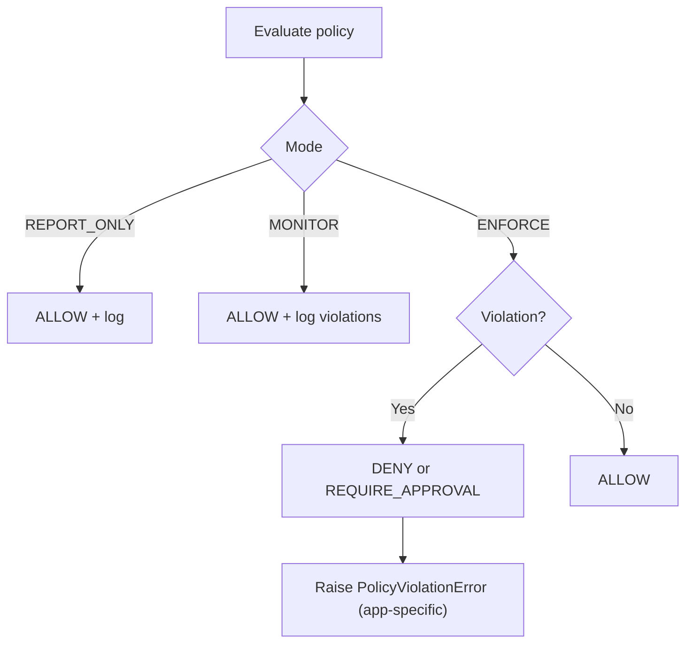

import { Callout } from "mintlify/components";

> **Version:** v1.1.0  
> This page documents behavior guaranteed in TealTiger v1.1.0.

# Enforcement Flow

<Callout type="note">
Mermaid diagrams require literal syntax (for example, use <code>--></code> inside the diagram source). If you see a render error, ensure the diagram block is not HTML-encoded.
</Callout>

## Notes

- **REPORT_ONLY:** Always allows execution but records decision evidence.
- **MONITOR:** Allows execution and records violations for tuning policies.
- **ENFORCE:** Blocks (or defers) when violations occur.

<Callout type="info">
Error handling is application-specific. Some integrations may throw exceptions; others may return structured errors. The stable contract is the emitted <b>Decision</b> and its <b>action</b>.
</Callout>
