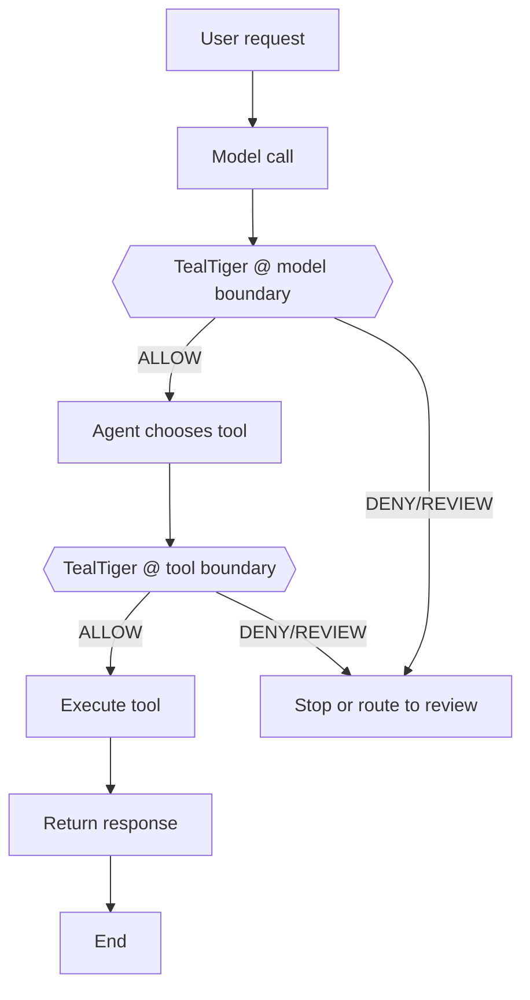
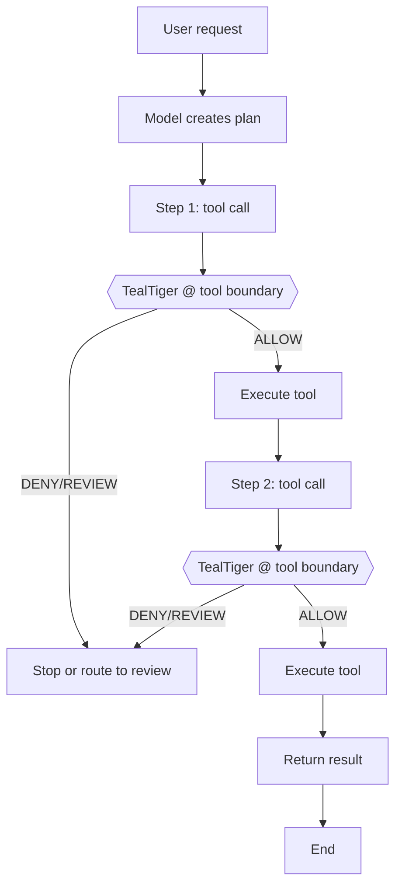
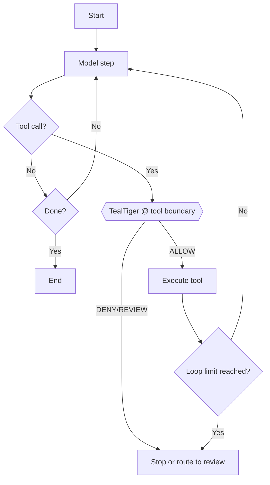
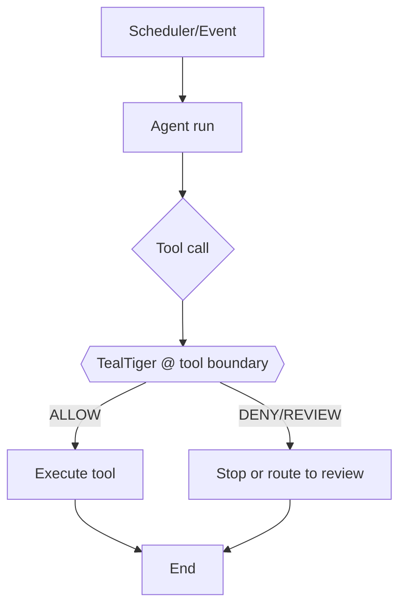
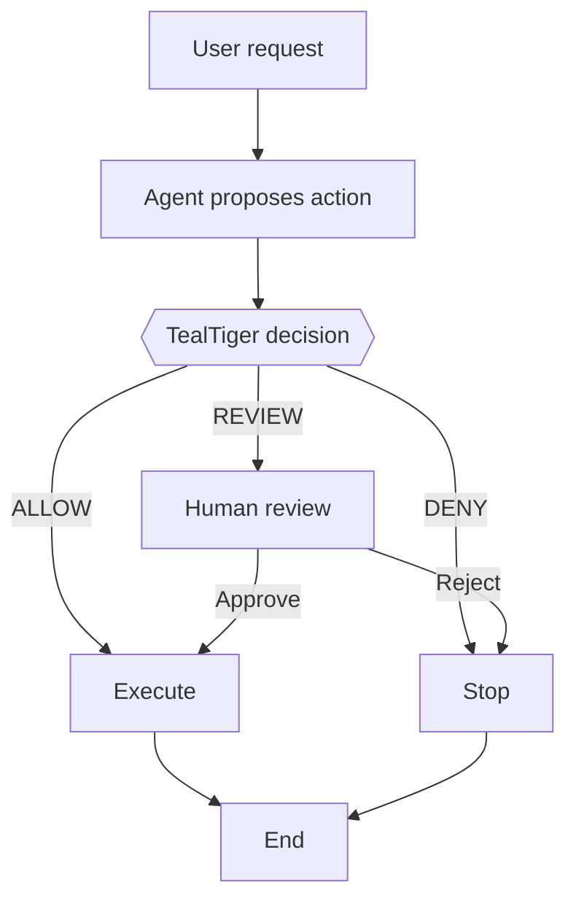

import { Callout } from 'mintlify/components';

# Agentic Patterns (v1.1) — Where TealTiger Fits

_Last updated: 2026-03-03_

<Callout type="info" title="Scope: v1.1.x only">
This page is **strictly scoped to TealTiger v1.1.x**.

- It only describes patterns using **capabilities that exist in v1.1.x** (SDK-first boundary interception + deterministic decisioning + logging).
- It does **not** reference v1.2/v1.3-only concepts (hybrid certificates, certified governance, platform triggers, etc.).
</Callout>

## What TealTiger v1.1 can do (scope reminder)
TealTiger v1.1 is applied at **execution boundaries**:
- **Model invocation boundary** (before/after calling the LLM)
- **Tool invocation boundary** (before executing a tool/API/function)

Typical outcomes in v1.1-style deployments:
- Allow an action
- Block an action
- Route to human review/approval (if your app implements a review path)
- Redact/transform output (only if your v1.1 integration implements it)

<Callout type="warning" title="Version hygiene">
If a capability is not implemented in your v1.1 branch, treat it as **out of scope** for this page.
</Callout>

---

## Pattern 1 — Single-Step Tool Agent

### What it is
One user request leads to one model call and (optionally) one tool call.

### Primary risks
- Unsafe tool call (wrong tool / wrong parameters)
- Leaking sensitive data in responses

### Where to apply TealTiger v1.1
- **Tool boundary**: validate/allow/deny the tool invocation
- **Model boundary**: validate response before returning to user

### Diagram (v1.1 placement)


---

## Pattern 2 — Planner → Executor (Two-Phase Agent)

### What it is
The agent creates a plan (steps) and executes step-by-step.

### Primary risks
- Plan drift (steps exceed intended scope)
- Hard-to-stop mid-flight unless you gate every step

### Where to apply TealTiger v1.1
- Apply TealTiger **at every tool call**, not just at the planning phase.

### Diagram (v1.1 placement)


---

## Pattern 3 — ReAct / Looping Agent

### What it is
The agent loops: think → act → observe → think → act …

### Primary risks
- Infinite loops
- Tool-call storms (cost + blast radius)

### Where to apply TealTiger v1.1
- Apply TealTiger at **every tool boundary**.
- Add deterministic loop limits in your app logic (e.g., max steps / max tool calls).

### Diagram (v1.1 placement)


---

## Pattern 4 — Retrieval-Augmented Agent (RAG)

### What it is
The agent retrieves documents/context and then calls the model.

### Primary risks
- Prompt injection via retrieved content
- Data exposure from unapproved sources

### Where to apply TealTiger v1.1
If v1.1 does not have a dedicated retrieval boundary, treat retrieval as a **tool**:
- Govern the retrieval call at the **tool boundary**
- Govern the final answer at the **model boundary**

### Diagram (v1.1 placement)
```mermaid
flowchart TD
  U[User request] --> Q[Retrieval query]
  Q --> T1{{TealTiger @ tool boundary (retrieval as tool)}}
  T1 -->|ALLOW| R1[Retrieve context]
  T1 -->|DENY/REVIEW| R0[Stop or route to review]
  R1 --> M[Model call with context]
  M --> T2{{TealTiger @ model boundary}}
  T2 -->|ALLOW| O[Return response]
  T2 -->|DENY/REVIEW| R0
  O --> Z[End]
```

---

## Pattern 5 — Autonomous Background Agent

### What it is
The agent runs without a direct user request (scheduler/event-driven).

### Primary risks
- No human oversight
- Silent destructive actions

### Where to apply TealTiger v1.1
- Always gate destructive tools at the **tool boundary**.
- Prefer “review required” defaults for high-impact tools.

### Diagram (v1.1 placement)


---

## Pattern 6 — Human-in-the-Loop Agent

### What it is
The agent pauses for approval before executing a high-impact action.

### Primary risks
- Approval fatigue
- Inconsistent review handling

### Where to apply TealTiger v1.1
- Use TealTiger decisioning to route actions to your existing review flow.

### Diagram (v1.1 placement)


---

## Pattern 7 — Multi-Agent Collaboration (v1.1-safe)

### What it is
Multiple agents coordinate, exchange intermediate results, and divide tasks.

### Primary risks
- Responsibility diffusion (harder to attribute “why”)
- Cross-agent trust assumptions (one agent passes unsafe instructions to another)
- Increased blast radius (parallel tool calls)

### Where to apply TealTiger v1.1
- Apply TealTiger **per agent**, at each agent’s tool boundary.
- Use a shared `correlation_id`/`run_id` in your app to keep logs traceable across agents.

### Diagram (v1.1 placement)
```mermaid
flowchart TD
  U[User request] --> A1[Agent A: reasoning]
  A1 --> T1{{TealTiger @ tool boundary (Agent A)}}
  T1 -->|ALLOW| X1[Agent A executes tool]
  T1 -->|DENY/REVIEW| R[Stop or route to review]

  X1 --> H[Handoff / message]
  H --> A2[Agent B: reasoning]
  A2 --> T2{{TealTiger @ tool boundary (Agent B)}}
  T2 -->|ALLOW| X2[Agent B executes tool]
  T2 -->|DENY/REVIEW| R

  X2 --> O[Return outcome]
  O --> Z[End]
```

<Callout type="note" title="v1.1 guidance">
In v1.1, treat cross-agent handoffs as **application messages** and focus on enforcing at **tool execution**. Stronger principal/actor/delegation semantics belong to later versions and should not be documented as v1.1 behavior.
</Callout>

---

## Summary (v1.1)
- TealTiger v1.1 fits wherever **models and tools are invoked**.
- For multi-step/looping agents, the rule is simple: **gate every tool call**.
- For multi-agent systems, gate tool calls **per agent** and keep traceability via shared correlation IDs.

---

## Implementation checklist (v1.1)
- Identify your **model call site(s)** and wrap them
- Identify your **tool execution site(s)** and wrap them
- Add deterministic loop limits (max steps/tool calls) in your agent runner
- Ensure cross-agent workflows share `correlation_id`/`run_id` for traceability
- Log every decision (action + reason code) for audit/debug
