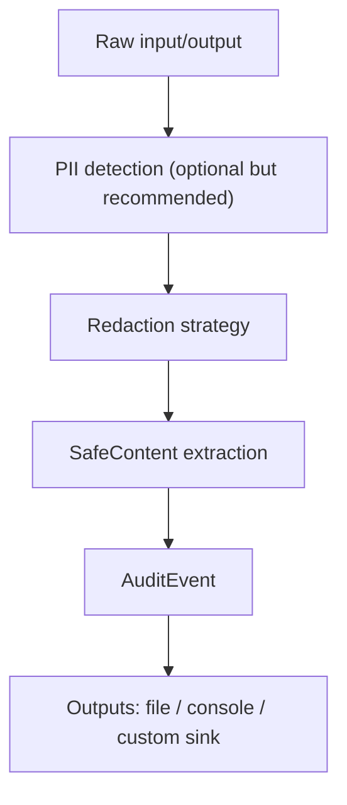

import { Callout } from "mintlify/components";

> **Version:** v1.1.0  
> This page documents behavior guaranteed in TealTiger v1.1.0. API names may evolve, but **audit and redaction guarantees** are stable.

# Audit & Redaction

## Why TealTiger audits everything (safely)

TealTiger is built for **security and governance** workflows, where you need evidence of:

- what was evaluated,
- what decision was made,
- why it was made,
- and how it was enforced,

**without leaking sensitive data** (prompts, responses, secrets, PII).

In v1.1.0, TealTiger’s audit posture is:

- ✅ **Redaction by default**
- ✅ **Correlation-driven traceability**
- ✅ **Deterministic decision evidence**
- ✅ **Safe structured metadata** for cost/security reporting

<Callout type="info">
Audit logs are only useful if they are safe to retain. Redaction is not a nice-to-have — it’s the default security posture.
</Callout>

---

## The audit pipeline (what happens to data)

---

## Redaction strategy (v1.1.0 guarantees)

TealTiger applies **redaction before persistence**. Raw inputs and outputs are **never written directly** to audit storage.

### Guaranteed redaction rules

In v1.1.0, the following are **never persisted** in audit logs:

- raw prompts
- raw model responses
- secrets (API keys, tokens, credentials)
- detected PII/PHI fields
- full tool payloads containing sensitive values

Instead, TealTiger records **safe derivatives**.

<Callout type="warning">
If a value is redacted, it is redacted **before** the AuditEvent is created.
There is no “raw audit” mode in v1.1.0.
</Callout>

---

## What *is* logged (AuditEvent contract)

TealTiger emits a structured `AuditEvent` that captures **decision evidence**, not raw content.

### Stable AuditEvent fields (v1.1.0)

The following fields are guaranteed and stable:

- `decision.action`  
  One of: `ALLOW`, `DENY`, `REDACT`, `TRANSFORM`, `DEGRADE`, `REQUIRE_APPROVAL`

- `decision.reason_codes[]`  
  Stable, machine-readable identifiers explaining *why* the decision occurred

- `decision.risk_scores` *(optional)*  
  Normalized risk signals (security, cost, reliability)

- `policy.id` / `policy.version`  
  Which policy produced the decision

- `enforcement.mode`  
  `REPORT_ONLY`, `MONITOR`, or `ENFORCE`

- `correlation.trace_id` / `correlation.span_id`  
  Used for end-to-end traceability

- `redaction.applied`  
  Boolean flag indicating redaction occurred

- `metadata.safe_context`  
  Sanitized, structured metadata (never raw text)

<Callout type="info">
Audit logs are designed to be SIEM-safe by default.
They can be retained long-term without leaking sensitive data.
</Callout>

---

## SafeContent vs RawContent

TealTiger intentionally separates **content** from **evidence**.

- Raw prompt: ❌ never stored
- Raw model output: ❌ never stored
- PII/PHI values: ❌ never stored
- Decision outcome: ✅ stored
- Reason codes: ✅ stored
- Risk scores: ✅ stored when enabled
- Tool name (normalized): ✅ stored
- Redaction flag: ✅ stored

If you need full prompt/response retention, handle that **outside** TealTiger using your own storage, consent, and retention controls.

---

## Redaction behavior by decision type

- `ALLOW`: evidence only
- `DENY`: evidence only
- `REDACT`: sensitive fields removed before audit
- `TRANSFORM`: only effective values are referenced (never originals)
- `DEGRADE`: safe defaults recorded; raw inputs excluded
- `REQUIRE_APPROVAL`: context summarized; not stored verbatim

---

## Determinism & reproducibility

Audit events support deterministic replay **without storing raw data**.

You can answer:

- Why was this blocked?
- Which policy fired?
- Was this enforced or only reported?
- Did redaction occur?

Without needing:

- the original prompt
- the original response
- sensitive payloads

---

## Production defaults (recommended)

Unless explicitly overridden:

- Redaction is **ON**
- Audit emission is **ON**
- Enforcement mode defaults to `REPORT_ONLY`
- Correlation IDs are auto-generated if missing

<Callout type="note">
These defaults are chosen to make TealTiger safe to enable early in production without increasing data retention risk.
</Callout>

---

## What will NOT change in v1.1.0

The following guarantees are locked for v1.1.0:

- Redaction happens before persistence
- Raw prompts/responses are never logged
- Reason codes are stable identifiers
- Audit event schema remains backward compatible within v1.1.x

Existing meanings remain stable; future versions may add fields only in compatible ways.

---

## Related reading

- /audit/audit-event-schema
- /policy/reason-codes
- /policy/risk-scores
- /architecture/enforcement-flow
- /versioning/stability-guarantees
