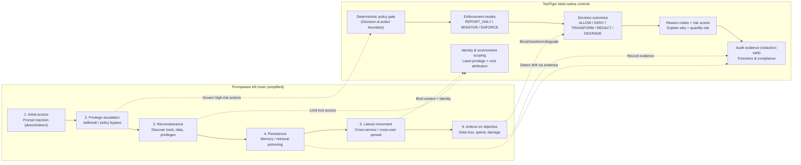

import { Callout } from "mintlify/components";

> **Version:** v1.1.0  
> Executive visual. This page does **not** change TealTiger v1.1.0 contracts.

# Promptware Kill Chain → Blast‑Radius Control (Executive View)

## Key idea

Prompt injection is best understood as **initial access** in a multi‑stage “promptware” kill chain, not a single isolated bug. citeturn125search97

TealTiger’s job is **blast‑radius control**: constrain what the agent can do at runtime, even if earlier stages succeed. citeturn125search97

<Callout type="info">
Think of TealTiger like a **seatbelt and airbag** for autonomous agents: it does not assume perfect prevention; it makes failures survivable.
</Callout>

---

## One diagram (attack progression vs governance controls)

<Callout type="note">
This diagram is intentionally high-level. It aligns with the article’s framing that prompt injection is only the first step in a broader operational chain. citeturn125search97
</Callout>

---

## What execs should take away

- **Attackers don’t need perfect prompts**; they need a path from input → action. citeturn125search97
- **“Prevent prompt injection” is not sufficient** as a standalone strategy because the threat is multi-stage. citeturn125search97
- **Blast radius** is the controllable variable: restrict tools, privileges, spend, and data movement.
- TealTiger provides a **deterministic decision boundary** and **audit-grade evidence** to contain impact and prove outcomes.

---

## Where this connects in TealTiger docs

- Decision contract: /concepts/decision-model
- Enforcement semantics: /architecture/enforcement-flow
- Audit safety: /concepts/audit-and-redaction
- Reason codes: /policy/reason-codes
- Risk scores: /policy/risk-scores
- Identity scoping: /concepts/execution-identity
