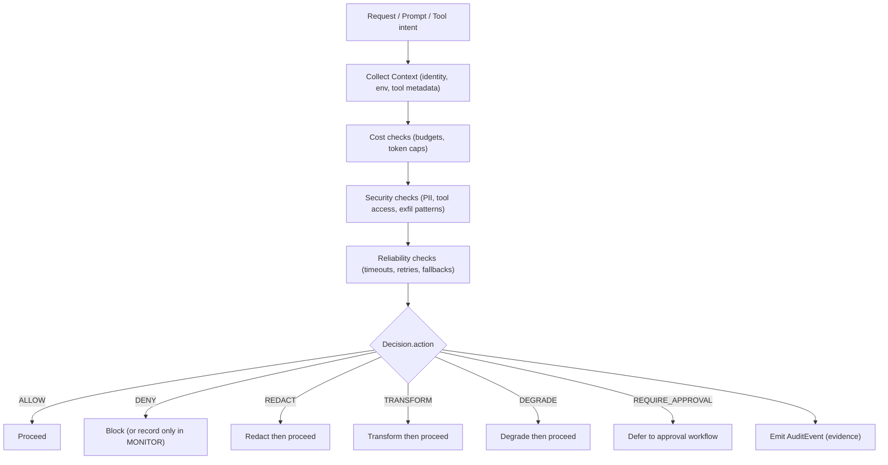

import { Callout } from "mintlify/components";

> **Version:** v1.1.0  
> This page is explanatory. It does **not** change v1.1.0 contracts.

# Visual Decision Mapping

## One visual mental model

<Callout type="info">
This diagram is intentionally high-level. The stable contract is the Decision Model: action + reason codes + optional risk.
</Callout>

---

## How to interpret the diagram

- Governance checks are **deterministic** and policy-driven.
- The Decision object is the **single application-facing outcome**.
- Reason codes and risk scores explain *why*.
- Audit events record evidence for later review.

## Where to start

- If you want the contract, see /concepts/decision-model
- If you want rollout behavior, see /architecture/enforcement-flow
- If you want determinism testing, see /policy/golden-corpus
