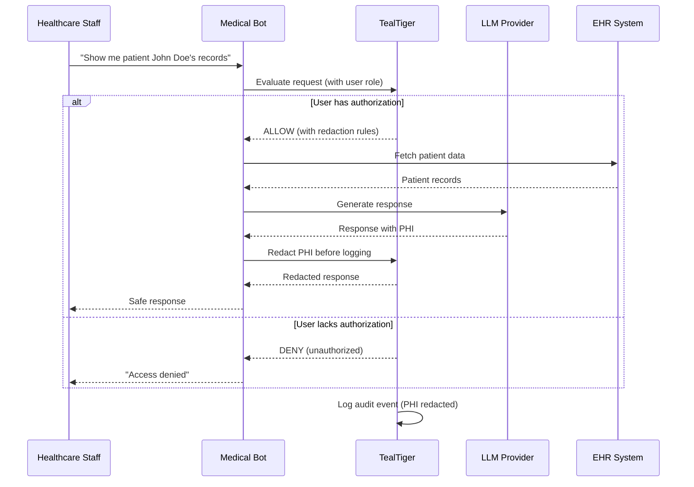

# HIPAA-Compliant Medical Bot

Learn how to build a HIPAA-compliant medical chatbot that automatically redacts Protected Health Information (PHI) and enforces strict access controls.

## The problem

Healthcare chatbots handle sensitive patient data that must be protected under HIPAA regulations. Common risks include:

- **PHI leakage** - Patient names, SSNs, medical record numbers appearing in logs
- **Unauthorized access** - Staff accessing patient records without proper authorization
- **Audit gaps** - Missing audit trails for compliance investigations
- **Over-sharing** - AI responses containing more PHI than necessary

## The solution

Use TealTiger to automatically redact PHI, enforce role-based access controls, and maintain comprehensive audit logs.

### Architecture



### Complete implementation

<CodeGroup>
```typescript TypeScript
import { TealTiger, PolicyMode, RedactionLevel } from 'tealtiger';
import OpenAI from 'openai';

// Initialize TealTiger with HIPAA-compliant policies
const teal = new TealTiger({
  policies: {
    // Role-based access control
    tools: {
      patient_records_read: {
        allowed: true,
        conditions: {
          // Only allow authorized roles
          requiredRoles: ['doctor', 'nurse', 'admin'],
          // Require valid session
          requireAuth: true,
          // Production environment requires stricter controls
          productionOnly: {
            requireMFA: true,
            requireAuditLog: true
          }
        }
      },
      patient_records_write: {
        allowed: true,
        conditions: {
          requiredRoles: ['doctor', 'admin'],
          requireAuth: true,
          requireApproval: true // Extra protection for writes
        }
      },
      // Block dangerous operations
      patient_records_delete: {
        allowed: false
      }
    },
    
    // Content policies for PHI detection
    content: {
      detectPHI: true,
      redactPHI: true,
      phiPatterns: [
        'SSN', 'MRN', 'DOB', 'PHONE', 'EMAIL', 'ADDRESS'
      ]
    }
  },
  
  // Audit configuration with automatic PHI redaction
  audit: {
    enabled: true,
    redactPII: true,
    redactionLevel: RedactionLevel.HASH,
    detectPHI: true,
    outputs: ['file', 'syslog'], // HIPAA requires persistent logs
    retention: {
      days: 2555 // 7 years for HIPAA compliance
    }
  },
  
  // Start in MONITOR mode, then switch to ENFORCE
  mode: {
    defaultMode: PolicyMode.MONITOR,
    policyModes: {
      'tools.patient_records_delete': PolicyMode.ENFORCE // Always block deletes
    }
  }
});

// Medical bot implementation
class MedicalBot {
  private openai: OpenAI;
  
  constructor() {
    this.openai = new OpenAI({
      apiKey: process.env.OPENAI_API_KEY
    });
  }
  
  async handleQuery(query: string, userContext: UserContext) {
    // Create execution context for traceability
    const context = teal.createContext({
      userId: userContext.userId,
      userRole: userContext.role,
      sessionId: userContext.sessionId,
      environment: process.env.NODE_ENV,
      mfaVerified: userContext.mfaVerified,
      purpose: 'patient_care'
    });
    
    try {
      // Check if user can access patient records
      const decision = await teal.evaluate({
        action: 'tool.execute',
        tool: 'patient_records_read',
        context,
        metadata: {
          query: query,
          timestamp: new Date().toISOString()
        }
      });
      
      // Handle decision
      if (decision.action === 'DENY') {
        await teal.logEvent({
          type: 'access_denied',
          reason: decision.reason_codes,
          context,
          correlationId: decision.correlation_id
        });
        
        return {
          success: false,
          message: 'Access denied. You do not have permission to access patient records.',
          correlationId: decision.correlation_id
        };
      }
      
      if (decision.action === 'REQUIRE_APPROVAL') {
        // Queue for approval workflow
        await this.queueForApproval(query, userContext, decision);
        
        return {
          success: false,
          message: 'This request requires supervisor approval.',
          approvalId: decision.correlation_id
        };
      }
      
      // Access allowed - proceed with LLM call
      const response = await teal.guard(
        () => this.openai.chat.completions.create({
          model: 'gpt-4',
          messages: [
            {
              role: 'system',
              content: `You are a HIPAA-compliant medical assistant. 
                       Only provide information relevant to the query.
                       Never include unnecessary PHI in responses.`
            },
            {
              role: 'user',
              content: query
            }
          ]
        }),
        context
      );
      
      // Extract response
      const answer = response.choices[0].message.content;
      
      // Log successful access (PHI automatically redacted)
      await teal.logEvent({
        type: 'patient_record_accessed',
        context,
        correlationId: decision.correlation_id,
        metadata: {
          queryType: 'read',
          responseLength: answer.length
        }
      });
      
      return {
        success: true,
        answer: answer,
        correlationId: decision.correlation_id
      };
      
    } catch (error) {
      // Log error (with PHI redaction)
      await teal.logEvent({
        type: 'error',
        error: error.message,
        context,
        correlationId: context.correlation_id
      });
      
      throw error;
    }
  }
  
  private async queueForApproval(
    query: string, 
    userContext: UserContext, 
    decision: any
  ) {
    // Implementation of approval workflow
    // Store in approval queue with correlation ID
  }
}

// Usage example
interface UserContext {
  userId: string;
  role: 'doctor' | 'nurse' | 'admin' | 'staff';
  sessionId: string;
  mfaVerified: boolean;
}

const bot = new MedicalBot();

// Example 1: Authorized doctor
const doctorContext: UserContext = {
  userId: 'dr-smith-123',
  role: 'doctor',
  sessionId: 'session-abc',
  mfaVerified: true
};

const result1 = await bot.handleQuery(
  "What medications is patient MRN-12345 currently taking?",
  doctorContext
);
// Result: Access allowed, PHI redacted in logs

// Example 2: Unauthorized staff
const staffContext: UserContext = {
  userId: 'staff-jones-456',
  role: 'staff',
  sessionId: 'session-xyz',
  mfaVerified: false
};

const result2 = await bot.handleQuery(
  "Show me patient records",
  staffContext
);
// Result: Access denied
```

```python Python
from tealtiger import TealTiger, PolicyMode, RedactionLevel
from openai import OpenAI
from typing import Dict, Any
from datetime import datetime

# Initialize TealTiger with HIPAA-compliant policies
teal = TealTiger({
    "policies": {
        # Role-based access control
        "tools": {
            "patient_records_read": {
                "allowed": True,
                "conditions": {
                    "requiredRoles": ["doctor", "nurse", "admin"],
                    "requireAuth": True,
                    "productionOnly": {
                        "requireMFA": True,
                        "requireAuditLog": True
                    }
                }
            },
            "patient_records_write": {
                "allowed": True,
                "conditions": {
                    "requiredRoles": ["doctor", "admin"],
                    "requireAuth": True,
                    "requireApproval": True
                }
            },
            "patient_records_delete": {
                "allowed": False
            }
        },
        
        # Content policies for PHI detection
        "content": {
            "detectPHI": True,
            "redactPHI": True,
            "phiPatterns": [
                "SSN", "MRN", "DOB", "PHONE", "EMAIL", "ADDRESS"
            ]
        }
    },
    
    # Audit configuration with automatic PHI redaction
    "audit": {
        "enabled": True,
        "redactPII": True,
        "redactionLevel": RedactionLevel.HASH,
        "detectPHI": True,
        "outputs": ["file", "syslog"],
        "retention": {
            "days": 2555  # 7 years for HIPAA compliance
        }
    },
    
    # Start in MONITOR mode, then switch to ENFORCE
    "mode": {
        "defaultMode": PolicyMode.MONITOR,
        "policyModes": {
            "tools.patient_records_delete": PolicyMode.ENFORCE
        }
    }
})

# Medical bot implementation
class MedicalBot:
    def __init__(self):
        self.openai = OpenAI(api_key=os.environ.get("OPENAI_API_KEY"))
    
    async def handle_query(self, query: str, user_context: Dict[str, Any]):
        # Create execution context for traceability
        context = teal.create_context({
            "userId": user_context["userId"],
            "userRole": user_context["role"],
            "sessionId": user_context["sessionId"],
            "environment": os.environ.get("ENV", "production"),
            "mfaVerified": user_context["mfaVerified"],
            "purpose": "patient_care"
        })
        
        try:
            # Check if user can access patient records
            decision = await teal.evaluate({
                "action": "tool.execute",
                "tool": "patient_records_read",
                "context": context,
                "metadata": {
                    "query": query,
                    "timestamp": datetime.utcnow().isoformat()
                }
            })
            
            # Handle decision
            if decision["action"] == "DENY":
                await teal.log_event({
                    "type": "access_denied",
                    "reason": decision["reason_codes"],
                    "context": context,
                    "correlationId": decision["correlation_id"]
                })
                
                return {
                    "success": False,
                    "message": "Access denied. You do not have permission to access patient records.",
                    "correlationId": decision["correlation_id"]
                }
            
            if decision["action"] == "REQUIRE_APPROVAL":
                await self.queue_for_approval(query, user_context, decision)
                
                return {
                    "success": False,
                    "message": "This request requires supervisor approval.",
                    "approvalId": decision["correlation_id"]
                }
            
            # Access allowed - proceed with LLM call
            response = await teal.guard(
                lambda: self.openai.chat.completions.create(
                    model="gpt-4",
                    messages=[
                        {
                            "role": "system",
                            "content": """You are a HIPAA-compliant medical assistant. 
                                       Only provide information relevant to the query.
                                       Never include unnecessary PHI in responses."""
                        },
                        {
                            "role": "user",
                            "content": query
                        }
                    ]
                ),
                context
            )
            
            # Extract response
            answer = response.choices[0].message.content
            
            # Log successful access (PHI automatically redacted)
            await teal.log_event({
                "type": "patient_record_accessed",
                "context": context,
                "correlationId": decision["correlation_id"],
                "metadata": {
                    "queryType": "read",
                    "responseLength": len(answer)
                }
            })
            
            return {
                "success": True,
                "answer": answer,
                "correlationId": decision["correlation_id"]
            }
            
        except Exception as error:
            # Log error (with PHI redaction)
            await teal.log_event({
                "type": "error",
                "error": str(error),
                "context": context,
                "correlationId": context["correlation_id"]
            })
            
            raise error
    
    async def queue_for_approval(self, query: str, user_context: Dict, decision: Dict):
        # Implementation of approval workflow
        pass

# Usage example
bot = MedicalBot()

# Example 1: Authorized doctor
doctor_context = {
    "userId": "dr-smith-123",
    "role": "doctor",
    "sessionId": "session-abc",
    "mfaVerified": True
}

result1 = await bot.handle_query(
    "What medications is patient MRN-12345 currently taking?",
    doctor_context
)
# Result: Access allowed, PHI redacted in logs

# Example 2: Unauthorized staff
staff_context = {
    "userId": "staff-jones-456",
    "role": "staff",
    "sessionId": "session-xyz",
    "mfaVerified": False
}

result2 = await bot.handle_query(
    "Show me patient records",
    staff_context
)
# Result: Access denied
```
</CodeGroup>

## Expected outcomes

### Scenario 1: Authorized access

**Input**: Doctor with MFA queries patient medications

**Decision**:
```json
{
  "action": "ALLOW",
  "reason_codes": ["AUTHORIZED_ROLE", "MFA_VERIFIED"],
  "risk_score": 10,
  "mode": "MONITOR",
  "correlation_id": "req-abc123"
}
```

**Audit log** (PHI automatically redacted):
```json
{
  "event_type": "patient_record_accessed",
  "timestamp": "2026-03-06T10:30:00Z",
  "correlation_id": "req-abc123",
  "user": {
    "userId": "dr-***",
    "role": "doctor",
    "mfaVerified": true
  },
  "query": "[REDACTED]",
  "decision": "ALLOW",
  "phi_detected": true,
  "phi_redacted": true
}
```

### Scenario 2: Unauthorized access

**Input**: Staff member without proper role tries to access records

**Decision**:
```json
{
  "action": "DENY",
  "reason_codes": ["INSUFFICIENT_ROLE", "UNAUTHORIZED_ACCESS"],
  "risk_score": 95,
  "mode": "ENFORCE",
  "correlation_id": "req-xyz789"
}
```

**Audit log**:
```json
{
  "event_type": "access_denied",
  "timestamp": "2026-03-06T10:31:00Z",
  "correlation_id": "req-xyz789",
  "user": {
    "userId": "staff-***",
    "role": "staff",
    "mfaVerified": false
  },
  "reason": ["INSUFFICIENT_ROLE"],
  "decision": "DENY"
}
```

## HIPAA compliance checklist

<Check>**Access controls** - Role-based policies enforce who can access patient data</Check>
<Check>**Audit logging** - All access attempts logged with 7-year retention</Check>
<Check>**PHI redaction** - Automatic redaction of SSN, MRN, DOB, and other PHI</Check>
<Check>**Encryption** - Audit logs encrypted at rest and in transit</Check>
<Check>**Traceability** - Correlation IDs link all related events</Check>
<Check>**Minimum necessary** - Policies enforce least-privilege access</Check>

## Best practices

1. **Start in MONITOR mode** - Test policies without blocking legitimate access
2. **Require MFA in production** - Add extra security for production environments
3. **Log everything** - Comprehensive audit trails are required for HIPAA
4. **Regular policy reviews** - Review and update access policies quarterly
5. **Test PHI redaction** - Verify that all PHI patterns are properly redacted
6. **Implement approval workflows** - Add human review for sensitive operations

## Next steps

<CardGroup cols={2}>
  <Card title="Audit schema" icon="file-lines" href="/audit/audit-event-schema">
    Learn about the complete audit event schema
  </Card>
  
  <Card title="Policy authoring" icon="pen" href="/policy/policy-authoring-guide">
    Write custom policies for your use case
  </Card>
  
  <Card title="Security best practices" icon="shield" href="/guides/security-best-practices">
    Follow security best practices for production
  </Card>
  
  <Card title="Redaction guide" icon="eye-slash" href="/concepts/audit-and-redaction">
    Understand how redaction works
  </Card>
</CardGroup>
