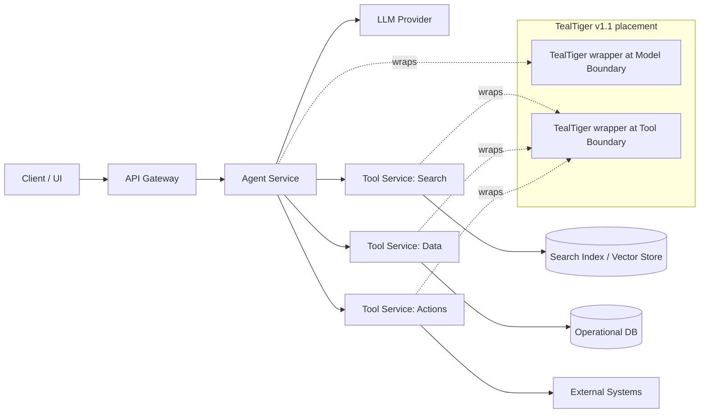
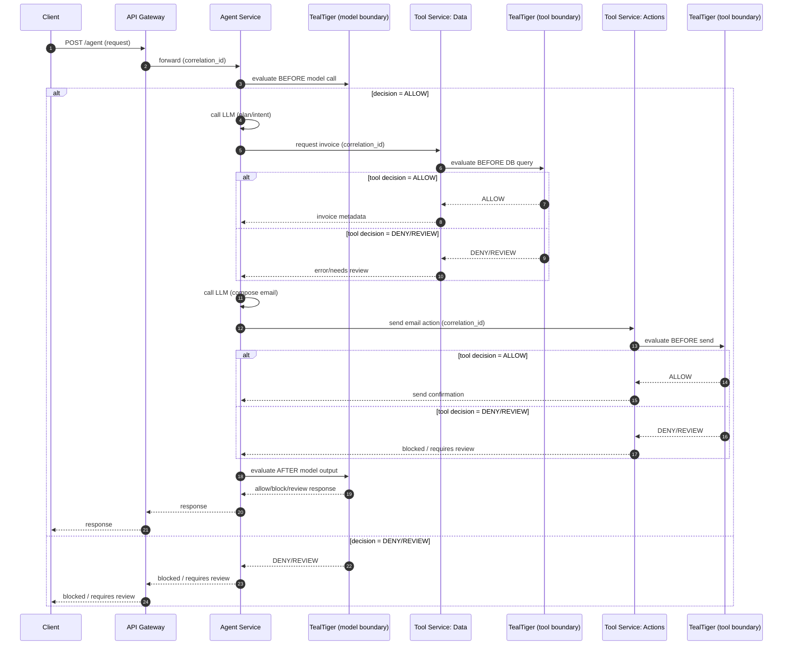

---
title: "Microservices Agentic Example (v1.1)"
description: "A v1.1-scoped walkthrough showing where to integrate TealTiger in an agentic AI application built on microservices. Includes Mermaid architecture and request-flow diagrams."
sidebarTitle: "Microservices Example"
---

import { Callout } from 'mintlify/components';

# Microservices Agentic Example (v1.1)

_Last updated: 2026-03-03_

<Callout type="info" title="Scope: v1.1.x only">
This document is **strictly scoped to TealTiger v1.1.x**.

- It demonstrates **SDK-first boundary interception** at **model invocation** and **tool invocation** points.
- It does **not** assume v1.2/v1.3 features (certificates, hybrid signal gating, principal/delegation envelopes, platform triggers, control plane).
</Callout>

---

## 1) Why this example exists
Most production AI agents do not run as a single script. They sit inside a microservices environment with API gateways, separate data services, and action services.

This example shows:
- a realistic microservices layout
- the **minimum places** to integrate TealTiger v1.1
- how to keep execution traceable across services using correlation IDs

---

## 2) Reference architecture (illustrative)
This is a common pattern for an AI agent integrated into a microservices stack.

### What this diagram means (v1.1)
- **Agent Service** calls the model and orchestrates tool calls.
- **Tool Services** perform real actions (search/data/action). Treat each tool service as a *policy enforcement point* for its own operations.
- TealTiger v1.1 lives **inside services** (as an SDK wrapper), not as a separate platform.

---

## 3) Where to integrate TealTiger v1.1 (the only two places that matter)

### A) Model invocation boundary (in Agent Service)
Integrate TealTiger in the service that calls the LLM.

**Why:** you can validate requests before calling the model and validate outputs before returning them to downstream steps.

**Placement:**
- `before_model_call()` → evaluate policy
- `after_model_output()` → evaluate policy

### B) Tool invocation boundary (in each Tool Service)
Integrate TealTiger inside each tool microservice where real side-effects happen.

**Why:** even if the agent service is compromised or misconfigured, each tool service can still enforce the allowed set of actions.

**Placement:**
- `before_execute_tool_action()` → evaluate policy
- `after_tool_result()` → log outcome

<Callout type="note" title="Rule of thumb">
In microservices, TealTiger is most valuable **closest to side effects** (tool services) and **closest to user-facing output** (agent service).
</Callout>

---

## 4) End-to-end request flow (step-by-step)

### Scenario
A user asks: "Find my last invoice and email it to me."

The agent likely needs to:
1) interpret the request
2) query data service
3) generate an email
4) call action service to send email

Below is a v1.1-safe flow showing where TealTiger sits.

---

## 5) Correlation & traceability (microservices hygiene)

To keep the workflow auditable across services, propagate the following across every hop:
- `correlation_id` (required)
- optional: `trace_id` / `span_id` (if you use distributed tracing)

**Recommendation:**
- Generate `correlation_id` at the gateway (or at the first entry service).
- Forward it via headers (e.g., `X-Correlation-Id`) to every internal service.
- Log it alongside every TealTiger decision.

<Callout type="warning" title="v1.1 reality">
In v1.1, treat correlation IDs and logs as your primary traceability mechanism. Do not document v1.2/v1.3 evidence/certificate features as if they exist in v1.1.
</Callout>

---

## 6) Policy examples (v1.1-safe, conceptual)
This section is intentionally **conceptual** to avoid implying v1.2/v1.3 policy language.

### Example controls teams often apply
- Block destructive actions (e.g., delete, irreversible updates)
- Require review for actions that create external side effects (e.g., sending emails, triggering payments)
- Redact obvious secrets in outputs (if your v1.1 integration performs redaction)

### Where each control belongs
- Destructive / side effects → enforce in **tool services**
- Output quality / leakage → enforce in **agent service** (model boundary)

---

## 7) Failure handling (v1.1)

### A) Tool service denies an action
- Tool service returns a clear error
- Agent service returns a safe explanation
- Correlation ID is preserved in logs

### B) Review required
If your application implements a review UI/queue, route requests flagged as REVIEW to that path.

> TealTiger v1.1 can drive the decision; your system must implement the review workflow.

---

## 8) What this example does NOT include (by design)
To keep this v1.1-scoped and credible, it intentionally excludes:
- certificates / certified governance
- probabilistic signal gating
- principal/actor/delegation envelopes
- centralized control plane
- org-wide dashboards

---

## 9) Takeaways
- In microservices, integrate TealTiger v1.1 in **two places**: the **agent service (model boundary)** and each **tool service (tool boundary)**.
- Treat each tool microservice as a policy enforcement point near side effects.
- Keep traceability via correlation IDs across hops.

---

## 10) Next steps
- Place this file at `cookbook/microservices-agentic-example.mdx`.
- Provide one runnable sample repository that matches this architecture.
- Start with a single tool service integration (lowest friction), then expand.
