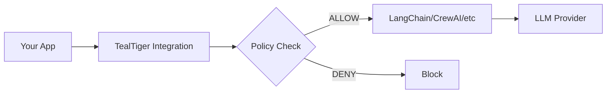

# Integrations

TealTiger integrates with popular AI frameworks and tools to add security, cost control, and governance to your existing stack.

## How integrations work

TealTiger integrations wrap your existing code to add policy enforcement:



Every integration provides:
- **Policy enforcement** - Control what agents can do
- **Cost tracking** - Monitor and limit spending
- **Audit logging** - Track all decisions
- **Zero code changes** - Drop-in replacements

## Agent frameworks

Integrate TealTiger with popular agent frameworks:

<CardGroup cols={2}>
  <Card title="LangChain" icon="link" href="/integrations/langchain">
    Add governance to LangChain agents and tools
  </Card>
  
  <Card title="CrewAI" icon="users" href="/integrations/crewai">
    Control multi-agent CrewAI workflows
  </Card>
  
  <Card title="OpenClaw" icon="terminal" href="/integrations/openclaw">
    Secure local-first agents with system access
  </Card>
  
  <Card title="MCP" icon="plug" href="/integrations/mcp">
    Govern Model Context Protocol tools
  </Card>
</CardGroup>

## Observability & monitoring

Export TealTiger data to your observability stack:

<CardGroup cols={2}>
  <Card title="OpenTelemetry" icon="chart-line" href="/integrations/opentelemetry">
    Export traces and metrics to OTel
  </Card>
  
  <Card title="Langfuse" icon="eye" href="/integrations/langfuse">
    LLM observability and tracing
  </Card>
  
  <Card title="LangSmith" icon="microscope" href="/integrations/langsmith">
    Debug and monitor LangChain apps
  </Card>
  
  <Card title="Helicone" icon="shield-halved" href="/integrations/helicone">
    LLM proxy and observability
  </Card>
</CardGroup>

## Integration patterns

TealTiger supports three integration patterns:

### Pattern 1: Drop-in wrapper

Replace your existing client with a TealTiger-wrapped version:

```typescript
// Before
import { ChatOpenAI } from 'langchain/chat_models/openai';
const model = new ChatOpenAI();

// After
import { TealTiger } from 'tealtiger';
import { ChatOpenAI } from 'langchain/chat_models/openai';

const teal = new TealTiger({ policies: { /* ... */ } });
const model = teal.wrap(new ChatOpenAI());
```

### Pattern 2: Pre-action hook

Intercept actions before they execute:

```typescript
import { TealTiger } from 'tealtiger';

const teal = new TealTiger({ policies: { /* ... */ } });

// Intercept tool calls
agent.onToolCall(async (tool, args) => {
  const decision = await teal.evaluate({
    action: 'tool.execute',
    tool: tool.name,
    arguments: args
  });
  
  if (decision.action === 'DENY') {
    throw new Error('Tool blocked by policy');
  }
  
  return tool.execute(args);
});
```

### Pattern 3: Telemetry export

Export TealTiger decisions to your observability stack:

```typescript
import { TealTiger } from 'tealtiger';

const teal = new TealTiger({
  policies: { /* ... */ },
  audit: {
    outputs: ['opentelemetry', 'langfuse']
  }
});
```

## Quick start

Here's a complete example integrating TealTiger with LangChain:

<CodeGroup>
```typescript TypeScript
import { TealTiger, PolicyMode } from 'tealtiger';
import { ChatOpenAI } from 'langchain/chat_models/openai';
import { initializeAgentExecutorWithOptions } from 'langchain/agents';
import { Calculator } from 'langchain/tools/calculator';

// Initialize TealTiger
const teal = new TealTiger({
  policies: {
    tools: {
      calculator: { allowed: true },
      web_search: { allowed: false }
    },
    budget: {
      maxCostPerRequest: 0.50,
      maxCostPerDay: 100.00
    }
  },
  mode: {
    defaultMode: PolicyMode.ENFORCE
  }
});

// Wrap the model
const model = teal.wrap(new ChatOpenAI({
  modelName: 'gpt-4',
  temperature: 0
}));

// Create agent with wrapped model
const tools = [new Calculator()];
const agent = await initializeAgentExecutorWithOptions(
  tools,
  model,
  {
    agentType: 'zero-shot-react-description'
  }
);

// Use the agent (now with governance)
const result = await agent.call({
  input: 'What is 25 * 4?'
});

console.log(result.output);
// TealTiger automatically:
// - Checks policies before each tool call
// - Tracks costs
// - Logs all decisions
```

```python Python
from tealtiger import TealTiger, PolicyMode
from langchain.chat_models import ChatOpenAI
from langchain.agents import initialize_agent, AgentType
from langchain.tools import Tool

# Initialize TealTiger
teal = TealTiger({
    "policies": {
        "tools": {
            "calculator": {"allowed": True},
            "web_search": {"allowed": False}
        },
        "budget": {
            "maxCostPerRequest": 0.50,
            "maxCostPerDay": 100.00
        }
    },
    "mode": {
        "defaultMode": PolicyMode.ENFORCE
    }
})

# Wrap the model
model = teal.wrap(ChatOpenAI(
    model_name="gpt-4",
    temperature=0
))

# Create agent with wrapped model
tools = [
    Tool(
        name="Calculator",
        func=lambda x: eval(x),
        description="Useful for math calculations"
    )
]

agent = initialize_agent(
    tools,
    model,
    agent=AgentType.ZERO_SHOT_REACT_DESCRIPTION
)

# Use the agent (now with governance)
result = agent.run("What is 25 * 4?")

print(result)
# TealTiger automatically:
# - Checks policies before each tool call
# - Tracks costs
# - Logs all decisions
```
</CodeGroup>

## What integrations provide

Every TealTiger integration gives you:

### Security controls

- Block dangerous tools
- Enforce role-based access
- Detect prompt injection
- Redact sensitive data

### Cost management

- Set budget limits
- Track spending per request
- Prevent runaway costs
- Downgrade expensive models

### Compliance

- Audit all decisions
- Redact PII automatically
- Maintain evidence trails
- Meet regulatory requirements

### Reliability

- Circuit breakers
- Rate limiting
- Timeout controls
- Graceful degradation

## Integration status

| Integration | Status | Documentation |
|-------------|--------|---------------|
| LangChain | ✅ Available | [View docs](/integrations/langchain) |
| CrewAI | ✅ Available | [View docs](/integrations/crewai) |
| OpenClaw | ✅ Available | [View docs](/integrations/openclaw) |
| MCP | ✅ Available | [View docs](/integrations/mcp) |
| OpenTelemetry | 🚧 Coming soon | [View docs](/integrations/opentelemetry) |
| Langfuse | 🚧 Coming soon | [View docs](/integrations/langfuse) |
| LangSmith | 🚧 Coming soon | [View docs](/integrations/langsmith) |
| Helicone | 🚧 Coming soon | [View docs](/integrations/helicone) |

## Need a custom integration?

Building a custom integration is straightforward:

1. **Identify the boundary** - Where do you want to enforce policies? (model calls, tool execution, etc.)
2. **Wrap the call** - Add `teal.evaluate()` before the action
3. **Handle the decision** - Act on ALLOW, DENY, TRANSFORM, etc.
4. **Log the event** - TealTiger handles audit logging automatically

Example custom integration:

```typescript
class CustomTool {
  constructor(private teal: TealTiger) {}
  
  async execute(action: string, args: any) {
    // Evaluate policy
    const decision = await this.teal.evaluate({
      action: 'tool.execute',
      tool: action,
      arguments: args
    });
    
    // Handle decision
    if (decision.action === 'DENY') {
      throw new Error(`Blocked: ${decision.reason_codes.join(', ')}`);
    }
    
    // Execute the action
    return await this.performAction(action, args);
  }
}
```

## Get help

Need help with an integration?

- **Email**: [reachout@tealtiger.ai](mailto:reachout@tealtiger.ai)
- **GitHub**: [github.com/agentguard-ai/tealtiger](https://github.com/agentguard-ai/tealtiger)
- **Documentation**: [docs.tealtiger.ai](https://docs.tealtiger.ai)

## Next steps

<CardGroup cols={2}>
  <Card title="LangChain integration" icon="link" href="/integrations/langchain">
    Get started with LangChain
  </Card>
  
  <Card title="Policy overview" icon="shield-check" href="/policy/overview">
    Learn how to write policies
  </Card>
  
  <Card title="Cookbook" icon="book" href="/cookbook/index">
    See real-world examples
  </Card>
  
  <Card title="API reference" icon="code" href="/api-reference/typescript/index">
    Explore the API
  </Card>
</CardGroup>
