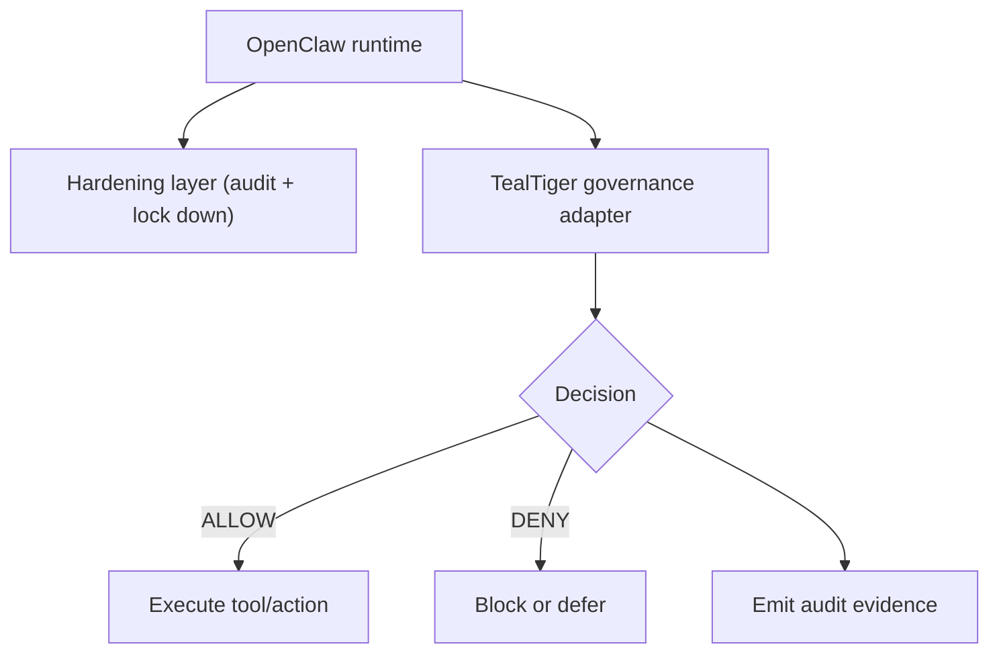

import { Callout } from "mintlify/components";

> **Version:** v1.1.0  
> This page is a neutral comparison for clarity. It does **not** change TealTiger v1.1.0 contracts.

# OpenClaw Hardening Tools vs TealTiger Governance

## Summary

Agent ecosystems often have two types of defenses:

1) **Hardening tools** (security): audit and lock down the agent environment.
2) **Governance layers** (TealTiger): evaluate actions against deterministic policy and emit audit evidence.

Both are valuable. They solve different problems.

---

## What hardening tools typically do

Hardening tools typically focus on:

- configuration audits (detect risky settings)
- automated remediation (apply safer defaults)
- network hardening (local-only bindings, TLS)
- credential scanning and hygiene
- supply chain checks for skills/plugins

**Goal:** prevent compromise and reduce exposure.

---

## What TealTiger adds

TealTiger adds a deterministic **decision boundary** for actions:

- policy-driven allow/deny/transform/degrade/redact decisions
- stable reason codes for explainability
- risk scores to quantify signals
- audit events as evidence
- rollout modes (report-only/monitor/enforce)

**Goal:** make agent behavior governable across security, cost, and reliability.

---

## Practical architecture (recommended)

<Callout type="note">
Hardening reduces attack surface. TealTiger governs what actions are allowed and records evidence.
</Callout>

---

## When you should use which

- If you’re worried about exposed ports, weak auth, or compromised plugins → start with **hardening**.
- If you’re worried about runaway spend, data movement, or policy compliance → add **TealTiger governance**.

Most production setups need both.

---

## Related reading

- /concepts/security-vs-governance
- /integrations/openclaw
- /concepts/decision-model
- /audit/audit-event-schema
