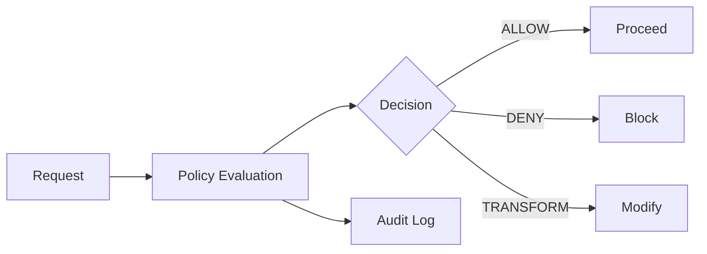

# Policy Overview

Policies are the heart of TealTiger. They're the rules that decide what your AI agents can and can't do.

## What is a policy?

A policy is a simple rule that says: "If this happens, then do that."

For example:
- **If** an agent tries to delete a file **then** block it
- **If** a request costs more than $1 **then** require approval
- **If** output contains PII **then** redact it

Every policy evaluates a request and returns a Decision telling your app what to do.

## Your first policy

Here's the simplest possible policy - blocking file deletions:

<CodeGroup>
```typescript TypeScript
import { TealTiger } from 'tealtiger';

const teal = new TealTiger({
  policies: {
    tools: {
      file_delete: { allowed: false }
    }
  }
});

// This will be blocked
const decision = await teal.evaluate({
  action: 'tool.execute',
  tool: 'file_delete'
});

console.log(decision.action);  // 'DENY'
console.log(decision.reason_codes);  // ['TOOL_NOT_ALLOWED']
```

```python Python
from tealtiger import TealTiger

teal = TealTiger({
    "policies": {
        "tools": {
            "file_delete": {"allowed": False}
        }
    }
})

# This will be blocked
decision = await teal.evaluate({
    "action": "tool.execute",
    "tool": "file_delete"
})

print(decision["action"])  # 'DENY'
print(decision["reason_codes"])  # ['TOOL_NOT_ALLOWED']
```
</CodeGroup>

That's it! You've created your first policy.

## How policies work

When you call `teal.evaluate()`, TealTiger:

1. **Checks the request** against your policies
2. **Evaluates conditions** (is this tool allowed?)
3. **Makes a decision** (ALLOW, DENY, etc.)
4. **Returns the decision** with reason codes
5. **Logs the event** for audit trails



## Policy types

TealTiger supports three main types of policies:

### Security policies

Control what agents can access and do.

```typescript
policies: {
  tools: {
    // Block dangerous operations
    file_delete: { allowed: false },
    database_drop: { allowed: false },
    
    // Allow safe operations
    file_read: { allowed: true },
    search: { allowed: true }
  }
}
```

### Cost policies

Control spending and resource usage.

```typescript
policies: {
  budget: {
    maxCostPerRequest: 0.50,
    maxCostPerDay: 100.00,
    maxTokens: 4000
  }
}
```

### Compliance policies

Control data handling and privacy.

```typescript
policies: {
  compliance: {
    redactPII: true,
    requireApprovalFor: ['customer_data_export'],
    auditAllAccess: true
  }
}
```

## Conditional policies

Policies can have conditions - rules that must be met:

```typescript
policies: {
  tools: {
    customer_data_export: {
      allowed: true,
      conditions: {
        // Only in production
        environment: 'production',
        
        // Only for authorized roles
        requiredRoles: ['admin', 'support_manager'],
        
        // Only with approval
        requireApproval: true,
        
        // Only during business hours
        businessHoursOnly: true
      }
    }
  }
}
```

## Policy decisions

Policies return one of six decision types:

### ALLOW

Request is safe and should proceed.

```typescript
{
  action: 'ALLOW',
  reason_codes: ['AUTHORIZED', 'WITHIN_LIMITS']
}
```

### DENY

Request is blocked.

```typescript
{
  action: 'DENY',
  reason_codes: ['TOOL_NOT_ALLOWED', 'UNAUTHORIZED']
}
```

### REQUIRE_APPROVAL

Request needs human review.

```typescript
{
  action: 'REQUIRE_APPROVAL',
  reason_codes: ['HIGH_VALUE_OPERATION', 'REQUIRES_MANAGER_APPROVAL']
}
```

### REDACT

Request proceeds but sensitive data is removed.

```typescript
{
  action: 'REDACT',
  reason_codes: ['PII_DETECTED'],
  redaction: {
    fields: ['ssn', 'email', 'phone']
  }
}
```

### TRANSFORM

Request proceeds but parameters are modified.

```typescript
{
  action: 'TRANSFORM',
  reason_codes: ['TOKEN_LIMIT_EXCEEDED'],
  transformations: {
    maxTokens: 4000  // Clamped from 10000
  }
}
```

### DEGRADE

Request proceeds with reduced capabilities.

```typescript
{
  action: 'DEGRADE',
  reason_codes: ['BUDGET_CONSTRAINT'],
  degradation: {
    model: 'gpt-3.5-turbo'  // Downgraded from gpt-4
  }
}
```

## Policy modes

Policies can run in different modes:

### MONITOR mode (testing)

Policies are evaluated but not enforced. Perfect for testing.

```typescript
const teal = new TealTiger({
  policies: { /* ... */ },
  mode: {
    defaultMode: PolicyMode.MONITOR
  }
});

// In MONITOR mode, even DENY decisions don't block
// They're just logged for analysis
```

### ENFORCE mode (production)

Policies are evaluated and enforced. Use after testing.

```typescript
const teal = new TealTiger({
  policies: { /* ... */ },
  mode: {
    defaultMode: PolicyMode.ENFORCE
  }
});

// In ENFORCE mode, DENY decisions actually block requests
```

## Real-world example

Here's a complete policy for a customer support agent:

<CodeGroup>
```typescript TypeScript
import { TealTiger, PolicyMode } from 'tealtiger';

const teal = new TealTiger({
  // Security policies
  policies: {
    tools: {
      // Allow safe operations
      customer_data_read: {
        allowed: true,
        conditions: {
          requiredRoles: ['support', 'admin']
        }
      },
      
      // Require approval for refunds
      issue_refund: {
        allowed: true,
        conditions: {
          maxAmount: 50.00,  // Auto-approve up to $50
          requireApprovalAbove: 50.00  // Human review for $50+
        }
      },
      
      // Block dangerous operations
      customer_data_delete: { allowed: false },
      database_access: { allowed: false }
    }
  },
  
  // Cost policies
  budget: {
    maxCostPerRequest: 0.25,
    maxCostPerDay: 50.00
  },
  
  // Compliance policies
  audit: {
    enabled: true,
    redactPII: true,
    outputs: ['file', 'syslog']
  },
  
  // Start in MONITOR mode
  mode: {
    defaultMode: PolicyMode.MONITOR,
    policyModes: {
      // But enforce critical policies immediately
      'tools.customer_data_delete': PolicyMode.ENFORCE,
      'tools.database_access': PolicyMode.ENFORCE
    }
  }
});

// Use the policy
async function handleRequest(request) {
  const decision = await teal.evaluate(request);
  
  if (decision.action === 'DENY') {
    throw new Error(`Blocked: ${decision.reason_codes.join(', ')}`);
  }
  
  if (decision.action === 'REQUIRE_APPROVAL') {
    return await queueForApproval(request, decision);
  }
  
  // Proceed with the request
  return await executeRequest(request);
}
```

```python Python
from tealtiger import TealTiger, PolicyMode

teal = TealTiger({
    # Security policies
    "policies": {
        "tools": {
            # Allow safe operations
            "customer_data_read": {
                "allowed": True,
                "conditions": {
                    "requiredRoles": ["support", "admin"]
                }
            },
            
            # Require approval for refunds
            "issue_refund": {
                "allowed": True,
                "conditions": {
                    "maxAmount": 50.00,
                    "requireApprovalAbove": 50.00
                }
            },
            
            # Block dangerous operations
            "customer_data_delete": {"allowed": False},
            "database_access": {"allowed": False}
        }
    },
    
    # Cost policies
    "budget": {
        "maxCostPerRequest": 0.25,
        "maxCostPerDay": 50.00
    },
    
    # Compliance policies
    "audit": {
        "enabled": True,
        "redactPII": True,
        "outputs": ["file", "syslog"]
    },
    
    # Start in MONITOR mode
    "mode": {
        "defaultMode": PolicyMode.MONITOR,
        "policyModes": {
            # But enforce critical policies immediately
            "tools.customer_data_delete": PolicyMode.ENFORCE,
            "tools.database_access": PolicyMode.ENFORCE
        }
    }
})

# Use the policy
async def handle_request(request):
    decision = await teal.evaluate(request)
    
    if decision["action"] == "DENY":
        raise Exception(f"Blocked: {', '.join(decision['reason_codes'])}")
    
    if decision["action"] == "REQUIRE_APPROVAL":
        return await queue_for_approval(request, decision)
    
    # Proceed with the request
    return await execute_request(request)
```
</CodeGroup>

## Policy best practices

1. **Start simple** - Begin with basic allow/deny rules
2. **Test in MONITOR mode** - Validate policies before enforcing
3. **Use conditions** - Add requirements for sensitive operations
4. **Set cost limits** - Prevent budget overruns
5. **Enable audit logging** - Track all decisions
6. **Review regularly** - Adjust policies based on real usage

## Common policy patterns

### Pattern 1: Environment-based access

```typescript
tools: {
  production_database: {
    allowed: true,
    conditions: {
      environment: 'production',
      requiredRoles: ['admin']
    }
  }
}
```

### Pattern 2: Time-based restrictions

```typescript
tools: {
  batch_processing: {
    allowed: true,
    conditions: {
      allowedHours: '22:00-06:00',  // Only at night
      allowedDays: ['Saturday', 'Sunday']  // Only weekends
    }
  }
}
```

### Pattern 3: Rate limiting

```typescript
tools: {
  api_call: {
    allowed: true,
    conditions: {
      maxCallsPerMinute: 60,
      maxCallsPerHour: 1000
    }
  }
}
```

### Pattern 4: Graduated enforcement

```typescript
tools: {
  data_export: {
    allowed: true,
    conditions: {
      maxRecords: 100,  // Auto-approve up to 100
      requireApprovalAbove: 100,  // Review for 100-1000
      denyAbove: 1000  // Always deny over 1000
    }
  }
}
```

## What policies can't do

Policies are powerful but have limits:

- ❌ Can't modify business logic
- ❌ Can't replace authentication/authorization
- ❌ Can't learn or adapt automatically
- ❌ Can't make probabilistic decisions

Policies are governance rules, not application code.

## Next steps

<CardGroup cols={2}>
  <Card title="Policy authoring guide" icon="pen" href="/policy/policy-authoring-guide">
    Learn how to write production-ready policies
  </Card>
  
  <Card title="Conditions and actions" icon="code-branch" href="/policy/conditions-and-actions">
    Understand policy building blocks
  </Card>
  
  <Card title="Reason codes" icon="list" href="/policy/reason-codes">
    Learn how decisions are explained
  </Card>
  
  <Card title="Cookbook examples" icon="book" href="/cookbook/index">
    See real-world policy examples
  </Card>
</CardGroup>
