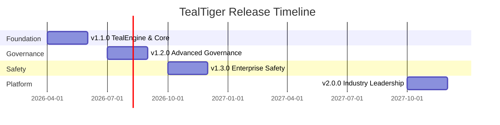

# TealTiger Product Roadmap

This page outlines TealTiger's product roadmap from the current v1.1.0 release through future versions. Our roadmap is guided by our core principle: **SDK-first, zero infrastructure, maximum adoption**.

<Note>
**Current Version:** v1.1.0 (In Development)  
**Timeline:** Q2 2026 - Q4 2027 (18 months)
</Note>

---

## Roadmap Overview

---

## v1.1.0: Foundation (Q2 2026) ✅

**Status:** In Development (Phase 4/5)  
**Theme:** TealEngine & Core Components

### What's Included

v1.1.0 establishes the foundation for SDK-first AI governance:

- **TealEngine** - Deterministic policy evaluation engine
- **TealGuard** - Security guardrails (PII, prompt injection, content moderation)
- **TealMonitor** - Cost tracking and budget management
- **TealCircuit** - Circuit breaker for failure isolation
- **TealAudit** - Comprehensive audit logging with correlation IDs

### Key Capabilities

- Policy-based control with three modes (REPORT_ONLY, MONITOR, ENFORCE)
- Six decision types (allow, deny, redact, transform, require_approval, defer)
- Risk scoring across four domains (security, cost, reliability, governance)
- Multi-provider support (OpenAI, Anthropic)
- Deterministic decisions with stable reason codes

### Strategic Value

- **OWASP Coverage:** 7/10 ASIs with SDK alone
- **Market Position:** First SDK-first AI governance solution
- **Developer Experience:** npm install, 5-minute setup

<Card title="v1.1.0 Release Details" icon="book" href="/versions/v1.1.0">
  Complete release scope and guarantees
</Card>

---

## v1.2.0: Advanced Governance (Q3 2026) 📋

**Status:** Draft - Requirements Under Review  
**Timeline:** 12 weeks (July - September 2026)  
**Theme:** Advanced Governance & Evidence

<Warning>
v1.2.0 features are in draft and subject to change. This represents our current planning direction.
</Warning>

### Planned Features

#### 1. Hybrid Signal Evaluation

Certificate-gated escalation for probabilistic signals:

- Evaluate optional probabilistic SignalAdapters at execution boundaries
- Escalate to REQUIRE_APPROVAL when signals exceed thresholds
- Bypass escalation with valid RiskCertificates
- Deterministic certificate validation (method allowlist, expiration, subject matching)

**Use Case:** Allow ML-based risk signals while maintaining deterministic governance.

#### 2. Enhanced Evidence Artifacts

Extended EvidenceBundle and LineageGraph:

- Hybrid evidence extension (`tt.hybrid.v0`) recording signal evaluations
- Certificate evidence extension (`tt.certificates.v1`) for validation results
- Risk-limiting governance extension (`tt.rlg.v0`) for evidence rounds
- Payload minimization (hashes/fingerprints, not raw content)

**Use Case:** Comprehensive audit trails for compliance and incident response.

#### 3. Advanced Secret Detection Pack

500+ credential types with ML-based confidence scoring:

- Cloud providers (AWS, Azure, GCP - 50+ patterns)
- Version control (GitHub, GitLab, Bitbucket - 20+ patterns)
- AI/ML services (OpenAI, Anthropic, Cohere - 30+ patterns)
- Payment systems (Stripe, PayPal - 15+ patterns)
- Databases, infrastructure, SaaS (100+ patterns)
- ML confidence scoring (0.0-1.0 scale with severity classification)

**Use Case:** Prevent secret leakage in AI agent interactions.

#### 4. Canonical Policy Representation

Locked CEL subset compiled to deterministic JSON rules:

- CEL is authoring-only, compiled before evaluation
- Policy hash (SHA-256) for stable versioning
- Cross-language determinism (TypeScript/Python parity)
- Golden corpora for release gating

**Use Case:** Ensure identical policy behavior across languages and environments.

#### 5. Risk-Limiting Governance

Multi-round evidence collection for high-risk operations:

- Round 0: Minimal checks
- Round 1: Additional deterministic checks
- Round 2: Strongest checks
- Escalate to REQUIRE_APPROVAL if confidence insufficient

**Use Case:** Graduated enforcement for operations with varying risk levels.

### Success Criteria

- 500+ secret types detected with under 5% false positive rate
- Hybrid signal evaluation with deterministic certificate validation
- Enhanced evidence artifacts with minimal payload size
- Cross-language policy parity (TypeScript/Python)
- Golden corpus coverage for all new capabilities

---

## v1.3.0: Enterprise Safety (Q4 2026) 📋

**Status:** Draft - Requirements Under Review  
**Timeline:** 12 weeks (October - December 2026)  
**Theme:** Enterprise Safety & Compliance

<Warning>
v1.3.0 features are in draft and subject to change. This represents our current planning direction.
</Warning>

### Planned Features

#### Epic D: High-Impact Safety Rails

**PLAN_ONLY Mode:**
- Guarantee no side effects during planning/chat-only operations
- Deny or convert mutating tool calls to REPORT_ONLY
- Evidence includes runtime_mode and stable reason codes

**FREEZE Controls:**
- Non-bypassable controls for specified action classes
- Global, per-agent, per-environment, or per-action-class scopes
- Always returns DENY with stable reason codes

**High-Impact Action Policy Pack:**
- Database writes/deletes
- Infrastructure changes
- Production deploys
- Secrets reveal
- External egress to unapproved destinations

**Use Case:** Prevent catastrophic incidents during agent planning or declared freeze periods.

#### Epic B: Non-Human Identity (NHI) Governance

**NHI Inventory:**
- Schema for agents, tools, datasets, models, policy bundles
- Ownership metadata and environment tracking
- Snapshot artifact generation on demand

**Role/Capability Bindings:**
- Bind agent roles to capabilities and tools
- Enforce environment/tenant boundaries
- Violations return DENY with stable reason codes

**Revocation Workflow:**
- Quick capability/tool permission revocation via policy update
- No redeploy required (external policy bundles)
- Revoked capabilities denied and logged

**Use Case:** Enterprise governance for autonomous agents with clear accountability.

#### Epic A: Autonomous Governance Modes

**Automation Levels:**
- AUTO_ALLOW, AUTO_SANITIZE, AUTO_DENY, REQUIRE_APPROVAL
- Policy metadata classifies automation level per action
- Deterministic enforcement behavior

**Policy Bundle Hot-Swap:**
- Versioned policy bundle deployment
- Rollback semantics with version tracking
- Every decision records policy_version

**Use Case:** Machine-speed operations with pre-authorized behavior boundaries.

#### Epic C: AI Code Agent Governance

**CODE_CHANGE Action Class:**
- Restrictions on files/paths, branches, environments
- Require approval for sensitive areas
- Evidence stores diff hash and approval metadata

**Two-Person Rule (Optional):**
- Require two independent approvals for sensitive changes
- Approval workflow captures approver identities
- Evidence proves both approvals for same change hash

**Use Case:** Secure governance for AI code security tools proposing patches.

#### Epic E: SOC/IR Evidence Pipeline

**SIEM-Friendly Exports:**
- Structured decision events (JSONL, HTTP sink)
- Outcome, reason_code, policy_version, agent_id, tool, environment
- Backpressure and failure-mode controls

**OpenTelemetry Conventions:**
- Span/attribute conventions for governance events
- Reason codes and policy versions in spans
- Sampling configuration support

**Policy Violation Hooks:**
- Alert interface for violations and approvals required
- Dedupe/rate-limit to prevent alert floods
- Alert payload references decision event IDs

**Use Case:** SOC automation with high-signal event streams.

#### Epic F: Standards-Aligned Policy Packs

**OWASP Agentic Top 10 Pack:**
- Policy pack aligned with OWASP Top 10 for Agentic Applications (2026)
- Recommended controls with stable reason codes
- Golden corpus cases tagged with OWASP categories

**Audit Evidence Templates:**
- Templates demonstrating governance controls
- Example decision logs and approval trails
- Reference policy IDs and versions

**Use Case:** Accelerate enterprise adoption with standards-aligned controls.

### Success Criteria

- PLAN_ONLY and FREEZE modes prevent high-impact actions
- NHI inventory with role/capability bindings
- AI code agent governance with two-person rule
- SIEM-friendly exports with OpenTelemetry conventions
- OWASP Agentic Top 10 policy pack shipped

---

## v2.0.0: Industry Leadership (Q4 2027) 🚀

**Status:** Future Planning  
**Timeline:** 12 weeks (October - December 2027)  
**Theme:** Industry Standard & Platform Preview

### Vision

Establish TealTiger as the industry standard for agentic AI security while previewing optional platform features.

### Planned Features

#### 1. Industry Leadership

- OWASP project sponsorship and standards contribution
- Open-source governance model
- Community-driven roadmap
- Published research and academic partnerships

#### 2. Platform Preview (Optional)

- Centralized policy management (optional)
- Multi-agent communication security (ASI07)
- Cloud deployment options (optional)
- Enterprise SaaS offering (optional)

<Note>
**SDK-First Commitment:** The core SDKs will always remain open source and fully functional without any platform. Platform features are optional enhancements.
</Note>

#### 3. Advanced Analytics

- Security posture scoring
- Benchmark comparisons
- Industry trend analysis
- Predictive threat modeling

#### 4. Ecosystem Maturity

- 10+ framework integrations
- 50+ community plugins
- 100+ secret detectors (community-contributed)
- Marketplace for policies and plugins

### Success Criteria

- 10,000+ enterprise customers
- 50,000+ monthly active developers
- 100+ community contributors
- Industry standard recognition

---

## Strategic Themes

### Theme 1: SDK-First Architecture

**Principle:** Everything must work without infrastructure

- Maximum developer adoption (npm install vs months of deployment)
- Zero friction onboarding (5 minutes vs 3-6 months)
- Privacy-preserving (client-side vs cloud-based)
- Cost-effective (95% cheaper than platform alternatives)

### Theme 2: Multi-Provider Support

**Principle:** Work with any LLM provider

**TypeScript SDK (v1.1.0) - 7 Providers ✅:**
- OpenAI (GPT-4, GPT-3.5)
- Anthropic (Claude 3)
- Google Gemini (Gemini Pro, Gemini 1.5)
- AWS Bedrock (Claude, Titan, Cohere, Llama)
- Azure OpenAI (GPT-3.5, GPT-4)
- Cohere (Command, Command Light)
- Mistral AI (Mistral Large, Medium, Small, Mixtral)

**Python SDK (v1.1.0) - 7 Providers ✅:**
- ✅ OpenAI (GPT-4, GPT-3.5)
- ✅ Anthropic (Claude 3)
- ✅ Azure OpenAI (GPT-3.5, GPT-4)
- ✅ Google Gemini (Gemini Pro, Gemini 1.5, multimodal)
- ✅ AWS Bedrock (Claude, Titan, Jurassic, Command, Llama)
- ✅ Cohere (Command, RAG, embeddings)
- ✅ Mistral AI (Mistral Large, Medium, Small, Mixtral)

**Status:** Python SDK achieved full parity with TypeScript SDK (March 6, 2026)

**Market Coverage:** 
- TypeScript: 95%+ of LLM market ✅
- Python: 95%+ of LLM market ✅ (parity achieved)

### Theme 3: Developer Experience

**Principle:** Simple, fast, powerful

- `npm install tealtiger` - that's it
- Zero configuration defaults
- Comprehensive documentation
- Active community support
- 5-minute quickstart

### Theme 4: Open-Source Community

**Principle:** Community-driven development

- MIT license (permissive)
- Public roadmap
- Community contributions
- Transparent governance
- Open benchmarks

### Theme 5: Academic Validation

**Principle:** Research-backed credibility

- Academic partnerships (v1.3.0+)
- Published research papers
- Conference presentations
- Open benchmarks
- Peer review

---

## Competitive Positioning

### Market Gap

All major competitors require platform infrastructure:

| Competitor | Approach | Infrastructure | Time to Deploy | Cost |
|------------|----------|----------------|----------------|------|
| Microsoft Agent 365 | Platform | M365 E5 + Azure | 3-6 months | $100k+/year |
| Cisco AI Defense | Platform | Cisco infrastructure | 3-6 months | $150k+/year |
| IBM Consulting | Consulting | Custom deployment | 6-12 months | $500k+/year |
| **TealTiger** | **SDK-First** | **None** | **5 minutes** | **$0-$99/month** |

### TealTiger's Unique Position

- Only SDK-first solution (npm install vs months of deployment)
- Multi-provider support (7+ providers vs single ecosystem)
- Privacy-preserving (client-side vs cloud-based)
- 95% cheaper than platform alternatives

---

## Feedback & Contributions

We welcome feedback on our roadmap! Here's how you can contribute:

<CardGroup cols={2}>
  <Card title="GitHub Discussions" icon="github" href="https://github.com/agentguard-ai/tealtiger/discussions">
    Share feedback and ideas
  </Card>
  
  <Card title="Community Discord" icon="discord" href="https://discord.gg/tealtiger">
    Join the conversation
  </Card>
  
  <Card title="Email Us" icon="envelope" href="mailto:reachout@tealtiger.ai">
    Direct feedback to the team
  </Card>
  
  <Card title="Feature Requests" icon="lightbulb" href="https://github.com/agentguard-ai/tealtiger/issues/new?template=feature_request.md">
    Request new features
  </Card>
</CardGroup>

---

## Related Reading

<CardGroup cols={2}>
  <Card title="v1.1.0 Release" icon="rocket" href="/versions/v1.1.0">
    Current release details
  </Card>
  
  <Card title="v1.1.0 Scope" icon="list-check" href="/versioning/v1.1.0-scope">
    What's included and excluded
  </Card>
  
  <Card title="Stability Guarantees" icon="shield-check" href="/versioning/stability-guarantees">
    Version compatibility contract
  </Card>
  
  <Card title="GitHub Roadmap" icon="map" href="https://github.com/agentguard-ai/tealtiger/blob/main/ROADMAP.md">
    Detailed technical roadmap
  </Card>
</CardGroup>

---

<Note>
**Roadmap Updates:** This roadmap is updated quarterly. Last updated: March 6, 2026.

**Recent Update (March 6, 2026):** Python SDK multi-provider implementation complete. All 7 providers now supported in both TypeScript and Python SDKs, achieving 95%+ market coverage.

**Disclaimer:** This roadmap represents our current planning direction. Features, timelines, and priorities may change based on user feedback, market conditions, and technical considerations. Draft features (v1.2.0, v1.3.0) are subject to change.
</Note>
