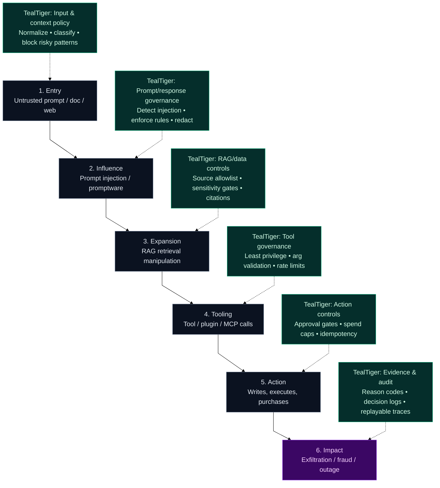

import { Callout } from "mintlify";

# Why TealTiger

Agentic AI changes the security, cost, and reliability equation.
When systems can **decide**, **call tools**, **move data**, and **act** across your stack, a single prompt, plugin, or misconfigured tool permission can trigger a chain of actions with real-world impact.

**TealTiger is blast‑radius control for agentic threats**—a contract‑first governance SDK that lets you **define**, **enforce**, and **prove** guardrails across prompts, tools, data access, model routing, and spend.

<Callout type="info">
TealTiger is **not just security**. It is governance across **security + cost + reliability + auditability** for AI/LLM/agent workflows.
</Callout>

---

## The core problem: promptware & agentic blast radius

Traditional AppSec assumes code changes flow through reviews, CI, and deployments.
Agentic systems can be influenced at **runtime** by:

- **Prompt injection / promptware** (malicious instructions, hidden payloads, retrieval manipulation)
- **Tool abuse** (over-permissioned connectors, plugins, MCP tools)
- **Data exfiltration paths** (RAG sources, logs, traces, tool outputs)
- **Spend explosions** (looping agents, retries, multi-tool fan-out)
- **Reliability collapse** (nondeterministic policy application, inconsistent routing)

**Governance must be enforced where the agent acts**—at the decision points where prompts, tools, data, and models intersect.

---

## What TealTiger provides (in one sentence)

> **Deterministic policies + evidence** applied at every agent decision point, so you can limit blast radius and prove control.

---

## Promptware kill chain (TealTiger mapping)

This executive-friendly diagram shows how agentic threats progress—and exactly where TealTiger reduces blast radius.

<Callout type="success">
**Outcome:** Even if an attacker reaches a stage in the chain, TealTiger constrains what the agent can do next—reducing blast radius and producing evidence of enforcement.
</Callout>

---

## How TealTiger differs from “guardrails”

Many "guardrails" focus on content moderation or best-effort pattern checks.
TealTiger is designed for **governance you can operationalize**:

- **Deterministic enforcement** (policies evaluate predictably; no silent drift)
- **Contract-first** (machine-readable policy + stable reason codes)
- **Runtime decision points** (prompt, tool, model, data, spend, outcome)
- **Auditability by default** (evidence artifacts for SOC2/ISO, incident review)
- **Cost & reliability controls** (caps, budgets, loop breakers, routing rules)

---

## What you can govern with TealTiger

### 1) Prompt & response policies
- Block / rewrite unsafe instructions
- Enforce structured outputs
- Redact secrets / PII
- Add safety and compliance constraints

### 2) Tool & MCP governance
- Allowlist tools per agent and environment
- Validate tool arguments (schema + semantic checks)
- Rate-limit risky tools
- Require approvals for destructive actions

### 3) Data & RAG governance
- Control which sources can be retrieved
- Sensitivity gates for regulated data
- Enforce citations & provenance
- Prevent data leakage to logs and traces

### 4) Model routing & spend
- Route by risk tier (cheap vs premium models)
- Set per-request and per-session budgets
- Detect loops and runaway fan-out
- Apply cost policies consistently across agents

### 5) Evidence & incident readiness
- Emit **reason codes** for every decision
- Store decision logs and policy versions
- Provide replayable traces for investigations
- Prove “policy was enforced” at the time of action

---

## The fastest path to value

1. **Start with blast-radius policies**: tool allowlists, spend caps, approval gates.
2. Add **data/RAG controls**: source allowlists, sensitivity gates, redaction.
3. Enable **evidence**: reason codes + decision logs + trace exports.
4. Expand to **organization-wide governance**: shared policy packs + CI checks.

---

## When TealTiger is a fit

Use TealTiger if you are building:

- AI agents that can call tools, access data, or take actions
- RAG systems with sensitive corpora
- LLM apps with strict cost / latency SLOs
- Regulated workflows that require auditability and provable controls

---

## Next steps

- Explore **Concepts → Decision Model** to understand how policies evaluate.
- Review **Policies** to see the contract-first structure and reason codes.
- See **Integrations** for frameworks, providers, telemetry, and tool protocols.
